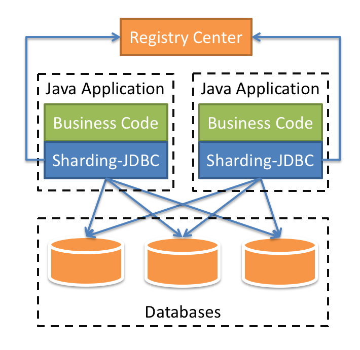
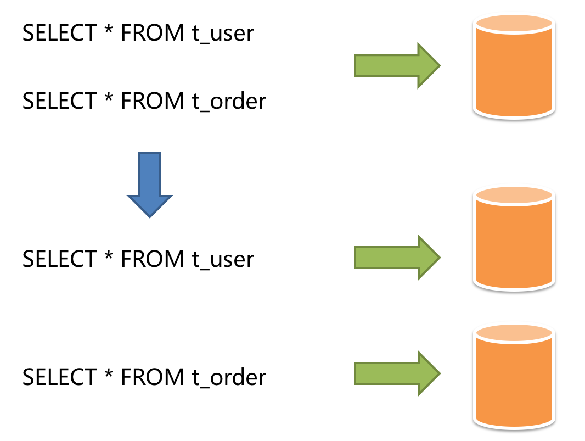
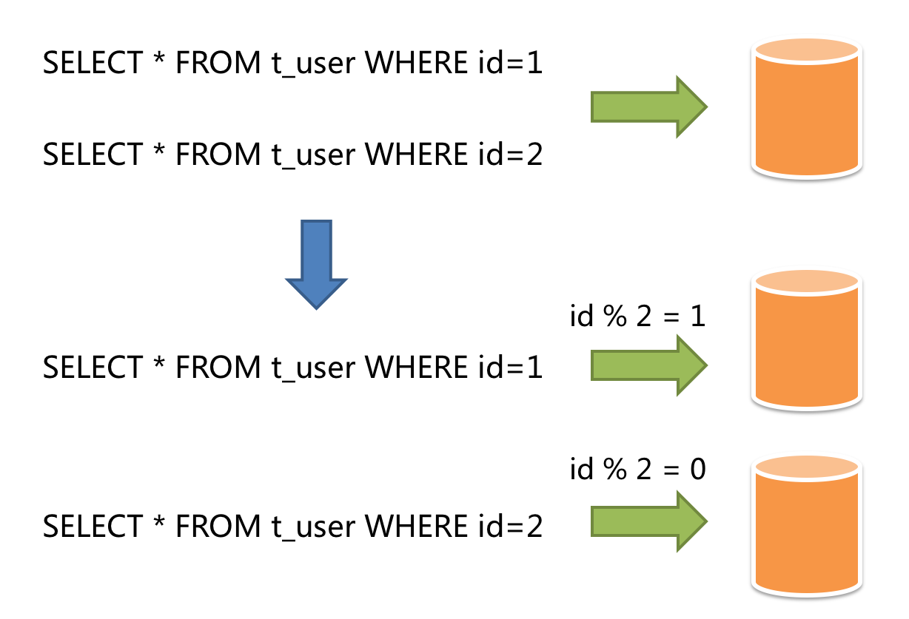
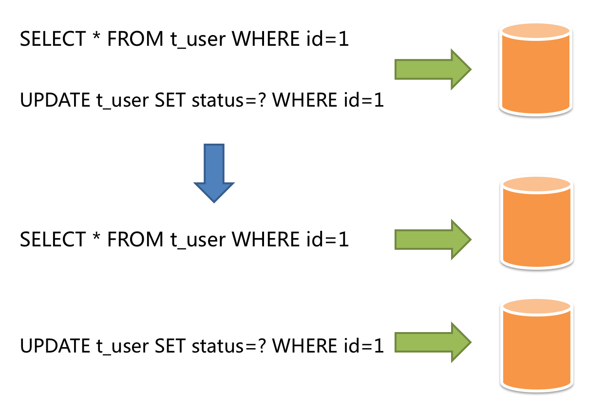

## 简介
Sharding-JDBC是ShardingSphere的第一个产品，也是ShardingSphere的前身。 它定位为轻量级Java框架，在Java的JDBC层提供的额外服务。它使用客户端直连数据库，以jar包形式提供服务，无需额外部署和依赖，可理解为增强版的JDBC驱动，完全兼容JDBC和各种ORM框架。

* 适用于任何基于Java的ORM框架，如：JPA, Hibernate, Mybatis, Spring JDBC Template或直接使用JDBC。
* 基于任何第三方的数据库连接池，如：DBCP, C3P0, BoneCP, Druid, HikariCP等。
* 支持任意实现JDBC规范的数据库。目前支持MySQL，Oracle，SQLServer和PostgreSQL。



官网链接：[https://shardingsphere.apache.org/document/current/en/overview/](https://shardingsphere.apache.org/document/current/en/overview/)

核心功能如下：

| 特性    | 定义                                                                                                  |
|-------|-----------------------------------------------------------------------------------------------------|
| 数据分片  | 	数据分片，是应对海量数据存储与计算的有效手段。ShardingSphere 基于底层数据库提供分布式数据库解决方案，可以水平扩展计算和存储。                             |
| 分布式事务 | 事务能力，是保障数据库完整、安全的关键技术，也是数据库的核心技术。基于 XA 和 BASE 的混合事务引擎，ShardingSphere 提供在独立数据库上的分布式事务功能，保证跨数据源的数据安全。 |
| 读写分离  | 读写分离，是应对高压力业务访问的手段。基于对 SQL 语义理解及对底层数据库拓扑感知能力，ShardingSphere 提供灵活的读写流量拆分和读流量负载均衡。                    |
| 数据迁移  | 数据迁移，是打通数据生态的关键能力。ShardingSphere 提供跨数据源的数据迁移能力，并可支持重分片扩展。                                           |
| 联邦查询  | 	联邦查询，是面对复杂数据环境下利用数据的有效手段。ShardingSphere 提供跨数据源的复杂查询分析能力，实现跨源的数据关联与聚合。                              |
| 数据加密  | 数据加密，是保证数据安全的基本手段。ShardingSphere 提供完整、透明、安全、低成本的数据加密解决方案。                                           |
| 影子库   | 在全链路压测场景下，ShardingSphere 支持不同工作负载下的数据隔离，避免测试数据污染生产环境。                                               |


--- 
### 数据分片

传统的将数据集中存储至单一数据节点的解决方案，在性能、可用性和运维成本这三方面已经难于满足互联网的海量数据场景。

从性能方面来说，由于关系型数据库大多采用B+树类型的索引，在数据量超过阈值的情况下，索引深度的增加也将使得磁盘访问的IO次数增加，进而导致查询性能的下降；同时，高并发访问请求也使得集中式数据库成为系统的最大瓶颈。

从可用性的方面来讲，服务化的无状态型，能够达到较小成本的随意扩容，这必然导致系统的最终压力都落在数据库之上。而单一的数据节点，或者简单的主从架构，已经越来越难以承担。数据库的可用性，已成为整个系统的关键。

从运维成本方面考虑，当一个数据库实例中的数据达到阈值以上，对于DBA的运维压力就会增大。数据备份和恢复的时间成本都将随着数据量的大小而愈发不可控。一般来讲，单一数据库实例的数据的阈值在1TB之内，是比较合理的范围。

在传统的关系型数据库无法满足互联网场景需要的情况下，将数据存储至原生支持分布式的NoSQL的尝试越来越多。 但NoSQL对SQL的不兼容性以及生态圈的不完善，使得它们在与关系型数据库的博弈中始终无法完成致命一击，而关系型数据库的地位却依然不可撼动。

数据分片指按照某个维度将存放在单一数据库中的数据分散地存放至多个数据库或表中以达到提升性能瓶颈以及可用性的效果。 数据分片的有效手段是对关系型数据库进行分库和分表。分库和分表均可以有效的避免由数据量超过可承受阈值而产生的查询瓶颈。 除此之外，分库还能够用于有效的分散对数据库单点的访问量；分表虽然无法缓解数据库压力，但却能够提供尽量将分布式事务转化为本地事务的可能，一旦涉及到跨库的更新操作，分布式事务往往会使问题变得复杂。 使用多主多从的分片方式，可以有效的避免数据单点，从而提升数据架构的可用性。

通过分库和分表进行数据的拆分来使得各个表的数据量保持在阈值以下，以及对流量进行疏导应对高访问量，是应对高并发和海量数据系统的有效手段。 数据分片的拆分方式又分为垂直分片和水平分片。

垂直拆分：按照业务拆分的方式称为垂直分片，又称为纵向拆分，它的核心理念是专库专用。 在拆分之前，一个数据库由多个数据表构成，每个表对应着不同的业务。而拆分之后，则是按照业务将表进行归类，分布到不同的数据库中，从而将压力分散至不同的数据库。 下图展示了根据业务需要，将用户表和订单表垂直分片到不同的数据库的方案。



水平拆分：水平分片又称为横向拆分。 相对于垂直分片，它不再将数据根据业务逻辑分类，而是通过某个字段（或某几个字段），根据某种规则将数据分散至多个库或表中，每个分片仅包含数据的一部分。 例如：根据主键分片，偶数主键的记录放入0库（或表），奇数主键的记录放入1库（或表），如下图所示。



### 读写分离

面对日益增加的系统访问量，数据库的吞吐量面临着巨大瓶颈。 对于同一时刻有大量并发读操作和较少写操作类型的应用系统来说，将数据库拆分为主库和从库，主库负责处理事务性的增删改操作，从库负责处理查询操作，能够有效的避免由数据更新导致的行锁，使得整个系统的查询性能得到极大的改善。

通过一主多从的配置方式，可以将查询请求均匀的分散到多个数据副本，能够进一步的提升系统的处理能力。 使用多主多从的方式，不但能够提升系统的吞吐量，还能够提升系统的可用性，可以达到在任何一个数据库宕机，甚至磁盘物理损坏的情况下仍然不影响系统的正常运行。

与将数据根据分片键打散至各个数据节点的水平分片不同，读写分离则是根据SQL语义的分析，将读操作和写操作分别路由至主库与从库。



### 数据治理

提供注册中心、配置动态化、数据库熔断禁用、调用链路等治理能力。

* 配置集中化：越来越多的运行时实例，使得散落的配置难于管理，配置不同步导致的问题十分严重。将配置集中于配置中心，可以更加有效进行管理。

* 配置动态化：配置修改后的分发，是配置中心可以提供的另一个重要能力。它可支持数据源、表与分片及读写分离策略的动态切换。

### 分布式事务

数据库事务需要满足ACID（原子性、一致性、隔离性、持久性）四个特性。

* 原子性（Atomicity）指事务作为整体来执行，要么全部执行，要么全不执行。
* 一致性（Consistency）指事务应确保数据从一个一致的状态转变为另一个一致的状态。
* 隔离性（Isolation）指多个事务并发执行时，一个事务的执行不应影响其他事务的执行。
* 持久性（Durability）指已提交的事务修改数据会被持久保存。
在单一数据节点中，事务仅限于对单一数据库资源的访问控制，称之为本地事务。几乎所有的成熟的关系型数据库都提供了对本地事务的原生支持。 但是在基于微服务的分布式应用环境下，越来越多的应用场景要求对多个服务的访问及其相对应的多个数据库资源能纳入到同一个事务当中，分布式事务应运而生。

关系型数据库虽然对本地事务提供了完美的ACID原生支持。 但在分布式的场景下，它却成为系统性能的桎梏。如何让数据库在分布式场景下满足ACID的特性或找寻相应的替代方案，是分布式事务的重点工作。

#### 本地事务

在不开启任何分布式事务管理器的前提下，让每个数据节点各自管理自己的事务。 
它们之间没有协调以及通信的能力，也并不互相知晓其他数据节点事务的成功与否。 
本地事务在性能方面无任何损耗，但在强一致性以及最终一致性方面则力不从心。

#### XA强一致事务

XA协议最早的分布式事务模型是由X/Open国际联盟提出的X/Open Distributed Transaction Processing（DTP）模型，简称XA协议。

基于XA协议实现的分布式事务对业务侵入很小。 它最大的优势就是对使用方透明，用户可以像使用本地事务一样使用基于XA协议的分布式事务。 XA协议能够严格保障事务ACID特性。

严格保障事务ACID特性是一把双刃剑。 事务执行在过程中需要将所需资源全部锁定，它更加适用于执行时间确定的短事务。 对于长事务来说，整个事务进行期间对数据的独占，将导致对热点数据依赖的业务系统并发性能衰退明显。 因此，在高并发的性能至上场景中，基于XA协议的分布式事务并不是最佳选择。

#### 柔性事务
如果将实现了ACID的事务要素的事务称为刚性事务的话，那么基于BASE事务要素的事务则称为柔性事务。 BASE是基本可用、柔性状态和最终一致性这三个要素的缩写。

* 基本可用（Basically Available）保证分布式事务参与方不一定同时在线。
* 柔性状态（Soft state）则允许系统状态更新有一定的延时，这个延时对客户来说不一定能够察觉。
* 而最终一致性（Eventually consistent）通常是通过消息可达的方式保证系统的最终一致性。

在ACID事务中对隔离性的要求很高，在事务执行过程中，必须将所有的资源锁定。 柔性事务的理念则是通过业务逻辑将互斥锁操作从资源层面上移至业务层面。通过放宽对强一致性要求，来换取系统吞吐量的提升。
基于ACID的强一致性事务和基于BASE的最终一致性事务都不是银弹，只有在最适合的场景中才能发挥它们的最大长处。可通过下表详细对比它们之间的区别，以帮助开发者进行技术选型。

---
## 项目使用

### 开发环境与依赖引入

| Framework      | Version |
|----------------|---------|
| JDK            | 17      |
| SpringBoot     | 3.0.0   |
| MySQL          | 8.0     |
| ShardingSphere | 5.4.1   |

**shardingsphere-JDBC版本选择**

_旧版本shardingsphere-JDBC V4.1.1_ 支持Java，YAML，Spring命名空间和Spring Boot Starter（SpringBoot3.x以下）四种方式配置，开发者可根据场景选择其中一种适合的配置方式
```xml

<dependencies>
    <!-- for yaml-->
<!--    <dependency>-->
<!--        <groupId>org.apache.shardingsphere</groupId>-->
<!--        <artifactId>sharding-jdbc-core</artifactId>-->
<!--        <version>4.1.1</version>-->
<!--    </dependency>-->
    <!-- for spring boot 2.x-->
    <dependency>
        <groupId>org.apache.shardingsphere</groupId>
        <artifactId>sharding-jdbc-spring-boot-starter</artifactId>
        <version>4.1.1</version>
    </dependency>
</dependency>

```


_shardingsphere-JDBC V5.2.1_, 这是shardingsphere-JDBC最后一个支持SpringBoot starter配置的版本，同时也支持SpringBoot3.0.0，但后续版本因为spring更新频繁，维护shardingsphere-JDBC-spring-boot-starter工作量大等原因而放弃此分支
```xml
<dependencies>
    <!-- for yaml-->
<!--    <dependency>-->
<!--        <groupId>org.apache.shardingsphere</groupId>-->
<!--        <artifactId>shardingsphere-jdbc-core</artifactId>-->
<!--        <version>5.2.1</version>-->
<!--    </dependency>-->
    <!-- for spring boot 3.0.0-->
    <dependency>
        <groupId>org.apache.shardingsphere</groupId>
        <artifactId>shardingsphere-jdbc-core-spring-boot-starter</artifactId>
        <version>5.2.1</version>
    </dependency>
</dependency>
```
_shardingsphere-JDBC V5.4.1_, 这是当前最新版本，仅支持yaml配置(与springboot-starter配置差别不大)，也是本文采用的版本号，如需旧版本lib配置方法，可以参考官网旧版本文档

```xml
<dependencies>
    <dependency>
        <groupId>org.apache.shardingsphere</groupId>
        <artifactId>shardingsphere-jdbc-core</artifactId>
        <version>5.4.1</version>
    </dependency>
    
    <dependency>
        <groupId>org.glassfish.jaxb</groupId>
        <artifactId>jaxb-runtime</artifactId>
        <version>2.3.8</version>
    </dependency>
</dependency>
```

> 引入jaxb-runtime的原因：JDK9对package进行了修改，将javax包重命名为jakarta并删除了一些API，所以在本文环境JDK17下直接运行会提示异常*javax.xml.bind.JAXBException: Implementation of JAXB-API has not been found on module path or classpath.* 
> 
> issue: [https://github.com/apache/shardingsphere/issues/26041](https://github.com/apache/shardingsphere/issues/26041) 
> 
> 需要注意的是，因为在SpringBoot3.2.x中，默认使用snakeyaml2.2（详情可参考上面issue讨论），因而此版本仍不支持SpringBoot3.2.x以上，建议等待shardingsphere-jdbc更新或者降低SpringBoot版本为3.0.x


### 数据分片


配置规则

```YAML
rules:
  - !SHARDING
    tables: # 数据分片规则配置
      <logic_table_name> (+): # 逻辑表名称
        actualDataNodes (?): # 由数据源名 + 表名组成（参考 Inline 语法规则）
        databaseStrategy (?): # 分库策略，缺省表示使用默认分库策略，以下的分片策略只能选其一
          standard: # 用于单分片键的标准分片场景
            shardingColumn: # 分片列名称
            shardingAlgorithmName: # 分片算法名称
          complex: # 用于多分片键的复合分片场景
            shardingColumns: # 分片列名称，多个列以逗号分隔
            shardingAlgorithmName: # 分片算法名称
          hint: # Hint 分片策略
            shardingAlgorithmName: # 分片算法名称
          none: # 不分片
        tableStrategy: # 分表策略，同分库策略
        keyGenerateStrategy: # 分布式序列策略
          column: # 自增列名称，缺省表示不使用自增主键生成器
          keyGeneratorName: # 分布式序列算法名称
        auditStrategy: # 分片审计策略
          auditorNames: # 分片审计算法名称
            - <auditor_name>
            - <auditor_name>
          allowHintDisable: true # 是否禁用分片审计hint
    autoTables: # 自动分片表规则配置
      t_order_auto: # 逻辑表名称
        actualDataSources (?): # 数据源名称
        shardingStrategy: # 切分策略
          standard: # 用于单分片键的标准分片场景
            shardingColumn: # 分片列名称
            shardingAlgorithmName: # 自动分片算法名称
    bindingTables (+): # 绑定表规则列表
      - <logic_table_name_1, logic_table_name_2, ...>
      - <logic_table_name_1, logic_table_name_2, ...>
    defaultDatabaseStrategy: # 默认数据库分片策略
    defaultTableStrategy: # 默认表分片策略
    defaultKeyGenerateStrategy: # 默认的分布式序列策略
    defaultShardingColumn: # 默认分片列名称

    # 分片算法配置
    shardingAlgorithms:
      <sharding_algorithm_name> (+): # 分片算法名称
        type: # 分片算法类型
        props: # 分片算法属性配置
        # ...

    # 分布式序列算法配置
    keyGenerators:
      <key_generate_algorithm_name> (+): # 分布式序列算法名称
        type: # 分布式序列算法类型
        props: # 分布式序列算法属性配置
        # ...
    # 分片审计算法配置
    auditors:
      <sharding_audit_algorithm_name> (+): # 分片审计算法名称
        type: # 分片审计算法类型
        props: # 分片审计算法属性配置
        # ...

  - !BROADCAST
    tables: # 广播表规则列表
      - <table_name>
      - <table_name>


```

> 广播表：指所有的数据源中都存在的表，表结构及其数据在每个数据库中均完全一致。 适用于数据量不大且需要与海量数据的表进行关联查询的场景，例如：字典表。
> 单表 //todo

配置示例

>拦截全路由的 SQL 语句。该算法通过判断分片条件是否为空来拦截，当然如果广播表或者非分片表则不应该拦截。
> 参考https://blog.csdn.net/weixin_39643007/article/details/125886425

### 读写分离


```yaml
rules:
- !READWRITE_SPLITTING
  dataSources:
    <data_source_name> (+): # 读写分离逻辑数据源名称，默认使用 Groovy 的行表达式 SPI 实现来解析
       write_data_source_name: # 写库数据源名称，默认使用 Groovy 的行表达式 SPI 实现来解析
       read_data_source_names: # 读库数据源名称，多个从数据源用逗号分隔，默认使用 Groovy 的行表达式 SPI 实现来解析
       transactionalReadQueryStrategy (?): # 事务内读请求的路由策略，可选值：PRIMARY（路由至主库）、FIXED（同一事务内路由至固定数据源）、DYNAMIC（同一事务内路由至非固定数据源）。默认值：DYNAMIC
       loadBalancerName: # 负载均衡算法名称
  
  # 负载均衡算法配置
  loadBalancers:
    <load_balancer_name> (+): # 负载均衡算法名称
      type: # 负载均衡算法类型
      props: # 负载均衡算法属性配置
        # ...

```

> ShardingSphere读写分离并不会提供主从数据源同步功能，需要sql服务本身实现。

配置示例

```
rules:
- !READWRITE_SPLITTING
  dataSources:
    readwrite_ds:
      writeDataSourceName: write_ds
      readDataSourceNames:
        - read_ds_0
        - read_ds_1
      transactionalReadQueryStrategy: PRIMARY
      loadBalancerName: random
  loadBalancers:
    random:
      type: RANDOM

```

### 数据加密

规则配置说明

```yaml

rules:
  - !ENCRYPT
    tables:
      <table_name> (+): # 加密表名称
        columns:
          <column_name> (+): # 加密列名称
            cipher:
              name: # 密文列名称
              encryptorName: # 密文列加密算法名称
            assistedQuery (?):
              name: # 查询辅助列名称
              encryptorName:  # 查询辅助列加密算法名称
            likeQuery (?):
              name: # 模糊查询列名称
              encryptorName:  # 模糊查询列加密算法名称

    # 加密算法配置
    encryptors:
      <encrypt_algorithm_name> (+): # 加解密算法名称
        type: # 加解密算法类型
        props: # 加解密算法属性配置
        # ...


```

> 密文列: 加密后的数据列。
> 
> 查询辅助列：用于查询的辅助列。 对于一些安全级别更高的非幂等加密算法，提供不可逆的幂等列用于查询。
> 
> 模糊查询列：用于模糊查询的列。自ShardingSphere5.3.0开始内置单向函数CHAR_DIGEST_LIKE用于模糊查询，
> 但是于最新的5.4.1版本却没有org.apache.shardingsphere.encrypt.algorithm.like.CharDigestLikeEncryptAlgorithm对应包，造成直接使用官方文档配置模糊查询列报错CHAR_DIGEST_LIKE算法找不到
> 所以建议如果有模糊查询列需求可以使用旧版本或者使用自定义的算法


table初始化脚本

```sql
CREATE TABLE t_encrypt(
id INT PRIMARY KEY,
user_name VARCHAR(255),
pwd VARCHAR(255)
);
```

配置示例

```yaml
dataSources:
  unique_ds:
    dataSourceClassName: com.zaxxer.hikari.HikariDataSource
    driverClassName: com.mysql.jdbc.Driver
    jdbcUrl: jdbc:mysql://localhost:3306/demo_ds?serverTimezone=UTC&useSSL=false&useUnicode=true&characterEncoding=UTF-8
    username: root
    password:

rules:
- !ENCRYPT
  tables:
    t_encrypt:
      columns:
        user_name:
          cipher:
            name: user_name
            encryptorName: aes_encryptor
          assistedQuery:
            name: assisted_query_username
            encryptorName: assisted_encryptor
            
        pwd:
          cipher:
            name: pwd
            encryptorName: aes_encryptor
  encryptors:
    aes_encryptor:
      type: AES
      props:
        aes-key-value: 123456abc
    assisted_encryptor:
      type: MD5

```

### 数据脱敏

规则配置说明

```yaml

rules:
- !MASK
  tables:
    <table_name> (+): # 脱敏表名称
      columns:
        <column_name> (+): # 脱敏列名称
          maskAlgorithm: # 脱敏算法

  # 脱敏算法配置
  maskAlgorithms:
    <mask_algorithm_name> (+): # 脱敏算法名称
      type: # 脱敏算法类型
      props: # 脱敏算法属性配置
      # ...

```

table初始化脚本

```sql
CREATE TABLE t_mask(
id INT PRIMARY KEY,
password VARCHAR(255),
email VARCHAR(255),
telephone VARCHAR(255)
);
```

配置示例
```
dataSources:
  unique_ds:
    dataSourceClassName: com.zaxxer.hikari.HikariDataSource
    driverClassName: com.mysql.jdbc.Driver
    jdbcUrl: jdbc:mysql://localhost:3306/demo_ds?serverTimezone=UTC&useSSL=false&useUnicode=true&characterEncoding=UTF-8
    username: root
    password:

rules:
- !MASK
  tables:
    t_mask:
      columns:
        password:
          maskAlgorithm: md5_mask
        email:
          maskAlgorithm: mask_before_special_chars_mask
        telephone:
          maskAlgorithm: keep_first_n_last_m_mask

  maskAlgorithms:
    md5_mask:
      type: MD5
    mask_before_special_chars_mask:
      type: MASK_BEFORE_SPECIAL_CHARS
      props:
        special-chars: '@'
        replace-char: '*'
    keep_first_n_last_m_mask:
      type: KEEP_FIRST_N_LAST_M
      props:
        first-n: 3
        last-m: 4
        replace-char: '*'

```

> 数据脱敏指的是对查询结果的字符替换，数据的储存还是使用明文储存。


### 影子库

规则配置说明
```yaml

rules:
  - !SHADOW
    dataSources:
      shadowDataSource:
        productionDataSourceName: # 生产数据源名称
        shadowDataSourceName: # 影子数据源名称
    tables:
      <table_name>:
        dataSourceNames: # 影子表关联影子数据源名称列表
          - <shadow_data_source>
        shadowAlgorithmNames: # 影子表关联影子算法名称列表
          - <shadow_algorithm_name>
    defaultShadowAlgorithmName: # 默认影子算法名称（选配项）
    shadowAlgorithms:
      <shadow_algorithm_name> (+): # 影子算法名称
        type: # 影子算法类型
        props: # 影子算法属性配置


```


