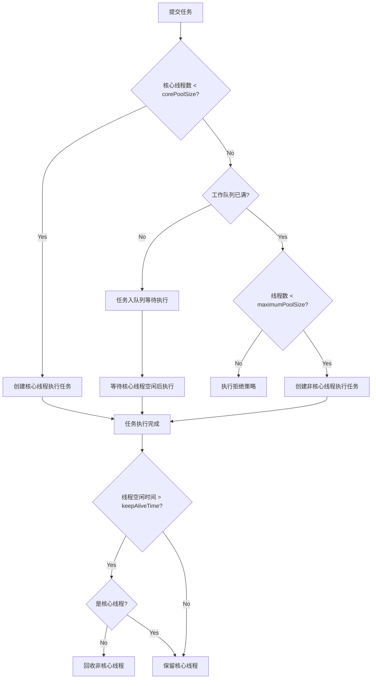

# Day 2：Java 并发编程深度复习（含 JDK 21 虚拟线程）

> 计划日期：Week 1 Day 2 | 主题：线程池、synchronized、Lock、volatile、CAS、虚拟线程
> 输出要求：能画出线程池工作流程、能对比平台线程与虚拟线程

---

## 一、核心概念速览

### 1.1 线程池（ThreadPoolExecutor）

**线程池的好处**：减少线程创建/销毁的开销，避免无限制创建线程导致 OOM 或过度上下文切换。

#### 7 个核心参数

| 参数 | 含义 |
|------|------|
| `corePoolSize` | 核心线程数，即使空闲也不销毁（除非 `allowCoreThreadTimeOut=true`） |
| `maximumPoolSize` | 最大线程数，核心线程满 + 队列满时才创建额外线程 |
| `keepAliveTime` | 额外空闲线程存活时间（非核心线程） |
| `unit` | `keepAliveTime` 的时间单位 |
| `workQueue` | 阻塞队列，存放等待执行的任务 |
| `threadFactory` | 线程工厂，用于创建新线程 |
| `handler` | 拒绝策略，当线程池 + 队列都满时的处理方式 |

#### 线程池工作流程（面试必画图）

```
                        提交任务
                           │
                           ▼
                    ┌───────────────┐
                    │ 核心线程满了？  │
                    └───────┬───────┘
                    N       │       Y
                    ▼       │       ▼
              创建核心线程    │  ┌──────────────┐
              执行任务       │  │  队列满了？   │
                            │  └──────┬───────┘
                            │  N      │      Y
                            │  ▼      │      ▼
                            │ 入队等待  │  ┌───────────────┐
                            │         │  │ 最大线程满了？  │
                            │         │  └──────┬────────┘
                            │         │  N      │      Y
                            │         │  ▼      │      ▼
                            │         │创建非核心 │  执行拒绝策略
                            │         │线程执行   │
                            │         │          │
                            ▼         ▼          ▼
                       ┌────────────────────────────────┐
                       │         线程执行完任务          │
                       │  非核心线程空闲超过 keepAliveTime │
                       │        → 回收非核心线程         │
                       └────────────────────────────────┘
```

**一句话总结**：核心线程 → 队列 → 非核心线程 → 拒绝策略，四级缓冲。

#### 4 种拒绝策略

| 策略 | 行为 | 适用场景 |
|------|------|---------|
| `AbortPolicy`（默认） | 抛 `RejectedExecutionException` | 必须感知任务被拒绝 |
| `CallerRunsPolicy` | 由调用者线程执行该任务 | 不能丢任务，能承受一定延迟 |
| `DiscardPolicy` | 静默丢弃新任务 | 允许丢任务（如日志采集） |
| `DiscardOldestPolicy` | 丢弃队列中最旧的任务，重试提交 | 优先处理最新数据 |

#### 核心线程数如何设置？

| 任务类型 | 公式 | 原因 |
|----------|------|------|
| **CPU 密集型** | `N + 1`（N=CPU 核数） | 多 1 个线程利用 CPU 空闲间隙（如缺页中断） |
| **I/O 密集型** | `2N` | I/O 期间 CPU 空闲，可让其他线程使用 CPU |

#### 常用阻塞队列对比

| 队列 | 特点 |
|------|------|
| `ArrayBlockingQueue` | 有界，数组结构，FIFO |
| `LinkedBlockingQueue` | 有界（可设）/ 无界，链表结构，吞吐量高于数组 |
| `SynchronousQueue` | 不存储元素，put 必须等待 take |
| `PriorityBlockingQueue` | 无界，支持优先级排序 |

> ⚠️ **阿里巴巴规约**：不要用 `Executors` 创建线程池！`newFixedThreadPool` 和 `newCachedThreadPool` 的队列无界或线程数无界，可能导致 OOM。**必须用 `ThreadPoolExecutor` 构造方法**。

---

### 1.2 synchronized 锁升级过程

> JDK 1.6 之后对 synchronized 做了大量优化，引入了**偏向锁 → 轻量级锁 → 重量级锁**的升级路径。

```
无锁状态
  │
  │ (同一线程反复获取)
  ▼
偏向锁（Mark Word 记录线程 ID）
  │        │
  │        │ (另一个线程竞争，CAS 撤销偏向锁)
  │        ▼
  │     轻量级锁（CAS 自旋获取）
  │        │
  │        │ (自旋 10+ 次仍失败，或竞争加剧)
  │        ▼
  │     重量级锁（操作系统 Monitor，线程阻塞/唤醒）
  │
  ▼
锁释放 → 回到无锁状态（不可降级！）
```

#### 各锁状态对比

| 锁状态 | 实现方式 | 适用场景 | 开销 |
|--------|---------|---------|------|
| **偏向锁** | Mark Word 记录持有线程 ID | 只有一个线程反复获取锁 | 极低 |
| **轻量级锁** | CAS 自旋 + Lock Record | 线程**交替**执行，无实际竞争 | 中等（消耗 CPU） |
| **重量级锁** | OS Mutex，未获取的线程阻塞 | 实际竞争激烈 | 高（涉及系统调用 + 上下文切换） |

> **关键点**：锁只能升级不能降级（偏向锁批量重偏向/撤销除外）。

#### synchronized 的使用方式

| 修饰对象 | 锁的对象 | 范围 |
|----------|---------|------|
| 普通方法 | `this`（当前实例） | 同一实例互斥 |
| 静态方法 | `类.class` | 所有实例互斥 |
| 代码块 `synchronized(obj)` | `obj` | 指定对象互斥 |
| 代码块 `synchronized(this)` | `this` | 同一实例互斥 |

---

### 1.3 ReentrantLock（显式锁）

> `ReentrantLock` 是基于 **AQS**（AbstractQueuedSynchronizer）实现的显式锁，JDK 1.5 引入。

#### synchronized vs ReentrantLock

| 维度 | synchronized | ReentrantLock |
|------|-------------|---------------|
| 实现 | JVM 关键字，C++ 实现 | JDK 类，基于 AQS（纯 Java） |
| 锁释放 | 自动释放（代码块/方法退出） | **必须**在 finally 中手动 `unlock()` |
| 可中断 | 不支持（一直阻塞） | 支持 `lockInterruptibly()` |
| 超时获取 | 不支持 | 支持 `tryLock(time, unit)` |
| 公平性 | 非公平 | 可选公平/非公平 |
| 条件变量 | `wait/notify`（单条件队列） | `Condition`（多条件队列） |
| 性能 | JDK 1.6+ 优化后相差不大 | 略低（额外对象开销） |

> **选型建议**：能用 synchronized 就用 synchronized（简洁、自动释放），需要可中断/超时/公平锁/多条件时才用 ReentrantLock。

#### AQS 简介

AQS 内部维护两个队列：
- **同步队列（CLH 双向链表）**：存放等待获取锁的线程，队头是即将获取锁的线程
- **条件队列（单向链表）**：存放因 `await()` 而等待的线程，被 `signal()` 唤醒后移到同步队列队尾

---

### 1.4 volatile 关键字

| 维度 | 说明 |
|------|------|
| **保证可见性** | 一个线程修改 volatile 变量后，其他线程立即可见（通过**内存屏障**强制刷入主存并失效其他 CPU 缓存行） |
| **禁止指令重排序** | 通过内存屏障禁止 JVM/JIT 对 volatile 变量的读写操作进行重排序 |
| **不保证原子性** | `volatile int i; i++;` → 非原子，多线程仍不安全！（读-改-写 三步） |

#### 典型使用场景

1. **状态标记位**：
```java
volatile boolean running = true;
// 线程 A 设置 running = false，线程 B 立刻退出循环
```

2. **DCL（双重检查锁定）单例**：
```java
public class Singleton {
    private static volatile Singleton instance;  // volatile 防止指令重排
    
    public static Singleton getInstance() {
        if (instance == null) {                  // 第一次检查
            synchronized (Singleton.class) {
                if (instance == null) {          // 第二次检查
                    instance = new Singleton();  // ①分配内存 ②初始化 ③赋值引用
                    // 没有 volatile 时可能 ①→③→②，其他线程拿到未初始化的对象
                }
            }
        }
        return instance;
    }
}
```

#### volatile 实现原理（JMM 层面）

- **写 volatile**：在写操作后插入 **StoreStore** + **StoreLoad** 屏障，强制刷主存
- **读 volatile**：在读操作前插入 **LoadLoad** + **LoadStore** 屏障，强制从主存取、禁止后续操作重排到读之前

---

### 1.5 CAS（Compare And Swap）

> CAS 是一条 CPU 原子指令（`cmpxchg`），用于实现无锁并发。Java 通过 `Unsafe` 类的 native 方法封装。

```
CAS(V, E, N)
  V: 内存地址（要更新的变量）
  E: 期望值（expected）
  N: 新值（new）

逻辑：如果 V 的当前值 == E，则将 V 更新为 N，返回 true；否则返回 false。

整个过程是 CPU 级别的原子操作。
```

#### ABA 问题

```
线程 1：CAS(A → B)，读取到 A
线程 2：CAS(A → B)，修改成功
线程 2：CAS(B → A)，改回 A
线程 1：CAS 执行，发现还是 A，修改成功
→ 线程 1 不知道 A 曾被改为 B 又改回来！
```

**解决方案**：`AtomicStampedReference` / `AtomicMarkableReference`，加版本号。

#### CAS 在 Java 中的应用

| 类/机制 | CAS 应用 |
|----------|---------|
| `AtomicInteger/AtomicLong/AtomicReference` | `compareAndSet()` |
| `ConcurrentHashMap`（JDK 1.8） | put 时空桶先用 CAS 尝试设置 |
| `ReentrantLock` | AQS 的 `state` 用 CAS 修改 |
| `LongAdder` | 分散到 `Cell[]` 数组，减少 CAS 竞争 |

---

### 1.6 虚拟线程（Virtual Threads，JDK 21+）

> JEP 444：虚拟线程是 JDK 21 正式发布的**轻量级线程**，由 JVM 而非操作系统管理，旨在以"每任务一线程"模型解决高并发 I/O 场景下平台线程（OS 线程）稀缺的问题。

#### 平台线程 vs 虚拟线程

```
平台线程（Platform Thread，传统 java.lang.Thread）
  JVM 线程 1:1 映射到 OS 内核线程
  ┌─────────┐    ┌─────────┐    ┌─────────┐
  │ Thread1 │    │ Thread2 │    │ Thread3 │   ← Java 层
  └────┬─────┘    └────┬─────┘    └────┬─────┘
       │               │               │
  ┌────▼───────────────▼───────────────▼─────┐
  │         OS 内核线程（昂贵，~1MB 栈）         │
  └──────────────────────────────────────────┘

虚拟线程（Virtual Thread）
  多个虚拟线程 M:N 映射到少量平台线程（载体线程）
  ┌───┐ ┌───┐ ┌───┐ ┌───┐ ┌───┐ ┌───┐
  │V1 │ │V2 │ │V3 │ │V4 │ │V5 │ │V6 │ ... (可创建上百万个)
  └──┬─┘ └──┬─┘ └──┬─┘ └──┬─┘ └──┬─┘ └──┬─┘
     └──────┴──────┴──────┴──────┴──────┘
                       │
              ┌────────▼────────┐
              │  少量平台线程     │
              │  (通常 = CPU 核数) │
              └─────────────────┘
```

| 维度 | 平台线程 | 虚拟线程 |
|------|---------|---------|
| **管理者** | 操作系统内核 | JVM（`ForkJoinPool` 作为调度器） |
| **栈内存** | ~1MB（固定，不可动态调整） | 按需分配，存储在堆上（初始 ~几百字节） |
| **创建数量** | 数千个（受 OS 限制） | **数百万个**（几乎无限制） |
| **上下文切换** | 内核态切换，开销大 | JVM 内部"挂载/卸载"，仅改内存指针，几乎无开销 |
| **I/O 阻塞** | 阻塞 OS 线程，不可释放 | **JVM 自动"卸载"**虚拟线程，释放平台线程去执行其他任务 |
| **适用场景** | CPU 密集型任务 | **I/O 密集型**高并发任务（如 HTTP 请求、DB 查询、RPC 调用） |
| **是否需要池化** | 是（线程池复用） | **不需要！**用完即创建，资源消耗极低 |

#### 核心原理

```
虚拟线程 I/O 阻塞时的"卸载-挂载"过程：

  Carrier Thread（平台线程）
      │
      ├── mount(V1) → V1 开始执行
      │       │
      │       │ V1 遇到 I/O 阻塞（如 socket read / DB 查询）
      │       │
      │       ▼
      │   JVM 自动 unmount(V1)  ← 将 V1 的栈帧从平台线程拷贝到堆对象
      │       │
      │   mount(V2) → 同一平台线程立即执行 V2  ← 无 OS 上下文切换！
      │       │
      │       │ V2 的 I/O 完成后
      │       │
      │       ▼
      │   unmount(V2) → mount(V1继续) → V1 从断点继续执行

整个过程在 JVM 内部完成，仅涉及内存指针的变更：
  ① V1 栈帧数据从平台线程栈复制到堆上的 V1 对象
  ② 平台线程立即去执行另一个已就绪的虚拟线程
  ③ 无需内核态切换，CPU 缓存保持"热"状态
```

> **一句话总结**：虚拟线程让 I/O 阻塞不再是"线程杀手"——当一个虚拟线程因为 I/O 被"停放"（park）时，它只是把栈帧暂存到堆上，所占用的平台线程立刻被释放去执行其他虚拟线程。**总耗时只取决于最长的单次 I/O 时间，而不是所有 I/O 时间的总和。**

#### 创建与使用

```java
// 方式 1：Thread API（JDK 21+）
Thread vThread = Thread.ofVirtual()
    .name("my-virtual-thread")
    .start(() -> {
        System.out.println("Running in virtual thread: " + Thread.currentThread());
        // 判断是否为虚拟线程
        System.out.println("Is virtual: " + Thread.currentThread().isVirtual());
    });

// 方式 2：ExecutorService（推荐）
try (ExecutorService executor = Executors.newVirtualThreadPerTaskExecutor()) {
    // 提交 10,000 个任务，每个任务对应一个新虚拟线程
    for (int i = 0; i < 10_000; i++) {
        final int taskId = i;
        executor.submit(() -> {
            // 模拟 I/O 操作（如 HTTP 调用、DB 查询）
            Thread.sleep(Duration.ofMillis(100));
            System.out.println("Task " + taskId + " done on " + Thread.currentThread());
        });
    }
} // try-with-resources 自动 close()，等待所有任务完成

// 方式 3：Thread.Builder（流式 API）
Thread vt = Thread.ofVirtual()
    .name("custom-vt")
    .unstarted(() -> { /* task */ });
vt.start();
```

#### 实测对比：虚拟线程 vs 传统线程池

```
场景：处理 1,000 个并发 HTTP 请求，每个请求 I/O 等待 100ms

传统线程池（假设 100 个平台线程）：
  100 线程同时执行 → 每批 100 任务需 100ms
  共需 10 批 → 总耗时 ≈ 1,000ms（1 秒）

虚拟线程：
  1,000 个虚拟线程并发 → 全部同时发起 I/O
  所有虚拟线程同时被"卸载"等待 → 平台线程全部空闲
  100ms 后 I/O 全部完成 → 所有虚拟线程恢复执行
  总耗时 ≈ 100ms（10x 提升！）
```

#### ⚠️ 虚拟线程注意事项（Pin 问题）

```java
// ❌ 危险：在虚拟线程中使用 synchronized 会导致 "pin"（固定）
// 虚拟线程被 pin 后，载体线程无法被释放，退化为平台线程行为
synchronized (lock) {
    Thread.sleep(1000);  // 虚拟线程被 pin，平台线程也被阻塞！
    // 其他虚拟线程无法使用此平台线程
}

// ✅ 替代方案：使用 ReentrantLock（配合 tryLock 或条件变量）
Lock lock = new ReentrantLock();
lock.lock();
try {
    Thread.sleep(1000);  // 虚拟线程正常卸载，平台线程可被释放
} finally {
    lock.unlock();
}

// ✅ JDK 24+：synchronized 已支持虚拟线程正常卸载！
```

#### 适用/不适用场景

| 适用 ✅ | 不适用 ❌ |
|---------|----------|
| HTTP 请求处理（如 Spring Boot Web） | 纯 CPU 计算（如加密、编解码、AI 推理） |
| 大量并发 DB 查询 / RPC 调用 | 需要使用 `synchronized` 的旧代码（JDK < 24） |
| 消息队列消费者 | 需要线程池固定资源控制的场景 |
| 调用外部 API（高延迟 I/O） | 需要 ThreadLocal 做线程级缓存的场景（虚拟线程用完即弃，ThreadLocal 会膨胀） |
| "每任务一线程"风格的代码简化 | |

> **Spring Boot 3.2+ 已内置对虚拟线程的支持**：配置 `spring.threads.virtual.enabled=true` 即可让 Tomcat/Jetty 的请求处理线程使用虚拟线程。

---

## 二、面试高频题（带答案）

### Q1：线程池的 7 个参数分别是什么？工作流程是怎样的？

**7 个参数**：corePoolSize, maximumPoolSize, keepAliveTime, unit, workQueue, threadFactory, handler

**流程图**（口述 + 白板画图）：
```
提交任务 → 核心线程未满 → 创建核心线程执行
                  ↓（核心线程满）
           → 入队列等待
                  ↓（队列满）
           → 创建非核心线程执行（总数 ≤ maximumPoolSize）
                  ↓（最大线程满）
           → 执行拒绝策略
```

---

### Q2：synchronized 锁升级过程是怎样的？

**偏向锁 → 轻量级锁 → 重量级锁（只升不降）**

1. **偏向锁**：Mark Word 记录持有线程 ID，同一线程反复获取无需 CAS
2. **轻量级锁**：有其他线程竞争时，撤销偏向锁，线程通过 CAS 自旋尝试获取
3. **重量级锁**：自旋超过一定次数（默认 10 次）或竞争线程数超过阈值，膨胀为重量级锁，未获取的线程进入阻塞状态

---

### Q3：synchronized 和 ReentrantLock 的区别？

| 维度 | synchronized | ReentrantLock |
|------|-------------|---------------|
| 实现层级 | JVM 内置 | JDK 类（AQS） |
| 锁释放 | 自动 | 手动 finally unlock |
| 中断响应 | 不支持 | `lockInterruptibly()` |
| 超时获取 | 不支持 | `tryLock(time, unit)` |
| 公平性 | 非公平 | 可选 |
| 条件变量 | 单条件 `wait/notify` | 多条件 `Condition` |

---

### Q4：volatile 能保证原子性吗？为什么？DCL 为什么需要 volatile？

**不能保证原子性**。`i++` 是三步操作（读-改-写），volatile 只保证单次读/写的可见性，不保证复合操作的原子性。

**DCL 需要 volatile**：`new Singleton()` 不是原子操作 — ①分配内存 ②初始化对象 ③赋值给引用。没有 volatile 时可能指令重排为 ①→③→②，其他线程在第一次 `if (instance == null)` 检查时拿到未初始化完成的对象，导致 NPE。

---

### Q5：什么是 CAS？有什么优缺点？

**CAS（Compare And Swap）**：CPU 原子指令，比较内存值与期望值，相等则更新。

| 优点 | 缺点 |
|------|------|
| 无锁，避免上下文切换 | **ABA 问题**（用版本号解决） |
| 高并发下性能优于锁 | **自旋消耗 CPU**（竞争激烈时不如锁） |
| 实现简单 | 只能保证**单个变量**的原子操作 |

---

### Q6：ThreadLocal 原理与内存泄漏问题

**原理**：每个线程内部有一个 `ThreadLocalMap`，key 是 `ThreadLocal` 的弱引用，value 是线程私有的变量副本。

**内存泄漏原因**：
- `ThreadLocalMap` 的 Entry 继承 `WeakReference`，key 是弱引用
- 当 `ThreadLocal` 对象没有外部强引用时，GC 会回收 key
- 但 **value 是强引用**，如果线程不销毁（如线程池），value 永远不会被回收 → 内存泄漏

**解决方法**：使用完 `ThreadLocal` 后**必须调用 `remove()`**。

```java
// 正确用法
ThreadLocal<String> tl = new ThreadLocal<>();
try {
    tl.set("value");
    // 使用...
} finally {
    tl.remove();  // 必须！
}
```

---

### Q7：虚拟线程（Virtual Threads）是什么？与传统平台线程有什么根本区别？

**虚拟线程**是 JDK 21 正式发布的轻量级线程，由 JVM 管理而非操作系统，M:N 映射到少量平台线程（载体线程）。

**根本区别**：

| 维度 | 平台线程 | 虚拟线程 |
|------|---------|---------|
| **栈内存** | ~1MB（OS 分配） | 按需分配在堆上（初始 ~几百字节） |
| **创建数量** | 数千个 | **数百万个** |
| **I/O 阻塞时** | 线程被 OS 挂起，不可释放 | JVM 自动"卸载"虚拟线程，**释放平台线程**去执行其他任务 |
| **是否需要池化** | 是 | **不需要** |

**核心价值**：对于 I/O 密集型高并发场景，虚拟线程让"每任务一线程"模型成为可能，总耗时只取决于最长的单次 I/O 时间。

**注意（Pin 问题）**：虚拟线程内使用 `synchronized` 会导致载体线程被 pin（无法释放），应优先使用 `ReentrantLock`（JDK 24+ 已修复此问题）。

```java
// 推荐：每个任务一个虚拟线程
try (ExecutorService executor = Executors.newVirtualThreadPerTaskExecutor()) {
    for (int i = 0; i < 10_000; i++) {
        executor.submit(() -> fetchFromAPI());  // I/O 阻塞时自动卸载
    }
} // 自动等待全部完成
```

---

## 三、核心流程图（面试白板必备）

### 3.1 线程池工作流程（详细版）



### 3.2 synchronized 锁升级路径


---

## 四、手写代码

### 4.1 手写线程池任务执行流程伪代码

```java
public class ThreadPoolExecutorFlow {

    // ---------- 执行流程伪代码 ----------
    public void execute(Runnable command) {
        if (command == null) throw new NullPointerException();
        
        int c = ctl.get();  // ctl 高 3 位存状态，低 29 位存线程数
        
        // Step 1: 当前线程数 < 核心线程数 → 尝试直接创建核心线程
        if (workerCountOf(c) < corePoolSize) {
            if (addWorker(command, true)) {  // true 表示核心线程
                return;
            }
            c = ctl.get();  // 重新读取状态
        }
        
        // Step 2: 线程池 RUNNING 状态 → 尝试入队列
        if (isRunning(c) && workQueue.offer(command)) {
            int recheck = ctl.get();
            // 二次检查：入队后线程池可能已关闭
            if (!isRunning(recheck) && remove(command)) {
                reject(command);
            } else if (workerCountOf(recheck) == 0) {
                // 防止任务在队列中但没有工作线程
                addWorker(null, false);
            }
        }
        
        // Step 3: 队列满了 → 尝试创建非核心线程
        else if (!addWorker(command, false)) {  // false 表示非核心线程
            // Step 4: 创建非核心线程也失败 → 拒绝
            reject(command);
        }
    }
    
    // ---------- 拒绝策略示例（CallerRunsPolicy） ----------
    public static class CallerRunsPolicy implements RejectedExecutionHandler {
        public void rejectedExecution(Runnable r, ThreadPoolExecutor e) {
            if (!e.isShutdown()) {
                r.run();  // 由调用者线程直接执行
            }
        }
    }
}
```

### 4.2 手写 DCL 单例（volatile 版）

```java
public class Singleton {
    // volatile 防止指令重排
    private static volatile Singleton instance;
    
    private Singleton() {}
    
    public static Singleton getInstance() {
        if (instance == null) {                      // ① 第一次检查（无锁，快速路径）
            synchronized (Singleton.class) {         // ② 加类锁
                if (instance == null) {              // ③ 第二次检查（防止重复创建）
                    instance = new Singleton();      // ④ 创建实例
                    // 无 volatile 时：分配内存 → 赋值引用 → 初始化对象（重排后）
                    // 有 volatile 时：分配内存 → 初始化对象 → 赋值引用（安全）
                }
            }
        }
        return instance;
    }
}
```

### 4.3 手写生产者-消费者（wait/notify）

```java
class BoundedBuffer<T> {
    private final LinkedList<T> buffer = new LinkedList<>();
    private final int capacity;
    
    public BoundedBuffer(int capacity) {
        this.capacity = capacity;
    }
    
    // ---------- 生产者 ----------
    public synchronized void put(T item) throws InterruptedException {
        while (buffer.size() == capacity) {  // while 而不是 if——防止虚假唤醒！
            wait();                           // 释放锁，进入等待队列
        }
        buffer.add(item);
        notifyAll();                          // 唤醒所有等待的消费者
    }
    
    // ---------- 消费者 ----------
    public synchronized T take() throws InterruptedException {
        while (buffer.isEmpty()) {
            wait();
        }
        T item = buffer.removeFirst();
        notifyAll();
        return item;
    }
}
```

### 4.4 虚拟线程并发 HTTP 请求示例

```java
// 场景：并发调用 100 个外部 API，每个 API 响应时间 ~500ms

// ------------------- JDK 21 虚拟线程版本（简单直观，~500ms 完成） -------------------
try (ExecutorService executor = Executors.newVirtualThreadPerTaskExecutor()) {
    List<Future<String>> futures = new ArrayList<>();
    
    for (int i = 0; i < 100; i++) {
        final int id = i;
        Future<String> future = executor.submit(() -> {
            // 模拟 HTTP 调用（I/O 阻塞），虚拟线程自动卸载，平台线程可复用
            Thread.sleep(Duration.ofMillis(500));
            return "API response for " + id;
        });
        futures.add(future);
    }
    
    // 收集所有结果
    for (Future<String> f : futures) {
        System.out.println(f.get());  // 阻塞等待每个结果
    }
} // executor.close() 自动等待所有虚拟线程完成
// 总耗时 ≈ 500ms + 收集开销（而非 100 × 500ms = 50s）

// ------------------- 传统平台线程池版本（复杂，需要调优线程数） -------------------
ExecutorService pool = Executors.newFixedThreadPool(100);  // 最多 100 线程，资源昂贵
try {
    List<Future<String>> futures = new ArrayList<>();
    for (int i = 0; i < 100; i++) {
        final int id = i;
        futures.add(pool.submit(() -> {
            Thread.sleep(Duration.ofMillis(500));
            return "API response for " + id;
        }));
    }
    for (Future<String> f : futures) {
        System.out.println(f.get());
    }
} finally {
    pool.shutdown();
}
// 总耗时 ≈ 500ms，但创建了 100 个重型 OS 线程（共 ~100MB 栈内存）
```

```java
// 虚拟线程最佳实践：在 Spring Boot 3.2+ 中一键启用
// application.properties:
// spring.threads.virtual.enabled=true
//
// 然后 Controller 的每个请求自动运行在虚拟线程上
@RestController
public class OrderController {
    
    @GetMapping("/orders/{id}")
    public Order getOrder(@PathVariable Long id) {
        // 此方法运行在虚拟线程上，DB 查询阻塞时自动卸载
        return orderService.findById(id);  // 包含 JPA / MyBatis I/O 调用
    }
}
```

---

## 五、实战练习

### 练习 1：线程池参数分析

```java
ThreadPoolExecutor executor = new ThreadPoolExecutor(
    2,      // corePoolSize
    4,      // maximumPoolSize
    60, TimeUnit.SECONDS,
    new LinkedBlockingQueue<>(5),  // 容量 5
    new ThreadPoolExecutor.AbortPolicy()
);

// 问题：依次提交 10 个任务，执行顺序是什么？哪些任务被拒绝？
// 任务假设执行时间足够长（不会立即完成）
```

<details>
<summary>答案</summary>

```
1. 任务 1-2：核心线程满了 → 创建 2 个核心线程直接执行
2. 任务 3-7：入队列（容量 5）→ 队列满
3. 任务 8-9：队列满 + 核心线程满 → 创建非核心线程（max=4，已用 2，还可创建 2 个）
4. 任务 10：max 满了 + 队列满 → AbortPolicy → 抛 RejectedExecutionException

执行顺序（假设任务执行时间相同）：
  先完成：任务 1、2、8、9（4 个线程同时执行）
  再完成：任务 3、4、5、6、7（按入队顺序 FIFO）
  任务 10：被拒绝！
```
</details>

### 练习 2：volatile 原子性验证

```java
public class VolatileTest {
    private static volatile int count = 0;
    
    public static void main(String[] args) throws InterruptedException {
        Thread t1 = new Thread(() -> {
            for (int i = 0; i < 10000; i++) count++;
        });
        Thread t2 = new Thread(() -> {
            for (int i = 0; i < 10000; i++) count++;
        });
        t1.start(); t2.start();
        t1.join(); t2.join();
        System.out.println(count);  // 期望 20000，实际 < 20000
    }
}
```

<details>
<summary>答案</summary>

输出结果小于 20000。`count++` 不是原子操作（读-改-写），volatile 只保证可见性不保证原子性。

**修复方案**：使用 `AtomicInteger` 的 `incrementAndGet()` 或 `synchronized`。
</details>

### 练习 3：判断死锁

```java
// 线程 A：
synchronized (lock1) {
    Thread.sleep(100);
    synchronized (lock2) { ... }
}

// 线程 B：
synchronized (lock2) {
    Thread.sleep(100);
    synchronized (lock1) { ... }
}

// 问题：会死锁吗？如何排查？
```

<details>
<summary>答案</summary>

**会死锁**。A 持有 lock1 等 lock2，B 持有 lock2 等 lock1。

**排查方法**：
- `jstack <pid>` 查看线程栈，会显示 `Found 1 deadlock`
- `jconsole` / `VisualVM` 可视化检测
- 代码层面：按固定顺序获取锁避免死锁
</details>

### 练习 4：虚拟线程场景分析

```java
// 场景：有 5,000 个并发任务，每个任务需要查询数据库 200ms（I/O 阻塞）

// 方案 A：传统线程池
ExecutorService pool = Executors.newFixedThreadPool(200);
for (int i = 0; i < 5000; i++) {
    pool.submit(() -> {
        db.query();  // 阻塞 200ms
    });
}

// 方案 B：虚拟线程
try (ExecutorService executor = Executors.newVirtualThreadPerTaskExecutor()) {
    for (int i = 0; i < 5000; i++) {
        executor.submit(() -> {
            db.query();  // 阻塞 200ms
        });
    }
}

// 问题：
// 1. 方案 A 总耗时大约多少？
// 2. 方案 B 总耗时大约多少？
// 3. 方案 B 中如果 db.query() 内部使用了 synchronized，会有什么问题？
```

<details>
<summary>答案</summary>

**1. 方案 A**：
- 200 个平台线程同时执行，每批 200 个任务
- 5,000 ÷ 200 = 25 批
- 总耗时 ≈ 25 × 200ms = **5,000ms（5 秒）**
- 同时占用 200 个 OS 线程（~200MB 栈内存）

**2. 方案 B**：
- 5,000 个虚拟线程全部同时发起 DB 查询
- 每个虚拟线程在 DB I/O 阻塞时自动"卸载"，平台线程被释放
- 200ms 后所有 I/O 几乎同时完成 → 虚拟线程恢复执行
- 总耗时 ≈ **200ms（25x 提升！）**

**3. synchronized 问题**：
- 如果 `db.query()` 内部使用了 `synchronized`（JDK < 24），虚拟线程会被 "pin"
- 载体线程无法释放，退化为平台线程行为，并发能力大幅下降
- **解决方案**：升级 JDK 24+ 或改用 `ReentrantLock`
</details>

---

## 六、易错点/坑

| # | 易错点 | 说明 |
|---|--------|------|
| 1 | 用 `Executors` 创建线程池 | `newFixedThreadPool` 队列无界 → OOM；`newCachedThreadPool` 线程数无界 → OOM。**必须用 `ThreadPoolExecutor`** |
| 2 | 线程池 `submit()` 吞异常 | `submit` 返回 `Future`，必须 `future.get()` 才能感知异常；`execute` 会直接抛出 |
| 3 | `volatile` 误以为原子 | `volatile int i; i++;` 不原子！用 `AtomicInteger` 或加锁 |
| 4 | `wait()` 不用 `while` | `if` 判断条件被唤醒后不会重新检查，可能因**虚假唤醒**导致错误 |
| 5 | `synchronized` 锁的对象变了 | 锁 `String` 或包装类的引用被重新赋值后，锁的对象变化，同步失效 |
| 6 | `ThreadLocal` 用完不 `remove()` | 线程池场景下线程复用，value 一直存在 → 内存泄漏 + 脏数据 |
| 7 | `Lock` 不放在 `finally` 中释放 | 异常后锁未释放 → 其他线程永远阻塞 |
| 8 | 虚拟线程中用 `synchronized`（JDK < 24） | 导致虚拟线程被 "pin"，载体线程无法释放 → 并发能力骤降，退化为平台线程行为。用 `ReentrantLock` 替代 |

---

## 七、对比速查表

### 锁体系全家福

```
Java 锁
├── synchronized（隐式锁，JVM 内置）
│   ├── 偏向锁 → 轻量级锁 → 重量级锁（锁升级）
│   └── wait/notify/notifyAll（Monitor 条件队列）
│
├── Lock 接口（显式锁，JDK 类）
│   ├── ReentrantLock（可重入锁，基于 AQS）
│   │   ├── 公平锁 / 非公平锁
│   │   ├── tryLock / lockInterruptibly
│   │   └── Condition（多条件队列）
│   ├── ReentrantReadWriteLock（读写锁）
│   │   ├── 读锁（共享）
│   │   └── 写锁（排他）
│   └── StampedLock（JDK 8，乐观读）
│
├── CAS（无锁，CPU 原子指令）
│   ├── AtomicInteger / AtomicLong / AtomicReference
│   └── LongAdder（JDK 8，减少 CAS 竞争）
│
├── 虚拟线程（Virtual Threads，JDK 21+）
│   ├── JVM 管理，非 OS 线程
│   ├── I/O 阻塞时自动卸载，释放平台线程
│   ├── 无需池化，可创建百万级
│   └── ⚠️ synchronized Pin 问题（JDK < 24）
│
└── volatile（轻量同步，内存可见性）
    └── 适合状态标记 + DCL
```

---

## 八、今日自测 Checklist

- [ ] 能画出线程池工作流程图（4 步：核心线程 → 队列 → 非核心线程 → 拒绝）
- [ ] 能说出线程池 7 个参数的含义
- [ ] 能说出 4 种拒绝策略及其适用场景
- [ ] 能解释 `synchronized` 锁升级过程（偏向 → 轻量级 → 重量级）
- [ ] 能对比 `synchronized` vs `ReentrantLock`（至少 5 点）
- [ ] 能解释 `volatile` 的 3 个特性（可见性、禁止重排、不保证原子性）
- [ ] 能写出 DCL 单例并解释为什么需要 `volatile`
- [ ] 能解释 CAS 原理和 ABA 问题及解决方案
- [ ] 能说出 `ThreadLocal` 内存泄漏原因和解决方案
- [ ] 能手写生产者-消费者（`wait`/`notify` 模式）
- [ ] 能解释 `submit()` vs `execute()` 的区别
- [ ] 能说出为什么不能用 `Executors` 创建线程池
- [ ] 能对比平台线程与虚拟线程（栈内存、创建数量、I/O 阻塞行为、是否池化）
- [ ] 能解释虚拟线程面临 I/O 阻塞时"卸载-挂载"的过程
- [ ] 能写出 `Executors.newVirtualThreadPerTaskExecutor()` 的基本用法
- [ ] 能说出虚拟线程的 Pin 问题（`synchronized`）及规避方案（`ReentrantLock` / JDK 24+）
- [ ] 能说出虚拟线程适用场景（I/O 密集型）和不适用场景（CPU 密集型、需池化）

---

> **Day 2 完成！** 明天 Day 3：JVM（内存模型、GC、类加载机制）