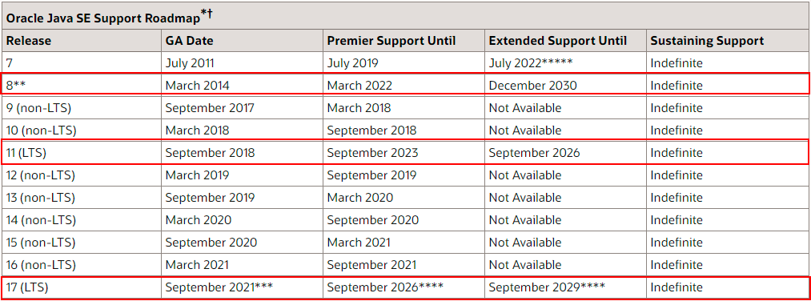

# The Feature JDK12-JDK17

## 介绍
JDK 17 是自JDK11后的一个长期支持版本（LTS）



Java 17 将是继 Java 8 以来最重要的长期支持（LTS）版本，是 Java 社区八年努力的成果。Spring 6.x 和 Spring Boot 3.x 最低支持的就是 Java 17。
学习JDK12到17的新特性是非常有必要的，本文主要介绍JDK12到17的API改动，对JVM及编译器底层优化忽略，如需获取全部新特性详情，可以前往Oracle官方文档查看

* [https://openjdk.org/projects/jdk/12/](https://openjdk.org/projects/jdk/12/)
* [https://openjdk.org/projects/jdk/13/](https://openjdk.org/projects/jdk/13/)
* [https://openjdk.org/projects/jdk/14/](https://openjdk.org/projects/jdk/14/)
* [https://openjdk.org/projects/jdk/15/](https://openjdk.org/projects/jdk/15/)
* [https://openjdk.org/projects/jdk/16/](https://openjdk.org/projects/jdk/16/)
* [https://openjdk.org/projects/jdk/17/](https://openjdk.org/projects/jdk/17/)


---
## JDK12

### 数字格式化工具NumberFormat

NumberFormat 新增了对复杂的数字进行格式化的支持

```java
public class NumberFormatUtil {


    public static void main(String[] args) throws ParseException {

        NumberFormat fmt = NumberFormat.getCompactNumberInstance(Locale.US, NumberFormat.Style.SHORT);
        String result = fmt.format(1000);
        System.out.println(result);
        //1K
        Number n1 = fmt.parse("1K");
        System.out.println(n1);
        //1000

        NumberFormat cnFmt = NumberFormat.getCompactNumberInstance(Locale.CHINA, NumberFormat.Style.LONG);
        String cnResult = cnFmt.format(1000);
        System.out.println(cnResult);
        //1,000
        Number c1 = cnFmt.parse("1000,00");
        System.out.println(c1);
        //1000

        NumberFormat usNumber = NumberFormat.getCurrencyInstance();
        Currency currency = usNumber.getCurrency();
        System.out.println(currency);
        //USD
        //因为本人当前系统环境是US，故输出USD，而非CNY


        String p2 = usNumber.format(10010);
        System.out.println(p2);
        //$10,010.00
        Number n2 = usNumber.parse("$10,010.00");
        System.out.println(n2);
        //10010
        //如果是国内环境则使用￥10,010.00转换

        //创建一个默认的通用格式
        NumberFormat numberFormat = NumberFormat.getInstance();
        DecimalFormat numberDecimalFormat;
        //捕捉异常，以防强制类型转换出错
        try {
            //强制转换成DecimalFormat
            numberDecimalFormat = (DecimalFormat) numberFormat;
            //保留小数点后面三位，不足的补零,前面整数部分 每隔四位 ，用 “,” 符合隔开
            numberDecimalFormat.applyPattern("#,####.000");
            //设置舍入模式 为DOWN,否则默认的是HALF_EVEN
            numberDecimalFormat.setRoundingMode(RoundingMode.DOWN);
            //设置 要格式化的数 是正数的时候。前面加前缀
            numberDecimalFormat.setPositivePrefix("Prefix  ");
            System.out.println("正数前缀  "+numberDecimalFormat.format(123456.7891));
            //设置 要格式化的数 是正数的时候。后面加后缀
            numberDecimalFormat.setPositiveSuffix("  Suffix");
            System.out.println("正数后缀  "+numberDecimalFormat.format(123456.7891));
            //设置整数部分的最大位数
            numberDecimalFormat.setMaximumIntegerDigits(3);
            System.out.println("整数最大位数 "+numberDecimalFormat.format(123456.7891));
            //设置整数部分最小位数
            numberDecimalFormat.setMinimumIntegerDigits(10);
            System.out.println("整数最小位数 "+numberDecimalFormat.format(123456.7891));
            //设置小数部分的最大位数
            numberDecimalFormat.setMaximumFractionDigits(2);
            System.out.println("小数部分最大位数 "+numberDecimalFormat.format(123.4));
            //设置小数部分的最小位数
            numberDecimalFormat.setMinimumFractionDigits(6);
            System.out.println("小数部分最小位数 "+numberDecimalFormat.format(123.4));
        }catch (Exception e){
            e.printStackTrace();
        }


    }

}
```


### String增强

```java
public class StrUtil {
    public static void main(String[] args) {

        //transform() 方法可以用来转变指定字符串。
        String result = "foo".transform(input -> input + " bar");
        System.out.println(result); // foo bar

        //indent() 方法可以实现字符串缩进。
        String text = "Java";
        // 缩进 4 格
        text = text.indent(4);
        System.out.println(text);
        text = text.indent(-10);
        System.out.println(text);

        //        Java
        //Java
    }

}
```

### File增强

mismatch() 方法用于比较两个文件，并返回第一个不匹配字符的位置，如果文件相同则返回 -1L。

```
public class FileUtil {
    public static void main(String[] args) throws IOException {
        Path filePath3 = Files.createTempFile("file3", ".txt");
        Path filePath4 = Files.createTempFile("file4", ".txt");
        Files.writeString(filePath3, "Java 12 Article\n66");
        Files.writeString(filePath4, "Java 12 Article\n667");

        long mismatch = Files.mismatch(filePath3, filePath4);
        System.out.println(mismatch);


//        String fileAPath = "C:/Users/MAO/Desktop/A.txt";
//        String fileBPath = "C:/Users/MAO/Desktop/B.txt";
        List<String> fileALines = Files.lines(filePath3)
                .collect(Collectors.toList());
        List<String> fileBLines = Files.lines(filePath4)
                .collect(Collectors.toList());
        // 文件A中不在文件B中的行
        List<String> uniqueLinesInFileA = fileALines.stream()
                .filter(line -> !fileBLines.contains(line))
                .collect(Collectors.toList());
        // 文件B中不在文件A中的行
        List<String> uniqueLinesInFileB = fileBLines.stream()
                .filter(line -> !fileALines.contains(line))
                .collect(Collectors.toList());
        System.out.println("Lines in file A that are not in file B:");
        uniqueLinesInFileA.forEach(System.out::println);
        System.out.println("Lines in file B that are not in file A:");
        uniqueLinesInFileB.forEach(System.out::println);
    }
}
```


### Switch增强

使用箭头表达式优化case语句，省略break关键字。
>- 该新特性为预览特性，与JDK14转正

```
switch (day) {
    case MONDAY, FRIDAY, SUNDAY -> System.out.println(6);
    case TUESDAY                -> System.out.println(7);
    case THURSDAY, SATURDAY     -> System.out.println(8);
    case WEDNESDAY              -> System.out.println(9);
}
```

### instanceof 模式匹配

instanceof 可以在判断是否属于具体的类型同时完成转换。
>- 该新特性为预览特性，于JDK16转正

```
//before JDK12
Object obj = "我是字符串";
if(obj instanceof String){
   String str = (String) obj;
  System.out.println(str);
}


//JDK12 & after JDK12
Object obj = "我是字符串";
if(obj instanceof String str){
  System.out.println(str);
}
```
### JVM优化

* 新增Shenandoah GC， 主要目标是 99.9% 的暂停小于 10ms，暂停与堆大小无关等
* G1 GC优化
---
## JDK13

### FileSystems 

FileSystems 类中添加了以下三种新方法，以便更容易地使用将文件内容视为文件系统的文件系统提供程序：

* newFileSystem(Path)
* newFileSystem(Path, Map<String, ?>)
* newFileSystem(Path, Map<String, ?>, ClassLoader)

```
public class FileSystemUtil {

    public static void main(String[] args) {

        FileSystem fileSystem = FileSystems.getDefault();
        Iterable<FileStore> iterable = fileSystem.getFileStores();
        for(FileStore fileStore: iterable){
            System.out.println(fileStore);
        }

        System.out.println();


        File file = new File("D://////\\\\\\/testFile\\\\///////\\file.txt");
        if (file.exists()){
            System.out.println(file.getName());
        }
    }

}
```

### 文本块

解决 Java 定义多行字符串时只能通过换行转义或者换行连接符来变通支持的问题，引入三重双引号来定义多行文本。
Java 13 支持两个 """ 符号中间的任何内容都会被解释为字符串的一部分，包括换行符。

>- 该新特性为预览特性，于JDK15转正
```java
public class FileSystemUtil {

    public static void main(String[] args) {
        
        //before JDK13
        String jsonOld ="{\n" +
                "   \"name\":\"mkyong\",\n" +
                "   \"age\":38\n" +
                "}\n";
        
        //JDK13
        String jsonNew = """
                {
                    "name":"mkyong",
                    "age":38
                }
                """;

        //before JDK13
        String query = "SELECT `EMP_ID`, `LAST_NAME` FROM `EMPLOYEE_TB`\n" +
                "WHERE `CITY` = 'INDIANAPOLIS'\n" +
                "ORDER BY `EMP_ID`, `LAST_NAME`;\n";


        //JDK13
        String query = """
                SELECT `EMP_ID`, `LAST_NAME` FROM `EMPLOYEE_TB`
                WHERE `CITY` = 'INDIANAPOLIS'
                ORDER BY `EMP_ID`, `LAST_NAME`;
                """;
        
        

    }

}        
```

### String增强

String 类新增加了 3 个新的方法来操作文本块：
* formatted(Object... args)：它类似于 String.format()方法。添加它是为了支持文本块的格式设置。
* stripIndent()：用于去除文本块中每一行开头和结尾的空格。
* translateEscapes()：转义序列如 “\\t” 转换为 “\t”

### Switch增强 

* Switch 表达式中就多了一个关键字用于跳出 Switch 块的关键字 yield，主要用于返回一个值
* yield和 return 的区别在于：return 会直接跳出当前循环或者方法，而 yield 只会跳出当前 Switch 块，同时在使用 yield 时，需要有 default 条件

>- 该新特性为预览特性，于JDK14转正

```java
private static String descLanguage(String name) {
    return switch (name) {
        case "Java": yield "object-oriented, platform independent and secured";
        case "Ruby": yield "a programmer's best friend";
        default: yield name +" is a good language";
    };
}
```

## JDK14

### NullPointerException空指针异常定位
在空指针异常中获取更为详细的调用信息，更快的定位和解决问题。

```
public class NullPointUtil {
    public static void main(String[] args) {
        Map<String, String> map = new HashMap();
        System.out.println(map.get("test").toLowerCase());
        //Exception in thread "main" java.lang.NullPointerException: Cannot invoke "String.toLowerCase()" because the return value of "java.util.Map.get(Object)" is null
	    //at org.example.version.jdk14.NullPointUtil.main(NullPointUtil.java:9)
    }
}
```


### record 关键字

record 关键字可以简化 数据类（一个 Java 类一旦实例化就不能再修改）的定义方式，使用 record 代替 class 定义的类，
只需要声明属性，就可以在获得属性的访问方法，以及 toString()，hashCode(), equals()方法。
类似于使用 class 定义类，同时使用了 lombok 插件，并打上了@Getter,@ToString,@EqualsAndHashCode注解.

>- 该新特性为预览特性，于JDK17转正

```
public class RecordUtil {

    //这里用record声明一个内部类
    record Rectangle(float length, float width) { }

    public static void main(String[] args) {

        Rectangle rectangle = new Rectangle(1f, 2f);
        System.out.println(rectangle.toString());

    }
}
```


### 文本块增强

引入转义字符
* \ : 表示行尾，不引入换行符
* \s：表示单个空格

>- 该新特性为预览特性，于JDK15转正

```
String str = "凡心所向，素履所往，生如逆旅，一苇以航。";

String str2 = """
        凡心所向，素履所往， \
        生如逆旅，一苇以航。""";
System.out.println(str2);// 凡心所向，素履所往， 生如逆旅，一苇以航。
String text = """
        java
        c++\sphp
        """;
System.out.println(text);
//输出：
java
c++ php
```

## JDK15

### EdDSA(数字签名算法)

新加入了一个安全性和性能都更强的基于 Edwards-Curve Digital Signature Algorithm （EdDSA）实现的数字签名算法。

虽然其性能优于现有的 ECDSA 实现，不过，它并不会完全取代 JDK 中现有的椭圆曲线数字签名算法( ECDSA)。

```
public class DsaUtil {
    public static void main(String[] args) throws NoSuchAlgorithmException, SignatureException, InvalidKeyException {
        testEdDSA("test");
        testECDSA("test");
    }
    private static void testEdDSA(String msg) throws NoSuchAlgorithmException, InvalidKeyException, SignatureException {
        // 获取明文字节数组
        byte[] plaintext = msg.getBytes(StandardCharsets.UTF_8);
        // 根据椭圆曲线 Ed25519 生成公私钥
        KeyPairGenerator kpg = KeyPairGenerator.getInstance("Ed25519");
        KeyPair kp = kpg.generateKeyPair();
        // 指定签名算法 Ed25519
        Signature sig = Signature.getInstance("Ed25519");
        // 传入私钥
        sig.initSign(kp.getPrivate());
        // 传入明文
        sig.update(plaintext);
        // 签名
        byte[] s = sig.sign();
        // 对签名结果做Base64编码
        String signStr = Base64.getEncoder().encodeToString(s);
        System.out.println(signStr);

        // 指定签名算法 Ed25519
        Signature verifier = Signature.getInstance("Ed25519");
        // 传入公钥
        verifier.initVerify(kp.getPublic());
        // 传入明文
        verifier.update(plaintext);
        // 验签
        boolean signVerify = verifier.verify(s);
        System.out.println(signVerify);
    }

    private static void testECDSA(String msg) throws NoSuchAlgorithmException, InvalidKeyException, SignatureException {
        // 明文
        byte[] plaintext = msg.getBytes(StandardCharsets.UTF_8);
        // 使用椭圆曲线 EC 生成公私钥
        KeyPairGenerator kpg = KeyPairGenerator.getInstance("EC");
        KeyPair kp = kpg.generateKeyPair();
        // 指定签名算法 SHA256withECDSA
        Signature sig = Signature.getInstance("SHA256withECDSA");
        // 传入私钥
        sig.initSign(kp.getPrivate());
        // 传入明文
        sig.update(plaintext);
        // 签名
        byte[] s = sig.sign();
        // 对签名做Base64编码
        String signStr = Base64.getEncoder().encodeToString(s);
        System.out.println(signStr);

        // 指定签名算法 SHA256withECDSA
        Signature verifier = Signature.getInstance("SHA256withECDSA");
        // 传入公钥
        verifier.initVerify(kp.getPublic());
        // 传入明文
        verifier.update(plaintext);
        // 验签
        boolean signVerify = verifier.verify(s);
        System.out.println(signVerify);
    }
}
```

### 密封类（Sealed Classes）

没有密封类之前，在 Java 中如果想让一个类不能被继承和修改，我们可以使用final 关键字对类进行修饰。不过，这种方式不太灵活，直接把一个类的继承和修改渠道给堵死了。

密封类可以对继承或者实现它们的类进行限制，这样这个类就只能被指定的类继承。

>- 该新特性为预览特性，于JDK17转正

```java

//限制只能被Employee继承
public abstract sealed class Person permits Employee {
    abstract int getSomething();
}

//另外，任何扩展密封类的类本身都必须声明为 sealed、non-sealed 或 final。
public final class Employee extends Person{
    @Override
    int getSomething() {
        return 0;
    }
}
```

## JDK16

### 值类型使用警告

原始类型的包装类（比如：java.lang.Integer、java.lang.Double）其构造函数上都已经标记有@Deprecated(since="9", forRemoval = true)注解，
这就意味着其构造函数在将来会被删除，不应该在程序中继续使用诸如new Integer()；
否则编译期将会产生'Integer(int)' is deprecated and marked for removal 警告；


## JDK17

### 增强的伪随机数生成器
Java 17 为伪随机数生成器 （pseudorandom number generator，PRNG，又称为确定性随机位生成器）增加了新的接口类型和实现，使得开发者更容易在应用程序中互换使用各种 PRNG 算法。

```
RandomGeneratorFactory<RandomGenerator> l128X256MixRandom = RandomGeneratorFactory.of("L128X256MixRandom");
// 使用时间戳作为随机数种子
RandomGenerator randomGenerator = l128X256MixRandom.create(System.currentTimeMillis());
// 生成随机数
randomGenerator.nextInt(10);
```

### switch 的类型匹配

正如 instanceof 一样， switch 也紧跟着增加了类型匹配自动转换功能。
>- 此特性为预览特性

```
// Old code
static String formatter(Object o) {
    String formatted = "unknown";
    if (o instanceof Integer i) {
        formatted = String.format("int %d", i);
    } else if (o instanceof Long l) {
        formatted = String.format("long %d", l);
    } else if (o instanceof Double d) {
        formatted = String.format("double %f", d);
    } else if (o instanceof String s) {
        formatted = String.format("String %s", s);
    }
    return formatted;
}

// New code
static String formatterPatternSwitch(Object o) {
    return switch (o) {
        case Integer i -> String.format("int %d", i);
        case Long l    -> String.format("long %d", l);
        case Double d  -> String.format("double %f", d);
        case String s  -> String.format("String %s", s);
        default        -> o.toString();
    };
}

```


## 参考

文章参考来源
* [https://openjdk.org/projects/jdk/](https://openjdk.org/projects/jdk/)
* [https://github.com/Snailclimb/JavaGuide](https://github.com/Snailclimb/JavaGuide)

