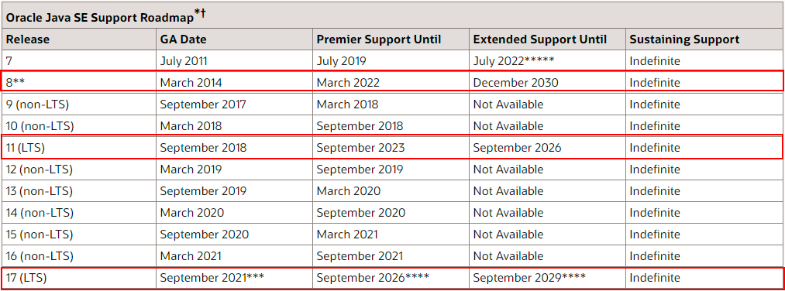
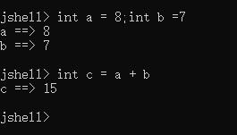

# JDK 9 到 11 的特性介绍

## 简介

JDK 8 是2014发布的LTS版本，直至今日仍被java开发广泛使用，但是在JDK19已经发行的今天（2022），我们也不应该固守己见，应该尝试去了解其他JDK版本，本文主要介绍JDK9到JDK11的特性。



-----------


## JDK9

Java 9 发行于2017年，Java 9 主要特性包括有 Java 平台模块系统的引入、集合、Stream 流等。

### 模块化系统Module

模块化作为JDK 9 的一个重要的新特性，可以看作是一组唯一命名、可重用的包、资源和模块描述文件（module-info.java）的集合  

按范围区分是 project > jar > module > package > class, interface  

模块化可通过 **exports** 和 **requires**  关键词来控制包的使用范围，进而达到减少jar包代码量和提高安全性的目的


使用方法：
必须将此文件命名为**module-info.java**并将其放在模块的根文件夹中。与其他Java源文件一样，模块文件被编译到模块中module-info类使
idea(JDK 9+环境下)可直接右键模块 new -> module-info.java  

现有common模块，项目结构如下： 
 
	- util	 
		- MyFailUtils.java 
	- failutil  
		- MyUtils.java
	- module-info.java

module-info.java代码如下：
``` java
module common {
	
	//暴露util package
    exports util;
	
    //exports failutil;
}
```


现有service模块，项目结构如下

	- main.java
	- module-info.java

main.java代码如下：
``` java
//提示 Package 'failutil' is declared in module 'common', which does not export it to module 'service'
//使用module模块即可控制package的使用权限，以提高安全性
import failutil.MyFailUtils;

import util.MyUtils;

public class main {
    public static void main(String[] args) {
        System.out.println(MyUtils.say());
		
		//error
        System.out.println(MyFailUtils.say());
    }
}
```

module-info.java代码如下：
``` java
module service {
    requires common;
}
```


JDK9 Module 和 Maven Module 区别
> java9模块和Maven的模型之间的区别在于，Maven管理整个jar的依赖性，并专注于整体。JDK9模块化管理是指jar中模块的外部公开内容和外部依赖模块，更关注细节。

-------

### 快速创建不可变集合  of()

增加了List.of()、Set.of()、Map.of() 和 Map.ofEntries()等工厂方法来创建**不可变集合**

``` java
//In JDK 8
List<Object> oldList = new ArrayList<>();
oldList.add(8);
oldList.add("This old list");
System.out.println("oldList" + oldList); //[8, This old list]

//In JDK9+
List<Object> newList = List.of(9,"This new list");
System.out.println("newList" + newList); //[9, This new list]
```

-------

### try-with-resources 增强
将创建资源的操作写在try()的括号中，那就不需要在finally中编写关闭资源的操作了，减少代码开发量，让代码变得更加美观

``` java
//In JDK 8
BufferedReader br = new BufferedReader(new FileReader(path));
try {
    return br.readLine();
} 
finally {
    if (br != null) 
		br.close();
}

//In JDK9+
try (BufferedReader br = new BufferedReader(new FileReader(path))) {
    return br.readLine();
}
```

-------

### G1垃圾收集器
JDK 9 中，使用G1作为默认的垃圾收集器  

G1(Garbage-First)作为继CMS之后新一代面向服务器的垃圾收集器，它已经不再严格按照之前老年代和新生代的划分来进行垃圾收集，即它是一个老年代和新生代共用的垃圾收集器。

G1更多是在多处理器(或多核)以及大内存的机器上发挥优势，在满足指定GC停顿时间要求的同时，还具备高吞吐量的能力。


G1的相关参数与说明如下：


|参数	|	介绍|
|--	|--	|
|	-XX:+UseG1GC	|开启使用G1垃圾收集器|
|	-XX:ParallelGCThreads	|	指定GC工作的线程数量	|
|	-XX:G1HeapRegionSize	|	指定分区大小(1MB~32MB，且必须是2的N次幂)，默认将整堆划分为2048个分区	|
|-XX:MaxGCPauseMillis	|目标暂停(STW)时间(默认200ms)
|-XX:G1NewSizePercent	|新生代内存初始空间(默认整堆5%，值配置整数，比如5，默认就是百分比)
|-XX:G1MaxNewSizePercent	|新生代内存最大空间(最大60%，值配置整数)
|-XX:TargetSurvivorRatio	|Survivor区的填充容量(默认50%)，Survivor区域里的一批对象(年龄1+年龄2+年龄n的多个年龄对象)总和超过了Survivor区域的50%，此时就会把年龄n(含)以上的对象都放入老年代
|-XX:MaxTenuringThreshold	|最大年龄阈值(默认15)
|-XX:InitiatingHeapOccupancyPercent	|老年代占用空间达到整堆内存阈值(默认45%)，则执行新生代和老年代的混合收集(MixedGC)，比如堆默认有2048个region，如果有接近1000个region都是老年代的region，则可能就要触发MixedGC了
|-XX:G1MixedGCLiveThresholdPercent	|默认85%，Region中的存活对象低于这个值时才会回收该Region，如果超过这个值，存活对象过多，回收的的意义不大
|-XX:G1MixedGCCountTarget	|在一次回收过程中指定做几次筛选回收(默认8次)，在最后一个筛选回收阶段可以回收一会，然后暂停回收，恢复系统运行，一会再开始回收，这样可以让系统不至于单次停顿时间过长。
|-XX:G1HeapWastePercent	|默认5%，一旦空闲出来的Region数量达到了堆内存的5%，此时就会立即停止混合回收

-------

### JShell实时交互工具

在 JShell 中可以直接输入表达式并查看其执行结果。  

降低JAVA学习门槛，快速测试JDK简单api  



-------

### String 存储结构优化
String 一直是用 char[] 存储。在 Java 9 之后，String 的实现改用 byte[] 数组存储字符串，节省了空间。

-------

### 接口私有方法
从Java 9开始，我们可以在Interface接口中添加private的私有方法和私有静态方法。这些私有方法将改善接口内部的代码可重用性。

例如，如果需要两个默认方法来共享代码，则私有接口方法将允许它们共享代码，但不将该私有方法暴露给它的实现类调用

-------

## JDK 10
Java 10 发布于 2018 年 3 月 20 日，最知名的特性应该是 var 关键字（局部变量类型推断）的引入了，其他还有垃圾收集器改善、GC 改进、性能提升、线程管控等一批新特性。

### 局部变量类型推断(var)

``` java
var id = 0;
var codefx = new URL("https://mp.weixin.qq.com/");
var list = new ArrayList<>();
var list = List.of(1, 2, 3);
var map = new HashMap<String, String>();
var p = Paths.of("src/test/java/Java9FeaturesTest.java");
var numbers = List.of("a", "b", "c");
for (var n : list)
    System.out.print(n+ " ");
var count=null; //❌编译不通过，不能声明为 null
var r = () -> Math.random();//❌编译不通过,不能声明为 Lambda表达式
var array = {1,2,3};//❌编译不通过,不能声明数组
```

-------

### 集合复制方法copy()
List，Set，Map 提供了静态方法copyOf()返回入参集合的一个不可变拷贝。

```
List<Object> newList = List.copyOf(oldList);
```

-------


### Optional 增强
Optional 新增了orElseThrow()方法来在没有值时抛出指定的异常。

```
Optional.ofNullable(cache.getIfPresent(key))
        .orElseThrow(() -> new PrestoException(NOT_FOUND, "Missing entry found for key: " + key));

```

-------

## JDK11
Java 11  于 2018 年 9 月 25 日正式发布,这是据 Java 8 以后支持的首个长期版本(LTS),这也是JDK8之后大多数人采用的版本。

### HTTP Client 标准化
JDK 11 中对 Http Client API 进行了标准化，Http Client 几乎被完全重写，并且现在完全支持异步非阻塞。

```
var request = HttpRequest.newBuilder()
    .uri(URI.create("https://javastack.cn"))
    .GET()
    .build();
var client = HttpClient.newHttpClient();

// 同步
HttpResponse<String> response = client.send(request, HttpResponse.BodyHandlers.ofString());
System.out.println(response.body());

// 异步
client.sendAsync(request, HttpResponse.BodyHandlers.ofString())
    .thenApply(HttpResponse::body)
    .thenAccept(System.out::println);

```

-------

### String 增强
Java 11 增加了一系列的字符串处理方法：

```
//判断字符串是否为空
" ".isBlank();//true
//去除字符串首尾空格
" Java ".strip();// "Java"
//去除字符串首部空格
" Java ".stripLeading();   // "Java "
//去除字符串尾部空格
" Java ".stripTrailing();  // " Java"
//重复字符串多少次
"Java".repeat(3);             // "JavaJavaJava"
//返回由行终止符分隔的字符串集合。
"A\nB\nC".lines().count();    // 3
"A\nB\nC".lines().collect(Collectors.toList());`
```

-------

### 直接启动java文件
允许直接使用java解释器执行Java源代码,搭配jshell将是任何初学者学习该语言的绝佳工具集

```
C:\> java HelloWorld.java
Hello World!!!
```

-------

## 文章引用

> JavaGuide：[https://snailclimb.gitee.io/javaguide](https://snailclimb.gitee.io/javaguide)


