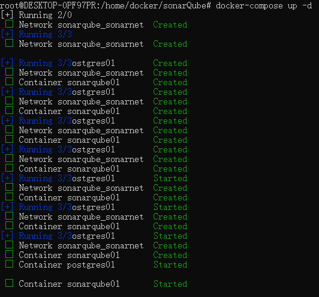
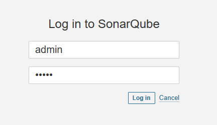
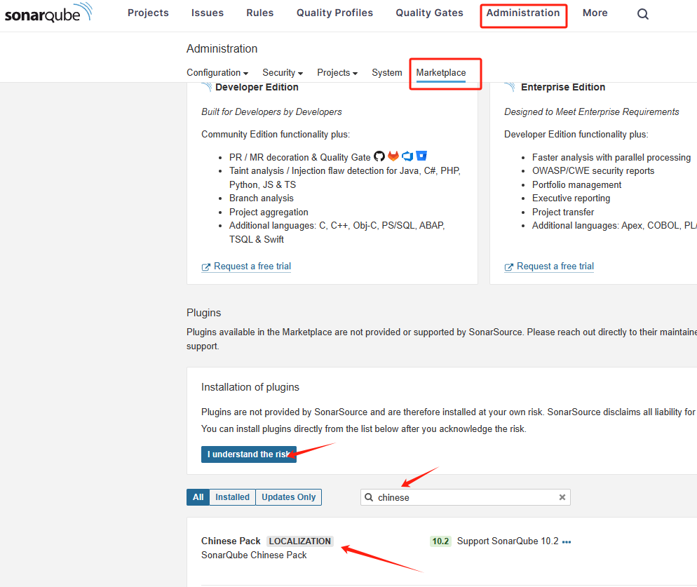
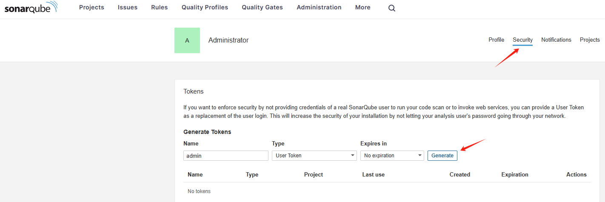
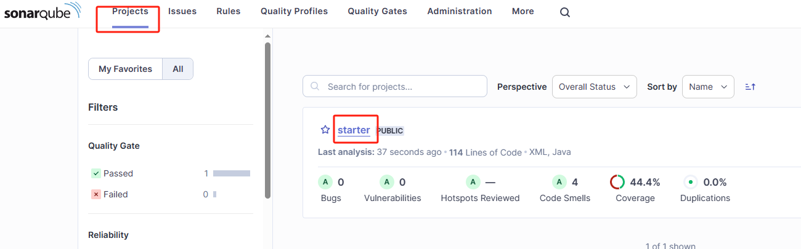
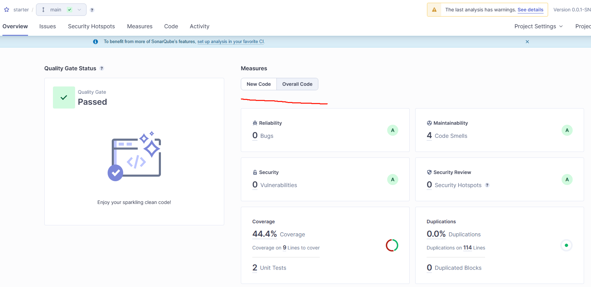

## 介绍

SonarQube provides the capability to not only show the health of an application but also to highlight issues newly introduced. 
With a Quality Gate in place, you can achieve Clean Code and therefore improve code quality systematically.

[点击进入官网](https://www.sonarsource.com/products/sonarqube/)

## 安装及使用

### Docker安装

1. 使用docker pull最新的sonarQube社区版，生产环境建议使用LTS版本,同时pull postgres数据库供sonar使用

```shell
docker pull sonarqube:10.2.1-community
docker pull postgres
```

2. 创建docker-compose.yml

```yml

version: '3.1'
services:
  db:
    image: postgres
    container_name: postgres01
    ports:
      - 5432:5432
    networks:
      - sonarnet
    environment:
      POSTGRES_USER: sonar
      POSTGRES_PASSWORD: sonar
  sonarqube:
    image: sonarqube:10.2.1-community
    container_name: sonarqube01
    depends_on: 
      - db
    ports:
      - 9000:9000
    networks:
      - sonarnet
    environment:
      SONAR_JDBC_URL: jdbc:postgresql://postgres01:5432/sonar
      SONAR_JDBC_USERNAME: sonar
      SONAR_JDBC_PASSWORD: sonar

networks:
  sonarnet:
    driver: bridge
```

3. 启动容器,访问9000端口进入SonarQube管理台，默认账户密码都是admin

```shell
docker-compose up -d
```





>- 如果日志提示max virtual memory areas vm.max_map_count [65530] is too low, increase to at least [262144]错误
>- 执行vi /etc/sysctl.conf，添加vm.max_map_count=262144，再执行sysctl -p启用配置即可

### 手动下载解压安装

1. 环境准备：JDK17（sonarQube 10.0以上仅支持JDK17以上），postgresql（sonarQube 10.0以上仅支持postgresql）

1. 官网下载对应安装包（工作环境建议下载LST版本），[点击下载](https://www.sonarsource.com/products/sonarqube/downloads/)

2. 于目标服务器解压，并修改配置文件 *./config/sonar.properties*

```properties
## sonar连接的数据库账号
sonar.jdbc.username=root
## sonar连接的数据库密码
sonar.jdbc.password=xxx
## sonar 连接的数据库驱动信息 (需要提前创建连接的数据库)
sonar.jdbc.url=jdbc:postgresql://postgres01:5432/sonar
## sonar.jdbc.url=jdbc:mysql://10.12.22.21:3306/sonar?useUnicode=true&characterEncoding=utf8&rewriteBatchedStatements=true&useConfigs=maxPerformance&useSSL=false
sonar.web.host=0.0.0.0
## sonar的网页 端口号
sonar.web.port=9000

```
>- 仅旧版本SonarQube支持Mysql数据库

3. 进入./bin/linux-x86-64,启动或停止服务

```
## 启动
./sonar.sh start  启动

## 停止
./sonar.sh stop  停止

## 重启
./sonar.sh restart 重启
```

4. 访问服务器IP+9000端口号（与配置文件port一致）进入SonarQube管理台，默认账户密码都是admin


## SonarQube使用

### 插件下载及token生产
1. 可以前往Administration的插件市场下载自己想要的插件



>- 初次下载需要点击同意风险须知才能继续下载，如图可搜索Chinese Pack下载中文语言插件。

2. 点击左上角进入我的账户选择security创建token供之后访问



### maven


1. 添加SonarQube配置信息到Maven配置文件settings.xml

```xml
<settings>
    <pluginGroups>
        <pluginGroup>org.sonarsource.scanner.maven</pluginGroup>
    </pluginGroups>
    <profiles>
        <profile>
            <id>sonar</id>
            <activation>
                <activeByDefault>true</activeByDefault>
            </activation>
            <properties>
                <!-- Optional URL to server. Default value is http://localhost:9000 -->
                <sonar.host.url>
                  http://myserver:9000
                </sonar.host.url>
                <!-- 不建议使用明文账号密码进行登陆，建议使用SonarQube生成的Token-->
<!--                <sonar.login>your_accountName</sonar.login>-->
<!--                <sonar.password>your_password</sonar.password>-->
                <!-- 如果有多个SonarQube环境，可由其他途径传入url和token-->
                <sonar.token>your_login_token</sonar.token>
            </properties>
        </profile>
     </profiles>
</settings>
```

2. pom.xml引用jacoco插件进行覆盖率统计

```xml
<?xml version="1.0" encoding="UTF-8"?>
<project xmlns="http://maven.apache.org/POM/4.0.0" xmlns:xsi="http://www.w3.org/2001/XMLSchema-instance"
         xsi:schemaLocation="http://maven.apache.org/POM/4.0.0 http://maven.apache.org/maven-v4_0_0.xsd">
    <modelVersion>4.0.0</modelVersion>

    <groupId>org.sonarqube</groupId>
    <artifactId>sonarscanner-maven-basic</artifactId>
    <version>1.0-SNAPSHOT</version>

    <name>Example of basic Maven project</name>

    <properties>
<!--        如果需要自定义jacoco报告日志位置，可使用如下属性-->
<!--        <sonar.coverage.jacoco.xmlReportPaths>-->
<!--            ../app-it/target/site/jacoco-aggregate/jacoco.xml-->
<!--        </sonar.coverage.jacoco.xmlReportPaths>-->
    </properties>

    <dependencies>
    
    </dependencies>

    <build>
        <pluginManagement>
            <plugins>
                <plugin>
                    <groupId>org.apache.maven.plugins</groupId>
                    <artifactId>maven-compiler-plugin</artifactId>
                    <version>3.8.1</version>
                </plugin>
                <plugin>
                    <groupId>org.sonarsource.scanner.maven</groupId>
                    <artifactId>sonar-maven-plugin</artifactId>
                    <version>3.9.1.2184</version>
                </plugin>
                <plugin>
                    <groupId>org.jacoco</groupId>
                    <artifactId>jacoco-maven-plugin</artifactId>
                    <version>0.8.6</version>
                </plugin>
            </plugins>
        </pluginManagement>
    </build>

    <profiles>
        <profile>
            <id>coverage</id>
            <activation>
                <activeByDefault>true</activeByDefault>
            </activation>
            <build>
                <plugins>
                    <plugin>
                        <groupId>org.jacoco</groupId>
                        <artifactId>jacoco-maven-plugin</artifactId>
                        <executions>
                            <execution>
                                <id>prepare-agent</id>
                                <goals>
                                    <goal>prepare-agent</goal>
                                </goals>
                            </execution>
                            <execution>
                                <id>report</id>
                                <goals>
                                    <goal>report</goal>
                                </goals>
                            </execution>
                        </executions>
                    </plugin>
                </plugins>
            </build>
        </profile>
    </profiles>
</project>
```

2. 执行分析过程

```shell
mvn clean verify sonar:sonar -Dsonar.token=myAuthenticationToken
```

3. SonarQube查看结果



从左至右依次代表：可用性质量问题，安全漏洞，需安全检查问题，可维护性问题，测试代码覆盖率，代码重复率



点击进入详情可浏览更多信息，其中New Code代表新添加的代码质量一览，Overall Code代表整体质量一览 
每个代码质量子项都有其阈值（以A到E分级），如果其中一个没达标，项目就会被标记为红色Failed


>- 多模块maven项目及gradle项目可参考SonarQube官方Demo，[https://github.com/SonarSource/sonar-scanning-examples/tree/master](https://github.com/SonarSource/sonar-scanning-examples/tree/master)

### Sonar-Scanner CLI

参考[官网](https://docs.sonarsource.com/sonarqube/latest/analyzing-source-code/scanners/sonarscanner/)或其他教程。

### Sonar-Scanner in Jenkins


#### 环境准备

1. Jenkins插件管理下载Sonar Scanner插件

2. Jenkins系统管理->全局设置->SonarQube Servers，输入SonarQube服务的访问地址和登陆Token

3. Jenkins系统管理->全局工具配置–>SonarScanner，配置SonarScanner信息（如jenkins服务器未安装可选择自动安装）


#### Job配置SonarQube扫描

1. job配置中，添加构建步骤->Execute Sonar Scanner，JDK选择Scanner依赖的jdk（Scanner 10.0以上依赖JDK17），Analysis properties配置sonar所需属性

```
sonar.projectname=${JOB_NAME}
sonar.projectname=${JOB_NAME}
sonar.source=./
sonar.java.binaries=target
```

#### Job启动

1. 查看Job日志
2. 查看SonarQube项目


