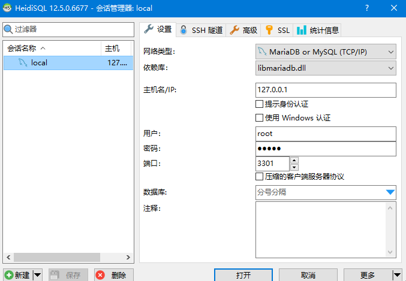

## introduction
Docker 提供一套开发工具、服务、可信内容和自动化，可单独或一起使用，以加速安全应用程序的交付.

* 快速启动新环境 

    使用 Docker 映像开发您自己独特的应用程序，并使用 Docker Compose 创建多个容器. 


* 与您现有的工具集成 

    Docker 可与所有开发工具配合使用，例如 VS Code、CircleCI 和 GitHub.


* 将应用程序容器化以实现一致性 

    在从本地 Kubernetes 到 AWS ECS、Azure ACI、Google GKE 等的任何环境中一致运行.

## install

//todo


## example

### mysql

1. 拉取指定版本（这里指定的是最新版8.1.0）

pull拉取最新版
```shell
docker pull mysql:latest
```

查看镜像情况
```shell
docker images

REPOSITORY               TAG              IMAGE ID       CREATED         SIZE
mysql                    latest           b2013ac99101   10 days ago     577MB
```


2. 启动mysql容器

```shell
docker run --name=mysql -itd -p 3301:3306 -e MYSQL_ROOT_PASSWORD=12345 -d mysql
```
> 参数说明：
> * --name：指定了容器的名称，方便之后进入容器的命令行。
> * -itd：其中，i是交互式操作，t是一个终端，d指的是在后台运行。
> * -p：指在本地生成一个端口，用来映射mysql的3306端口。
> * -e：设置环境变量。
> * MYSQL_ROOT_PASSWORD=root123456：指定了MySQL的root密码
> * -d mysql：指运行mysql镜像，设置容器在在后台一直运行

```
docker ps

CONTAINER ID   IMAGE                           COMMAND                   CREATED      STATUS             PORTS                                                      NAMES
1955f35a812f   mysql                           "docker-entrypoint.s…"   8 days ago   Up 16 minutes      33060/tcp, 0.0.0.0:3301->3306/tcp                          mysql
```

3. mysql配置修改

进入mysql容器

```shell
docker exec -it mysql-test /bin/bash
```

进入mysql服务（默认账户为root）
```
mysql -uroot -p

Enter password：12345
```

切换数据库
注意：默认应该就是这个，不切换也行，保险起见还是切换一下
```
use mysql;
```


给root用户分配远程访问权限
```
GRANT ALL PRIVILEGES ON *.* TO root@'%' WITH GRANT OPTION;
```

4. 使用HeidiSQL连接

注意host，端口，账号密码更改为自己实际设置的值




> 参数说明：
> * GRANT：赋权命令
> * ALL PRIVILEGES：当前用户的所有权限
> * ON：介词
> *  \*.\*：当前用户对所有数据库和表的相应操作权限
> * TO：介词
> * ‘root’@’%’：权限赋给root用户，所有ip都能连接
> * WITH GRANT OPTION：允许级联赋权


强制刷新权限

```
FLUSH PRIVILEGES;
```

### redis

1. 拉取最新版本

pull拉取最新版

```shell
docker pull redis:latest
```

查看镜像情况

```shell
docker images

REPOSITORY               TAG              IMAGE ID       CREATED         SIZE
redis                    latest           da63666bbe9a   11 days ago     138MB

```


2. 无配置文件启动容器

传入密码直接启动

```shell
docker run -p 6379:6379 --name redis01 -d redis:latest  --requirepass 12345
```
redis服务测试

```
docker exec -it redis01 /bin/bash

root@8b22eb447e52:/data# redis-cli
127.0.0.1:6379> auth 12345
OK
127.0.0.1:6379> set k1 v1
OK
127.0.0.1:6379> get k1
"v1"
```

> 如果只是学习用途，可以采用这种启动方法，无需传统配置文件，简单快捷。


3. 使用配置文件启动容器

于主机准备redis.conf配置文件,准备作为共享文件，这里路径是/home/docker/redis/config/redis.conf
配置详情：[redis.conf](https://github.com/FishBaII/study-note/blob/main/server/docker/file/redis.conf)

>   requirepass 12345 以12345作为密码
> 
>   bind 0.0.0.0 可以被任意ip远程连接，注意生产环境不能这样配置
> 
>   其余皆为默认的配置，看参考[Redis安装及使用](https://github.com/FishBaII/study-note/blob/main/redis/Redis.md)进行配置自定义 

启动容器命令
```shell
docker run --restart=always -p 6380:6379 --name redis02 -v /home/docker/redis/config/redis.conf:/etc/redis/redis.conf -v /home/docker/redis/data:/data -d redis:latest redis-server /etc/redis/redis.conf
```

> 参数说明：
> * --name：指定了容器的名称，方便之后进入容器的命令行。
> * --restart=always docker：启动或者重启时会自动启动该容器
> * -v：挂载主机目录,将主机redis.conf，data文件夹共享给容器
> * redis-server /etc/redis/redis.conf：以redis.conf作为配置文件启动redis服务
> * -d：设置容器在在后台一直运行


redis服务测试

```
docker exec -it redis02 /bin/bash

root@8b22eb447e52:/data# redis-cli
127.0.0.1:6379> auth 12345
OK
127.0.0.1:6379> set k1 v1
OK
127.0.0.1:6379> get k1
"v1"
```


## 参考引用

[https://zhuanlan.zhihu.com/p/5661317940](https://zhuanlan.zhihu.com/p/5661317940)
