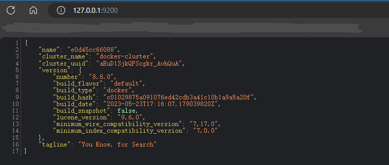
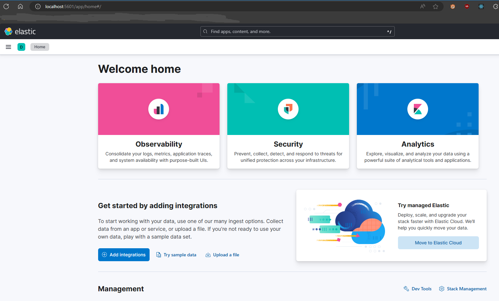
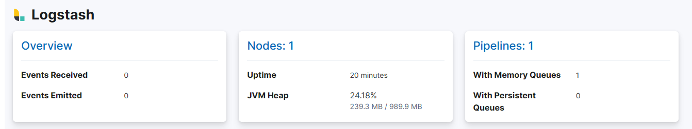
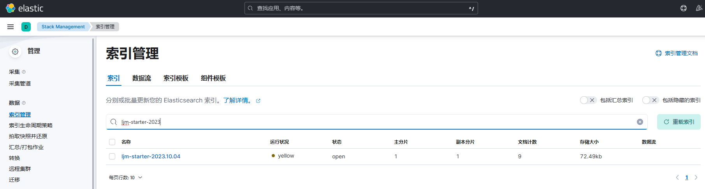
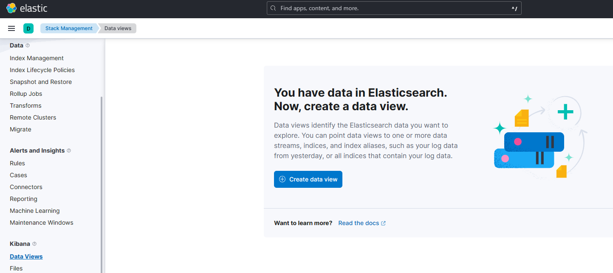
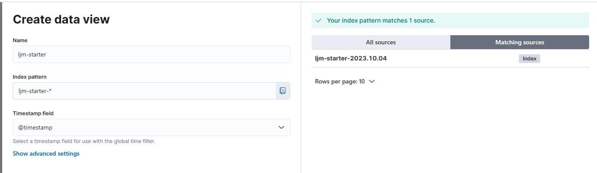
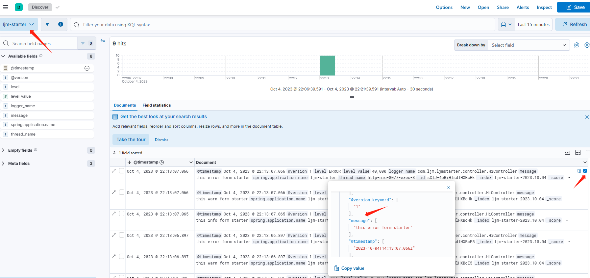

## introduction
Docker 提供一套开发工具、服务、可信内容和自动化，可单独或一起使用，以加速安全应用程序的交付.

* 快速启动新环境 

    使用 Docker 映像开发您自己独特的应用程序，并使用 Docker Compose 创建多个容器. 


* 与您现有的工具集成 

    Docker 可与所有开发工具配合使用，例如 VS Code、CircleCI 和 GitHub.


* 将应用程序容器化以实现一致性 

    在从本地 Kubernetes 到 AWS ECS、Azure ACI、Google GKE 等的任何环境中一致运行.

## install

//todo


## example

### mysql

1. 拉取指定版本（这里指定的是最新版8.1.0）

pull拉取最新版
```shell
docker pull mysql:latest
```

查看镜像情况
```shell
docker images

REPOSITORY               TAG              IMAGE ID       CREATED         SIZE
mysql                    latest           b2013ac99101   10 days ago     577MB
```


2. 启动mysql容器

```shell
docker run --name=mysql -itd -p 3301:3306 -e MYSQL_ROOT_PASSWORD=12345 -d mysql
```
> 参数说明：
> * --name：指定了容器的名称，方便之后进入容器的命令行。
> * -itd：其中，i是交互式操作，t是一个终端，d指的是在后台运行。
> * -p：指在本地生成一个端口，用来映射mysql的3306端口。
> * -e：设置环境变量。
> * MYSQL_ROOT_PASSWORD=root123456：指定了MySQL的root密码
> * -d mysql：指运行mysql镜像，设置容器在在后台一直运行

```
docker ps

CONTAINER ID   IMAGE                           COMMAND                   CREATED      STATUS             PORTS                                                      NAMES
1955f35a812f   mysql                           "docker-entrypoint.s…"   8 days ago   Up 16 minutes      33060/tcp, 0.0.0.0:3301->3306/tcp                          mysql
```

3. mysql配置修改

进入mysql容器

```shell
docker exec -it mysql-test /bin/bash
```

进入mysql服务（默认账户为root）
```
mysql -uroot -p

Enter password：12345
```

切换数据库
注意：默认应该就是这个，不切换也行，保险起见还是切换一下
```
use mysql;
```


给root用户分配远程访问权限
```
GRANT ALL PRIVILEGES ON *.* TO root@'%' WITH GRANT OPTION;
```

4. 使用HeidiSQL连接

注意host，端口，账号密码更改为自己实际设置的值


> 参数说明：
> * GRANT：赋权命令
> * ALL PRIVILEGES：当前用户的所有权限
> * ON：介词
> *  \*.\*：当前用户对所有数据库和表的相应操作权限
> * TO：介词
> * ‘root’@’%’：权限赋给root用户，所有ip都能连接
> * WITH GRANT OPTION：允许级联赋权


强制刷新权限

```
FLUSH PRIVILEGES;
```

### redis

1. 拉取最新版本

pull拉取最新版

```shell
docker pull redis:latest
```

查看镜像情况

```shell
docker images

REPOSITORY               TAG              IMAGE ID       CREATED         SIZE
redis                    latest           da63666bbe9a   11 days ago     138MB

```


2. 无配置文件启动容器

传入密码直接启动

```shell
docker run -p 6379:6379 --name redis01 -d redis:latest  --requirepass 12345
```
redis服务测试

```
docker exec -it redis01 /bin/bash

root@8b22eb447e52:/data# redis-cli
127.0.0.1:6379> auth 12345
OK
127.0.0.1:6379> set k1 v1
OK
127.0.0.1:6379> get k1
"v1"
```

> 如果只是学习用途，可以采用这种启动方法，无需传统配置文件，简单快捷。


3. 使用配置文件启动容器

于主机准备redis.conf配置文件,准备作为共享文件，这里路径是/home/docker/redis/config/redis.conf
配置详情：[redis.conf](https://github.com/FishBaII/study-note/blob/main/server/docker/file/redis.conf)

>   requirepass 12345 以12345作为密码
> 
>   bind 0.0.0.0 可以被任意ip远程连接，注意生产环境不能这样配置
> 
>   其余皆为默认的配置，看参考[Redis安装及使用](https://github.com/FishBaII/study-note/blob/main/redis/Redis.md)进行配置自定义 

启动容器命令
```shell
docker run --restart=always -p 6380:6379 --name redis02 -v /home/docker/redis/config/redis.conf:/etc/redis/redis.conf -v /home/docker/redis/data:/data -d redis:latest redis-server /etc/redis/redis.conf
```

> 参数说明：
> * --name：指定了容器的名称，方便之后进入容器的命令行。
> * --restart=always docker：启动或者重启时会自动启动该容器
> * -v：挂载主机目录,将主机redis.conf，data文件夹共享给容器
> * redis-server /etc/redis/redis.conf：以redis.conf作为配置文件启动redis服务
> * -d：设置容器在在后台一直运行


redis服务测试

```
docker exec -it redis02 /bin/bash

root@8b22eb447e52:/data# redis-cli
127.0.0.1:6379> auth 12345
OK
127.0.0.1:6379> set k1 v1
OK
127.0.0.1:6379> get k1
"v1"
```

### elasticsearch

1. 拉取镜像和创建网络容器

```shell
docker pull elasticsearch:8.8.0
```


```shell
docker network create es-net
```

> 这里创建网络容器es-net是kibana环境所需，可根据需求取舍。


2. 创建临时容器以获取配置文件


```
docker run -d --name elasticsearchTmp -p 9200:9200 -p 9300:9300 -e "discovery.type=single-node" elasticsearch:8.2.0
```

```shell
docker cp elasticsearchTmp:/usr/share/elasticsearch/config /home/docker/elasticsearch
```

> /home/docker/elasticsearch为作为es共享目录存放配置文件，插件及数据文件，需授予可读写权限chmod 777 /home/docker/elasticsearch/*
> 
> 复制配置文件完毕可对临时容器进行停止和删除docker rm -f elasticsearchTmp

3. 修改配置文件

修改从docker容器复制的配置文件，将安全相关的true改为false，否则es需通过ssl访问，生产环境可根据需求自定义。
```
cluster.name: "docker-cluster"
#可被所有ip远程访问
network.host: 0.0.0.0

#----------------------- BEGIN SECURITY AUTO CONFIGURATION -----------------------
#
# The following settings, TLS certificates, and keys have been automatically      
# generated to configure Elasticsearch security features on 03-10-2023 16:35:51
#
# --------------------------------------------------------------------------------

# Enable security features
xpack.security.enabled: false

xpack.security.enrollment.enabled: false

# Enable encryption for HTTP API client connections, such as Kibana, Logstash, and Agents
xpack.security.http.ssl:
  enabled: false
  keystore.path: certs/http.p12

# Enable encryption and mutual authentication between cluster nodes
xpack.security.transport.ssl:
  enabled: false
  verification_mode: certificate
  keystore.path: certs/transport.p12
  truststore.path: certs/transport.p12
#----------------------- END SECURITY AUTO CONFIGURATION -------------------------
```


4. 启动容器

```
docker run \
--name es02 \
--privileged=true \
--network es-net \
-p 9200:9200 \
-p 9300:9300 \
-v /home/docker/elasticsearch/config:/usr/share/elasticsearch/config \
-v /home/docker/elasticsearch/data:/usr/share/elasticsearch/data \
-v /home/docker/elasticsearch/plugins:/usr/share/elasticsearch/plugins \
-e ES_JAVA_OPTS="-Xms512m -Xmx1024m" \
-e "discovery.type=single-node" \
-idt elasticsearch:8.8.0
```
> 参数说明：
> * --privileged=true：扩大容器的权限解决挂载目录没有权限的问题,使其具有root权限
> * -v：使主机指定目录作为挂载目录，挂载目录需提前在主机创建（/home/docker/elasticsearch/data，/home/docker/elasticsearch/plugins）
> * --network es-net： 指定网络容器

访问http://{docker IP}:9200




### kibana


1. 拉取镜像和创建网络容器(需和es版本一致)

```shell
docker pull kibana:8.8.0
```

```shell
docker network create es-net
```

> 保证和es的network一致，如es已经创建和使用不需要重复创建。


2. 创建临时容器以获取配置文件


```
docker run --name kibanaTmp -p 5601:5601 -d kibana:8.8.0
```

```shell
docker cp kibanaTmp:/usr/share/kibana/config /home/docker/kibana
```

> /home/docker/kibana为作为es共享目录存放配置文件，需授予可读写权限chmod 777 /home/docker/kibana/*
>
> 复制配置文件完毕可对临时容器进行停止和删除docker rm -f kibanaTmp

3. 修改配置文件

修改es服务地址，可直接使用docker容器名称也可以使用ip地址
```
server.host: "0.0.0.0"
server.shutdownTimeout: "5s"
elasticsearch.hosts: [ "http://es02:9200" ]
monitoring.ui.container.elasticsearch.enabled: true
```

> es ip可以使用实际ip，容器name
> 
> 如果kibana启动提示主页显示‘Kibana server is not ready yet’,则需要去容器详情获取docker分配给es的ip
> 
> 使用命令 docker inspect es01  |grep IPAddress 获取并填入elasticsearch.hosts

4. 启动容器

```
docker run \
--name kibana02 \
--privileged=true \
--network es-net \
-p 5601:5601 \
-v /home/docker/kibana/config:/usr/share/kibana/config \
-d kibana:8.8.0
```
> 参数说明：
> * --privileged=true：扩大容器的权限解决挂载目录没有权限的问题,使其具有root权限
> * -v：使主机指定目录作为挂载目录，挂载目录需提前在主机创建（/home/docker/kibana）
> * --network es-net： 指定网络容器，需和es一致

访问kibana主页，地址http://{docker IP}:5601



> 本人部署过程曾出现访问kibana主页提示需要es的token认证，去es的bin目录产生token依旧提示失败
> 
> 查看日志后发现，kibana默认是去http://172.17.0.2:9200/访问es服务（docker的默认ip），故而提示认证失败，于是将es和kibana绑定为同一network容器es-net下则可以正常运行
> 如果没有遇到该问题也可跳过--network es-net参数运行


## logstash

1. 拉取镜像

```shell
docker pull logstash:8.8.0
```

2. 创建配置文件

与主机目录创建配置文件logstash.yml，logstash.conf作为共享文件

/home/docker/logstash/config/logstash.yml
```
http.host: "0.0.0.0"
xpack.monitoring.elasticsearch.hosts: [ "http://es01:9200" ]
```

/home/docker/logstash/pipeline/logstash.conf
```
input {
  tcp {
    mode => "server"
    host => "0.0.0.0"
    port => 5044
    codec => json_lines
  }
}
output {
  elasticsearch {
    hosts => "172.18.0.2:9200"
    index => "%{[spring.application.name]}-%{+YYYY.MM.dd}"
  }
}
```

> 需修改配置文件中的es服务地址

3. 启动容器

```shell
docker run -d --name logstash01 -m 1000M \
-p 5044:5044 -p 9600:9600 --privileged=true \
--network es-net \
-e ES_JAVA_OPTS="-Duser.timezone=Asia/Shanghai" \
-v /home/docker/logstash/pipeline/logstash.conf:/usr/share/logstash/pipeline/logstash.conf \
-v /home/docker/logstash/config/logstash.yml:/usr/share/logstash/config/logstash.yml \
logstash:8.8.0
```
> 此处只共享了logstash.conf和logstash.yml，可根据需求自行决定是否需要共享data目录及其他配置文件




4. SpringBoot集成Logstash

pom引入
```
		<!-- logstash -->
		<dependency>
			<groupId>net.logstash.logback</groupId>
			<artifactId>logstash-logback-encoder</artifactId>
			<version>7.2</version>
		</dependency>
```


logback-spring.xml
```
<?xml version="1.0" encoding="UTF-8"?>
<configuration>
    <include resource="org/springframework/boot/logging/logback/base.xml" />

    <!--输出到logstash的appender-->
    <appender name="logstash" class="net.logstash.logback.appender.LogstashTcpSocketAppender">
        <!--可以访问的logstash日志收集端口-->
        <destination>localhost:5044</destination>
        <encoder charset="UTF-8" class="net.logstash.logback.encoder.LogstashEncoder">
            <customFields>{"spring.application.name":"ljm-starter"}</customFields>
        </encoder>
    </appender>

    <root level="info">
        <appender-ref ref="logstash"/>
    </root>

</configuration>
```

启动项目打印日志，查看kibana(Management->Index Management)




5. kibana查看logstash

第一次查看需要先创建视图（Management->Stack Management->Data Views->Create data view）





创建完毕之后，即可前往Analytics->discover查看logstash日志



## 参考引用

[https://zhuanlan.zhihu.com/p/5661317940](https://zhuanlan.zhihu.com/p/5661317940)
