## 安装和启动

1. 使用docker安装和启动容器

```shell
docker pull jenkins/jenkins:2.414.3-lts
docker run -d -p 10240:8080 -p 10241:50000 \
-v /home/docker/jenkins/data:/var/jenkins_home \
--name jenkins01 --privileged=true \
jenkins/jenkins:2.414.3-lts
```
>- 这里将目标服务器的/home/docker/jenkins/data（需提前授予文件夹读写权限）目录映射为jenkins容器jenkins_home目录

2. 如日志输出如下则启动成功，其中*b286e4b59c1446358f07226d8a288127*为初始默认密码
```
...

2023-11-08 22:32:18 2023-11-08 14:32:18.225+0000 [id=34]        INFO    jenkins.InitReactorRunner$1#onAttained: Started initialization
2023-11-08 22:32:18 2023-11-08 14:32:18.397+0000 [id=52]        INFO    jenkins.InitReactorRunner$1#onAttained: Listed all plugins
2023-11-08 22:32:20 2023-11-08 14:32:20.848+0000 [id=41]        INFO    jenkins.InitReactorRunner$1#onAttained: Prepared all plugins
2023-11-08 22:32:20 2023-11-08 14:32:20.859+0000 [id=50]        INFO    jenkins.InitReactorRunner$1#onAttained: Started all plugins
2023-11-08 22:32:20 2023-11-08 14:32:20.866+0000 [id=38]        INFO    jenkins.InitReactorRunner$1#onAttained: Augmented all extensions
2023-11-08 22:32:21 2023-11-08 14:32:21.240+0000 [id=53]        INFO    h.p.b.g.GlobalTimeOutConfiguration#load: global timeout not set
2023-11-08 22:32:21 2023-11-08 14:32:21.431+0000 [id=32]        INFO    jenkins.InitReactorRunner$1#onAttained: System config loaded
2023-11-08 22:32:21 2023-11-08 14:32:21.431+0000 [id=33]        INFO    jenkins.InitReactorRunner$1#onAttained: System config adapted
2023-11-08 22:32:21 2023-11-08 14:32:21.437+0000 [id=52]        INFO    jenkins.InitReactorRunner$1#onAttained: Loaded all jobs
2023-11-08 22:32:21 2023-11-08 14:32:21.444+0000 [id=42]        INFO    jenkins.InitReactorRunner$1#onAttained: Configuration for all jobs updated
2023-11-08 22:32:21 2023-11-08 14:32:21.485+0000 [id=54]        INFO    jenkins.install.SetupWizard#init: 
2023-11-08 22:32:21 
2023-11-08 22:32:21 *************************************************************
2023-11-08 22:32:21 *************************************************************
2023-11-08 22:32:21 *************************************************************
2023-11-08 22:32:21 
2023-11-08 22:32:21 Jenkins initial setup is required. An admin user has been created and a password generated.
2023-11-08 22:32:21 Please use the following password to proceed to installation:
2023-11-08 22:32:21 
2023-11-08 22:32:21 b286e4b59c1446358f07226d8a288127
2023-11-08 22:32:21 
2023-11-08 22:32:21 This may also be found at: /var/jenkins_home/secrets/initialAdminPassword
2023-11-08 22:32:21 
2023-11-08 22:32:21 *************************************************************
2023-11-08 22:32:21 *************************************************************
2023-11-08 22:32:21 *************************************************************
2023-11-08 22:32:21 
2023-11-08 22:32:29 2023-11-08 14:32:29.329+0000 [id=54]        INFO    jenkins.InitReactorRunner$1#onAttained: Completed initialization
2023-11-08 22:32:29 2023-11-08 14:32:29.382+0000 [id=26]        INFO    hudson.lifecycle.Lifecycle#onReady: Jenkins is fully up and runni

...

```

3. 进入共享文件夹，修改jenkins默认下载源为国内镜像

```
cd /home/docker/jenkins/data
vi hudson.model.UpdateCenter.xml
```
将url修改为国内镜像https://mirrors.tuna.tsinghua.edu.cn/jenkins/updates/update-center.json，重启jenkins容器


3. 打开http://{host}:10240，进入jenkins管理页面，输入上一步获取的初始密码
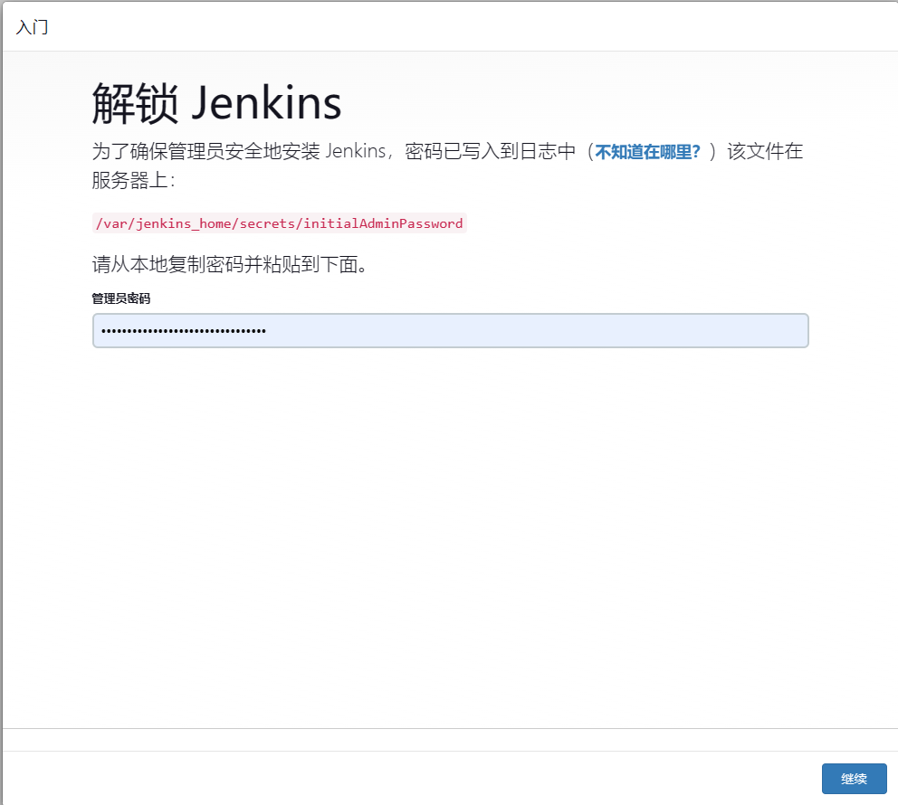

4. 下载插件

建议选自定义，如需要部分插件可之后进入设置另行下载。

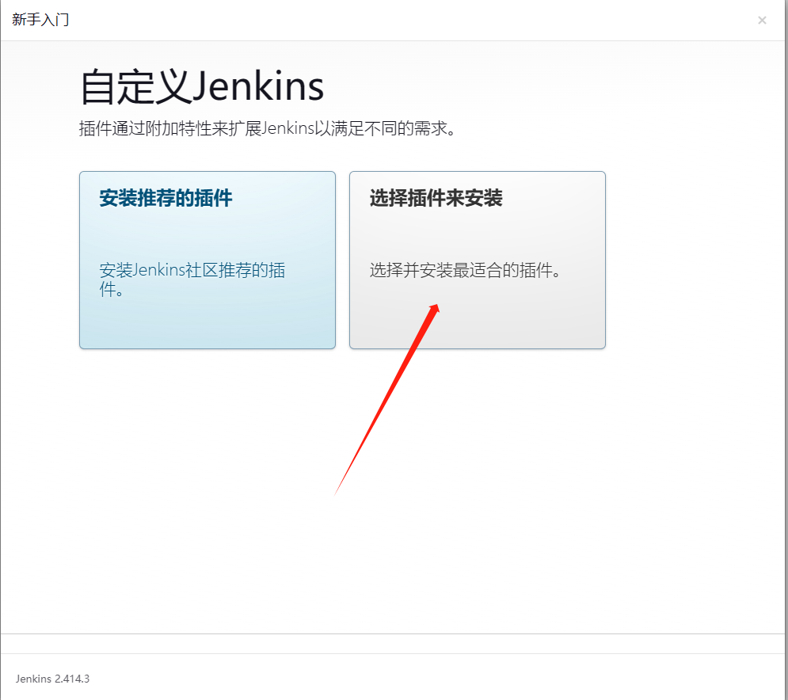

按照默认选项，点击安装进入下一步，如提示部分插件安装失败无需在意，仍然进行下一步

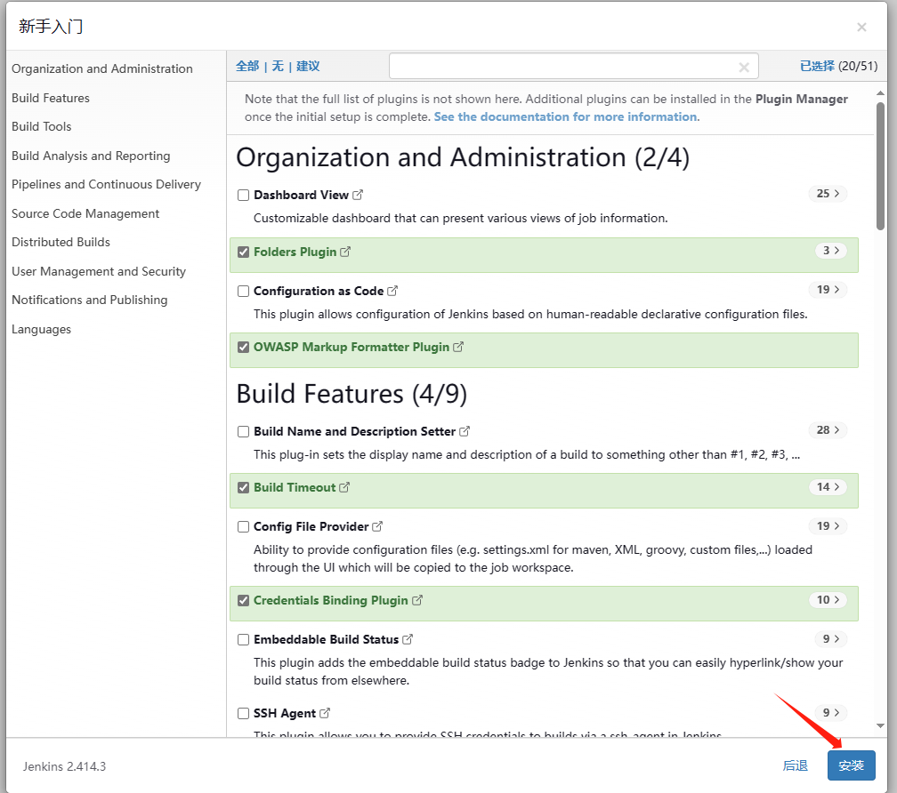

5. 创建自定义账户并完成初始化

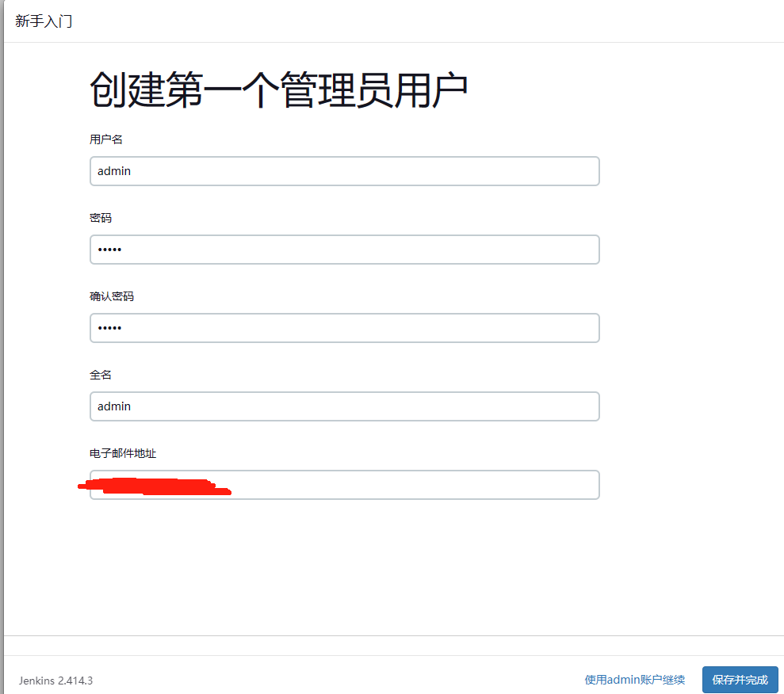

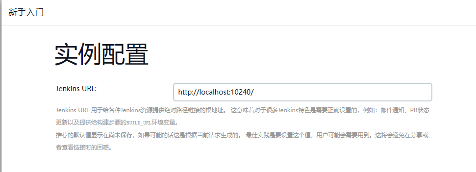

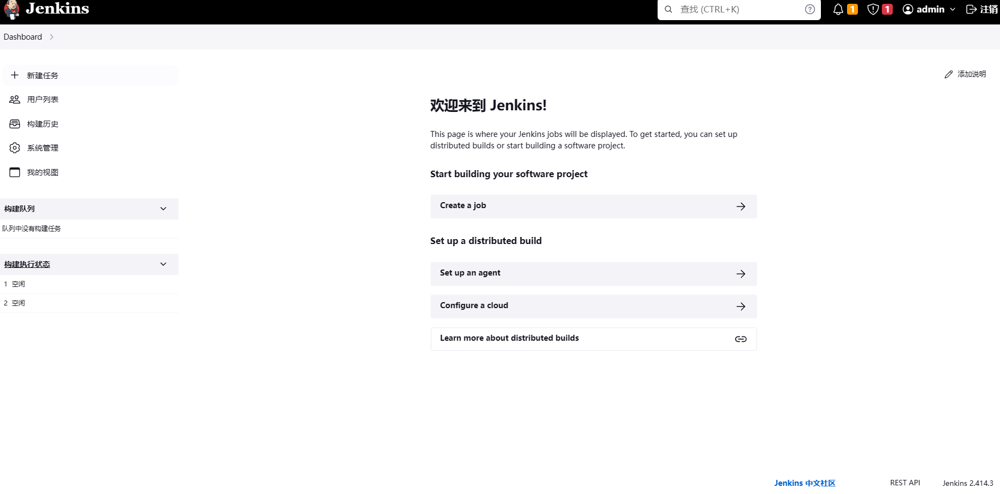

## 安装插件和环境准备

1. 进入jenkins manage（系统管理）菜单，进入manage plugins（插件管理），在available搜索并下载如下插件

* git parameter
* publish over ssh
>- 如提示下载失败，则应更新下载源为国内最新镜像

2. 配置jdk和maven环境

* 将jdk和maven安装在jenkins的共享目录（例：/home/docker/jenkins/data）

  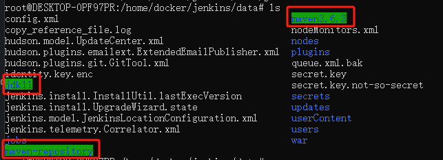

* 全局配置中声明jdk和maven路径,路径必须为容器路径

  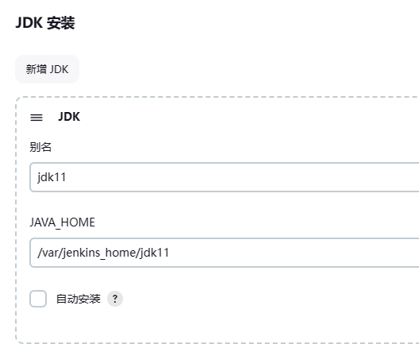
  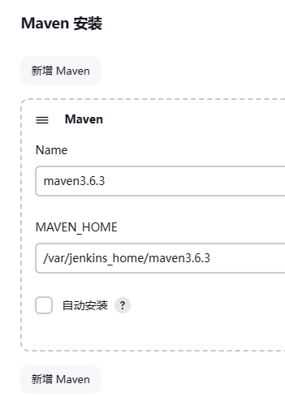

* 系统配置中配置目标服务器的连接信息(生产环境使用ssh key连接)

  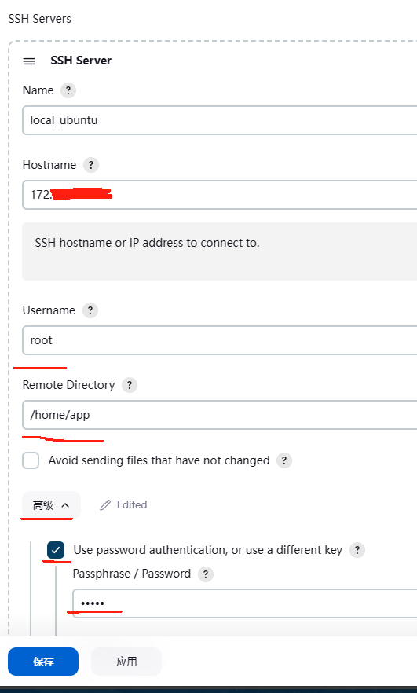
>- Remote Directory需提前创建，配置完可以先使用test Configuration测试连接性

## jenkins创建job

### 创建和启动job
1. 准备一个普通的SpringBoot-maven项目，上传到git，用于jenkins job  
   https://github.com/FishBaII/jenkins-starter.git


2. 创建job 

  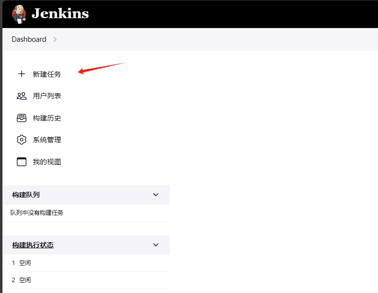 
  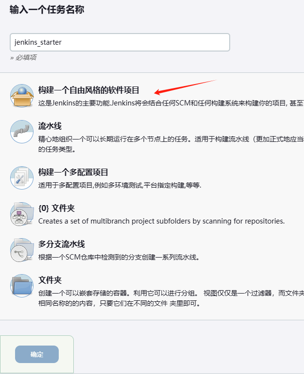 
  
3. 配置git, 需提前添加git访问凭证，其中凭证可以是账户密码，也可以是ssh私钥

  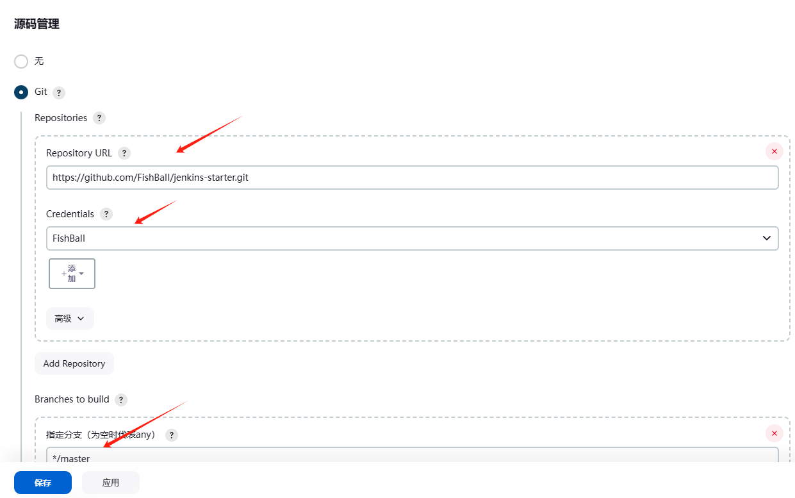

4. 保存后启动job, 查看控制台日志输出

  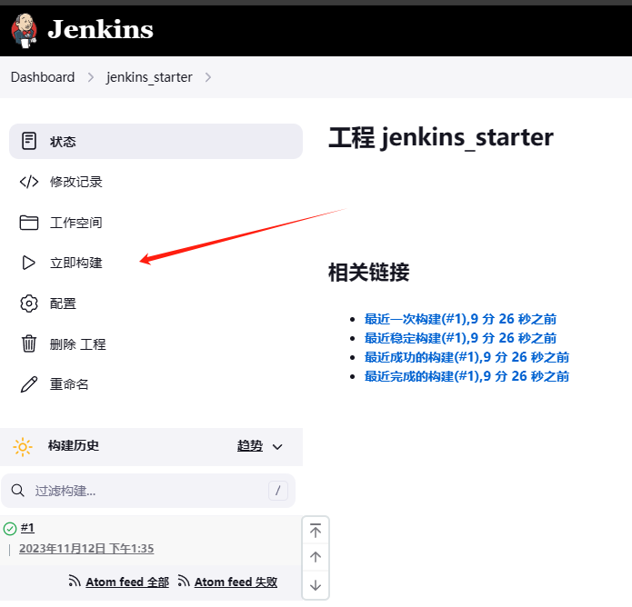
  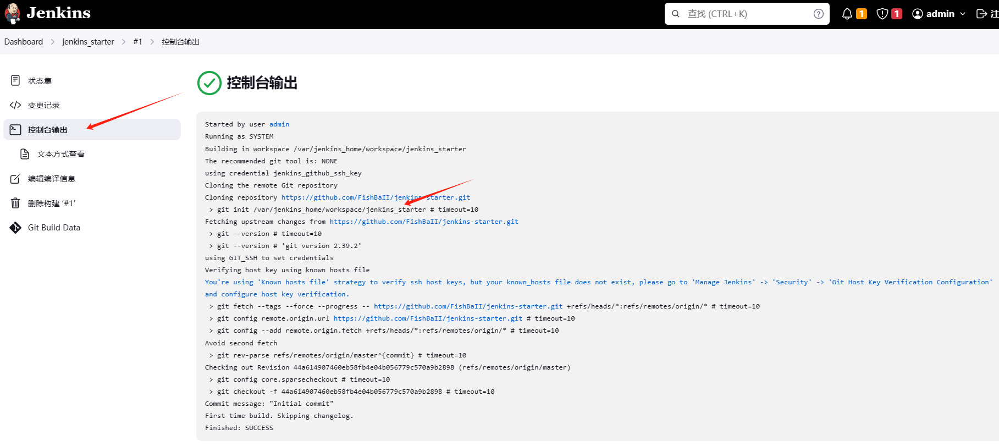
  
5. 容器中，可于上一步日志输出的workspace路径查看被jenkins检出的git项目

  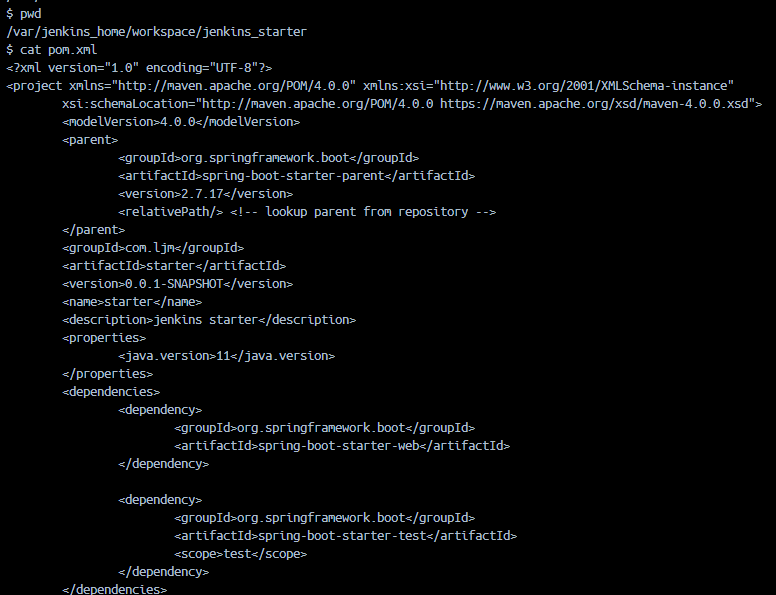


### 使用maven构建项目

1. 在上一步基础上，进入job设置，**Build**->**Invoke top-level Maven targets**


2. 选择之前配置的maven环境，输入需要maven执行的命令（如clean package -DskipTests），保存


3. 执行job，查看日志有执行我们自定义的maven命令日志，maven依赖下载日志等，以及workspace中项目target目录有打包完成的jar等

### 部署到服务器

1. 在上一步基础上，进入job设置，**Post-build Actions**->**Send build artifacts over SSH**


2. **Name**选择之前配置的目标服务器，Source files选择workspace的目标文件(target/*.jar)，Exec command输入部署后执行的命令，保存

3. 执行job，查看日志有使用SSH连接目标服务器的日志，部署后执行的命令日志等，可于目标服务器查看jar部署情况及服务启动情况

  
### 部署到docker

1. 在源项目处添加Dockerfile和docker-compose.yml

```
FROM daocloud.io/library/java:8u40-jdk
copy starter-0.0.1-SNAPSHOT.jar /usr/local/
WORKDIR /usr/local
CMD java -jar starter-0.0.1-SNAPSHOT.jar
```

```yml
version: '3.1'
services: 
  starter:
    build:
      context: ./
      dockerfile: Dockerfile
    image: starter:v0.0.1
    container_name: spring-starter
    ports:
      - 9090:9090

```

2. 进入job设置，**Post-build Actions**->**Send build artifacts over SSH**

3. **Name**选择之前配置的目标服务器，Source files选择workspace的目标文件(target/*.jar docker/*)，Exec command输入部署后执行的命令，保存

```
cd /usr/local/docker/app
mv ../target//*jar ./
docker-compose down
docker-compose up -d --build
//删除为none镜像
docker image prune -f
```

4. 执行job，查看job执行状态，进入目标docker服务器， docker ps查看容器是否成功启动