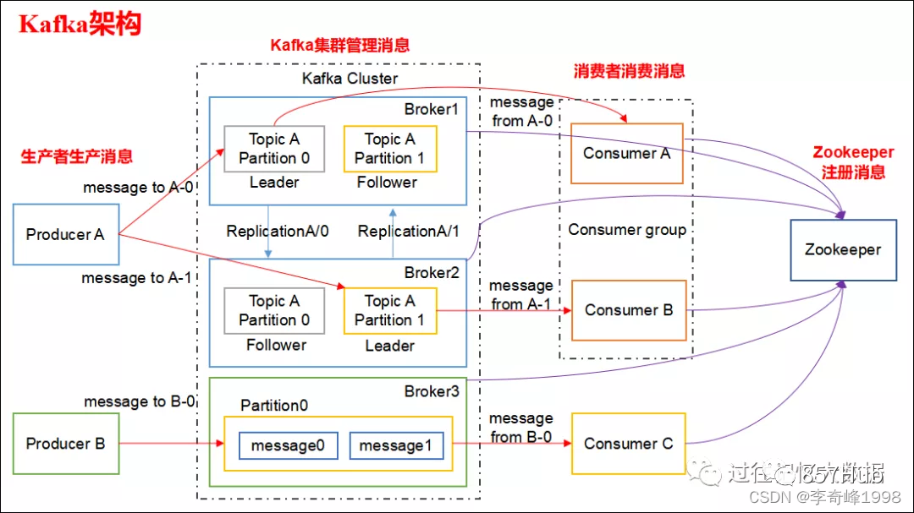

## 介绍

###  什么是Kafka
Kafka 是由 Linkedin 公司开发的，它是一个分布式的，支持多分区、多副本，基于 Zookeeper 的分布式消息流平台，它同时也是一款开源的基于发布订阅模式的消息引擎系统。

### Kafka 的基本术语
* 消息message：Kafka 中的数据单元被称为消息，也被称为记录，可以把它看作数据库表中某一行的记录。

* 批次batch：为了提高效率， 消息会分批次写入 Kafka，批次就代指的是一组消息。

* 主题topic：消息的种类称为主题,可以说一个主题代表了一类消息。相当于是对消息进行分类。主题就像是数据库中的表。

* 分区partition：主题可以被分为若干个分区，同一个主题中的分区可以不在一个机器上，有可能会部署在多个机器上，由此来实现 kafka 的伸缩性，单一主题中的分区有序，但是无法保证主题中所有的分区有序

* 生产者producer：向主题发布消息的客户端应用程序称为生产者，生产者用于持续不断的向某个主题发送消息。

* 消费者consumer：订阅主题消息的客户端程序称为消费者，消费者用于处理生产者产生的消息。

* 偏移量Consumer Offset：偏移量是一种元数据，它是一个不断递增的整数值，用来记录消费者发生重平衡时的位置，以便用来恢复数据。

* 缓存代理broker: 一个独立的 Kafka 服务器就被称为 broker，broker 接收来自生产者的消息，为消息设置偏移量，并提交消息到磁盘保存。

* broker 集群：broker 是集群 的组成部分，broker 集群由一个或多个 broker 组成，每个集群都有一个 broker 同时充当了集群控制器的角色（自动从集群的活跃成员中选举出来）。

* 副本Replica：Kafka 中消息的备份又叫做 副本，副本的数量是可以配置的，Kafka 定义了两类副本：领导者副本（Leader Replica） 和 追随者副本（Follower Replica），前者对外提供服务，后者只是被动跟随。

* 重平衡Rebalance：消费者组内某个消费者实例挂掉后，其他消费者实例自动重新分配订阅主题分区的过程。Rebalance 是 Kafka 消费者端实现高可用的重要手段。

### Kafka 的特性（设计原则）
* 高吞吐、低延迟：kakfa 最大的特点就是收发消息非常快，kafka 每秒可以处理几十万条消息，它的最低延迟只有几毫秒。
* 高伸缩性：每个主题(topic) 包含多个分区(partition)，主题中的分区可以分布在不同的主机(broker)中。
* 持久性、可靠性：Kafka 能够允许数据的持久化存储，消息被持久化到磁盘，并支持数据备份防止数据丢失，Kafka 底层的数据存储是基于 Zookeeper 存储的，Zookeeper 我们知道它的数据能够持久存储。
* 容错性：允许集群中的节点失败，某个节点宕机，Kafka 集群能够正常工作
* 高并发：支持数千个客户端同时读写

### Kafka 的使用场景
* 活动跟踪：Kafka 可以用来跟踪用户行为，比如我们经常回去淘宝购物，你打开淘宝的那一刻，你的登陆信息，登陆次数都会作为消息传输到 Kafka ，当你浏览购物的时候，你的浏览信息，你的搜索指数，你的购物爱好都会作为一个个消息传递给 Kafka ，这样就可以生成报告，可以做智能推荐，购买喜好等。
* 传递消息：Kafka 另外一个基本用途是传递消息，应用程序向用户发送通知就是通过传递消息来实现的，这些应用组件可以生成消息，而不需要关心消息的格式，也不需要关心消息是如何发送的。
* 度量指标：Kafka也经常用来记录运营监控数据。包括收集各种分布式应用的数据，生产各种操作的集中反馈，比如报警和报告。
* 日志记录：Kafka 的基本概念来源于提交日志，比如我们可以把数据库的更新发送到 Kafka 上，用来记录数据库的更新时间，通过kafka以统一接口服务的方式开放给各种consumer，例如hadoop、Hbase、Solr等。
* 流式处理：流式处理是有一个能够提供多种应用程序的领域。
* 限流削峰：Kafka 多用于互联网领域某一时刻请求特别多的情况下，可以把请求写入Kafka 中，避免直接请求后端程序导致服务崩溃。

### Kafka架构


发布订阅模型（Pub-Sub） 使用主题（Topic） 作为消息通信载体，类似于广播模式；
发布者发布一条消息，该消息通过主题传递给所有的订阅者，在一条消息广播之后才订阅的用户则是收不到该条消息的。
* Topic（主题） : Producer 将消息发送到特定的主题，Consumer 通过订阅特定的 Topic(主题) 来消费消息。
* Partition：分区，为了实现扩展性，一个topic可以分布在多个broker上，一个topic可以分为多个partition，每个partition都是一个有序的队列。partition中的每条消息都会被分配一个有序的id（offset）。kafka只保证同一个partition中的消息顺序，不保证一个topic的整体（多个partition之间）的顺序。生产者和消费者使用时可以指定topic中的具体partition。
* Consumer Group （CG）：若干个Consumer组成的集合。这是kafka用来实现一个topic消息的广播（发给所有的consumer）和单播（发给任意一个consumer）的手段。
一个topic可以有多个CG。topic的消息会复制（不是真的复制，是概念上的）到所有的CG，但**每个CG只会把消息发给该CG中的一个consumer**。如果需要实现广播，只要每个consumer有一个独立的CG就可以了。要实现单播只要所有的consumer在同一个CG。用CG还可以将consumer进行自由的分组而不需要多次发送消息到不同的topic。


## 安装与配置

### Docker环境安装

#### Zookeeper安装


```shell
docker pull wurstmeister/zookeeper
```

```shell
docker run \
--log-driver json-file \
--log-opt max-size=300m \
--log-opt max-file=2  \
--name zookeeper01 -p 2181:2181 \
-v /home/docker/zookeeper/data:/data \
-v /home/docker/zookeeper/datalog:/datalog \
-v /home/docker/zookeeper/logs:/logs \
-v /etc/localtime:/etc/localtime \
-d wurstmeister/zookeeper

```


An attempt was made to access a socket in a way forbidden by its access permissions.
```
netsh int ipv4 set dynamicport tcp start=9000 num=10000
```


#### kafka

```shell
docker pull wurstmeister/kafka:2.13-2.8.1
```


```shell
docker run --privileged=true \
--log-driver json-file \
--log-opt max-size=300m \
--log-opt max-file=2 \
--name kafka01 -p 9092:9092 \
--link zookeeper01 \
-e KAFKA_BROKER_ID=0 \
--env KAFKA_ZOOKEEPER_CONNECT=zookeeper01:2181 \
-e KAFKA_ADVERTISED_LISTENERS=PLAINTEXT://localhost:9092 \
-e KAFKA_LISTENERS=PLAINTEXT://0.0.0.0:9092 \
-e ALLOW_PLAINTEXT_LISTENER=yes \
-e KAFKA_HEAP_OPTS='-Xms512M -Xmx4G' \
-v /home/docker/kafka:/kafka  \
-d wurstmeister/kafka:2.13-2.8.1


```

```
docker run -d --name kafka01 -p 9092:9092 \
--link zookeeper01 \
--env KAFKA_ZOOKEEPER_CONNECT=zookeeper01:2181 \
--env KAFKA_ADVERTISED_HOST_NAME=localhost \
--env KAFKA_ADVERTISED_PORT=9092  \
--env KAFKA_LOG_DIRS=/kafka/logs \
-v /home/docker/kafka:/kafka  \
wurstmeister/kafka:2.13-2.8.1
```


```shell
#进入容器
docker exec -it kafka01 /bin/bash

#进入kafka bin目录
cd /opt/kafka_2.13-2.8.1/bin

# 启动Producer
sh kafka-console-producer.sh --broker-list localhost:9092 --topic test

```

```shell
#进入容器
docker exec -it kafka01 /bin/bash

#进入kafka bin目录
cd /opt/kafka_2.13-2.8.1/bin

# 启动Consumer
sh kafka-console-consumer.sh --bootstrap-server localhost:9092 --topic test

```

> 往生产者发送消息，消费者能接受到


## Spring应用

### 引用


https://cloud.tencent.com/developer/article/2005281