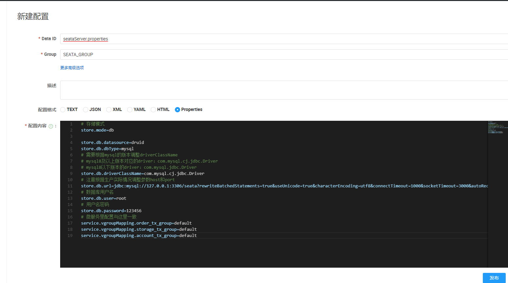

## seata官方文档

[链接](http://seata.io/en-us/docs/user/quickstart.html)

## seata 1.0.0的安装及使用
该例子使用seata 1.0.0进行开发，dynamicData作为多数据源框架，seata配置模式为file（seata还支持nacos、consul、apollo、zk、etcd3）
### 引入pom （seata 1.0.0）

```
		<dependency>
            <groupId>com.alibaba.cloud</groupId>
            <artifactId>spring-cloud-alibaba-seata</artifactId>
            <exclusions>
                <exclusion>
                    <groupId>io.seata</groupId>
                    <artifactId>seata-all</artifactId>
                </exclusion>
            </exclusions>
            <version>2.1.1.RELEASE</version>
        </dependency>
        <dependency>
            <groupId>io.seata</groupId>
            <artifactId>seata-all</artifactId>
            <version>1.0.0</version>
        </dependency>
```

<a name="a34fd744"></a>
### spring配置文件修改

```
spring: 
  cloud:
    alibaba:
      seata:
        tx-service-group: my_test_tx_group
  datasource: 
    dynamic: 
	  seata: true //dynamic需开启这个注解
```

<a name="66d7be37"></a>
## 配置文件file.conf和registry.conf
- 将这两个seata配置文件置于项目资源目录处（resources）
- 修改registry.conf的 type = "file" 可以根据需求修改为其他type（未测试），其他不用改
- 修改file.conf的35行 default.grouplist = "127.0.0.1:8091" ，根据seata运行的设备修改为127.0.0.1（本机运行）或是其他ip，其他不改

<a name="56c309dc"></a>
## 具体使用

```
	@Transactional
    @GlobalTransactional //第一次发起事务的需要这个注解
	public void order（）{
		buy（）；
		reduce（）；
	}
	
	@Transactional(propagation = Propagation.REQUIRES_NEW) //后面开启的需要这个属性
	public void buy(){}
	
	@Transactional(propagation = Propagation.REQUIRES_NEW) //后面开启的需要这个属性
	public void reduce(){}
```

<a name="e7c973f3"></a>
## 附件registry.conf和file.conf

<a name="registry.conf"></a>
### registry.conf

```
registry {
  # file 、nacos 、eureka、redis、zk、consul、etcd3、sofa
  type = "file"

  nacos {
    serverAddr = "localhost"
    namespace = "public"
    cluster = "default"
  }
  eureka {
    serviceUrl = "http://localhost:9101/eureka"
    application = "default"
    weight = "1"
  }
  redis {
    serverAddr = "localhost:6379"
    db = "0"
  }
  zk {
    cluster = "default"
    serverAddr = "127.0.0.1:2181"
    session.timeout = 6000
    connect.timeout = 2000
  }
  consul {
    cluster = "default"
    serverAddr = "127.0.0.1:8500"
  }
  etcd3 {
    cluster = "default"
    serverAddr = "http://localhost:2379"
  }
  sofa {
    serverAddr = "127.0.0.1:9603"
    application = "default"
    region = "DEFAULT_ZONE"
    datacenter = "DefaultDataCenter"
    cluster = "default"
    group = "SEATA_GROUP"
    addressWaitTime = "3000"
  }
  file {
    name = "file.conf"
  }
}

config {
  # file、nacos 、apollo、zk
  type = "file"

  nacos {
    serverAddr = "localhost"
    namespace = "public"
    cluster = "default"
  }
  apollo {
    app.id = "seata-server"
    apollo.meta = "http://192.168.1.204:8801"
  }
  zk {
    serverAddr = "127.0.0.1:2181"
    session.timeout = 6000
    connect.timeout = 2000
  }
  file {
    name = "file.conf"
  }
}
```

<a name="file.conf"></a>
### file.conf

```
transport {
  # tcp udt unix-domain-socket
  type = "TCP"
  #NIO NATIVE
  server = "NIO"
  #enable heartbeat
  heartbeat = true
  # the client batch send request enable
  enable-client-batch-send-request = true
  #thread factory for netty
  thread-factory {
    boss-thread-prefix = "NettyBoss"
    worker-thread-prefix = "NettyServerNIOWorker"
    server-executor-thread-prefix = "NettyServerBizHandler"
    share-boss-worker = false
    client-selector-thread-prefix = "NettyClientSelector"
    client-selector-thread-size = 1
    client-worker-thread-prefix = "NettyClientWorkerThread"
    # netty boss thread size,will not be used for UDT
    boss-thread-size = 1
    #auto default pin or 8
    worker-thread-size = 8
  }
  shutdown {
    # when destroy server, wait seconds
    wait = 3
  }
  serialization = "seata"
  compressor = "none"
}
service {
  #transaction service group mapping
  vgroup_mapping.my_test_tx_group = "default"
  #only support when registry.type=file, please don't set multiple addresses
  default.grouplist = "127.0.0.1:8091"
  #degrade, current not support
  enableDegrade = false
  #disable seata
  disableGlobalTransaction = false
}

client {
  rm {
    async.commit.buffer.limit = 10000
    lock {
      retry.internal = 10
      retry.times = 30
      retry.policy.branch-rollback-on-conflict = true
    }
    report.retry.count = 5
    table.meta.check.enable = false
    report.success.enable = true
  }
  tm {
    commit.retry.count = 5
    rollback.retry.count = 5
  }
  undo {
    data.validation = true
    log.serialization = "jackson"
    log.table = "undo_log"
  }
  log {
    exceptionRate = 100
  }
  support {
    # auto proxy the DataSource bean
    spring.datasource.autoproxy = false
  }
}
```

<a name="6ab67b20"></a>


## seata 1.5.2安装及使用
本例子采用seata 1.5.2，nacos 进行开发

### 安装及运行

1. 从官方github下载对应Released压缩包 [点此进入下载](https://github.com/seata/seata/releases)
2. 解压后，进入seata/bin目录，修改application.yml配置，可参考application.example.yml进行改动，主要修改内容为nacos注册中心信息

```
server:
  port: 7091

spring:
  application:
    name: seata-server

logging:
  config: classpath:logback-spring.xml
  file:
    path: ${user.home}/logs/seata
  extend:
    logstash-appender:
      destination: 127.0.0.1:4560
    kafka-appender:
      bootstrap-servers: 127.0.0.1:9092
      topic: logback_to_logstash

console:
  user:
    username: seata
    password: seata

seata:
  config:
    # support: nacos, consul, apollo, zk, etcd3
	# 声明seata配置方法为nacos并补充nacos信息
    type: nacos
    nacos:
	  //nacos地址
      server-addr: http://127.0.0.1:8848
      # namespace: 7392baed-d98b-48a4-8676-34e1b38eade6
	  //默认不填则为public，可自定义其他
      namespace:
	  //默认不填则为DEFAULT_GROUP，可自定义其他
      group: SEATA_GROUP
      username:
      password:
      ##if use MSE Nacos with auth, mutex with username/password attribute
      #access-key: ""
      #secret-key: ""
	  //nacos 配置名称
      data-id: seataServer.properties	
  registry:
    # support: nacos, eureka, redis, zk, consul, etcd3, sofa
	# 声明seata注册方法为nacos并补充nacos信息
    type: nacos
    nacos:
      application: seata-server
	  //nacos地址
      server-addr: http://127.0.0.1:8848
	  //默认不填则为DEFAULT_GROUP，可自定义其他
      group: SEATA_GROUP
      namespace:
      # namespace: 7392baed-d98b-48a4-8676-34e1b38eade6
      cluster: default
      username:
      password:
      ##if use MSE Nacos with auth, mutex with username/password attribute
      #access-key: ""
      #secret-key: ""
  store:
    # support: file 、 db 、 redis
    mode: file
#  server:
#    service-port: 8091 #If not configured, the default is '${server.port} + 1000'
  security:
    secretKey: SeataSecretKey0c382ef121d778043159209298fd40bf3850a017
    tokenValidityInMilliseconds: 1800000
    ignore:
      urls: /,/**/*.css,/**/*.js,/**/*.html,/**/*.map,/**/*.svg,/**/*.png,/**/*.ico,/console-fe/public/**,/api/v1/auth/login

```
3. 进入nacos管理台创建上一步声明的seata配置信息,补充你的数据源信息（seata官方只支持mysql，oracle，postgresql）



```
# 存储模式
store.mode=db
 
store.db.datasource=druid
store.db.dbType=mysql
# 需要根据mysql的版本调整driverClassName
# mysql8及以上版本对应的driver：com.mysql.cj.jdbc.Driver
# mysql8以下版本的driver：com.mysql.jdbc.Driver
store.db.driverClassName=com.mysql.cj.jdbc.Driver
# 注意根据生产实际情况调整参数host和port
store.db.url=jdbc:mysql://127.0.0.1:3306/seata?rewriteBatchedStatements=true&useUnicode=true&characterEncoding=utf8&connectTimeout=1000&socketTimeout=3000&autoReconnect=true&useSSL=false
# 数据库用户名
store.db.user=root
# 用户名密码
store.db.password=123456
# 微服务里配置与这里一致
service.vgroupMapping.order_tx_group=default
service.vgroupMapping.storage_tx_group=default
service.vgroupMapping.account_tx_group=default
```

4. 先启动nacos，再启动seata，会自动运行seata\script\server\db的sql脚本进行建表（mysql则运行mysql.sql）
5. 检查seata启动日志，检查nacos配置（进入配置列表->对应seata配置文件->更多，监听查询）无误则为启动成功


