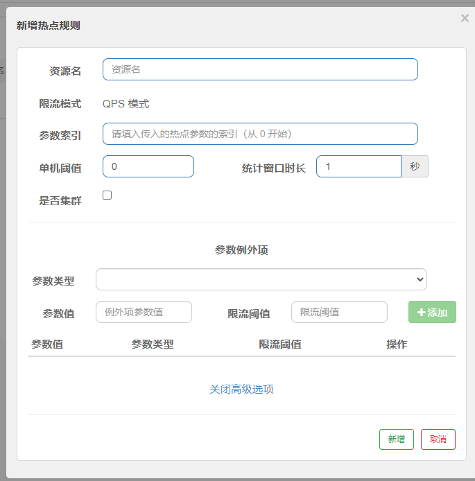

官网文档： [https://sentinelguard.io/zh-cn/docs/quick-start.html](https://sentinelguard.io/zh-cn/docs/quick-start.html)<br />官方Github：[https://github.com/alibaba/Sentinel](https://github.com/alibaba/Sentinel)

<a name="PmpC1"></a>
## 简介
随着微服务的流行，服务和服务之间的稳定性变得越来越重要。Sentinel 是面向分布式、多语言异构化服务架构的流量治理组件，主要以流量为切入点，从流量路由、流量控制、流量整形、熔断降级、系统自适应过载保护、热点流量防护等多个维度来帮助开发者保障微服务的稳定性。

<a name="BpTzK"></a>
## Sentinel 功能和设计理念
<a name="Gtpvm"></a>
### 流量控制
流量控制在网络传输中是一个常用的概念，它用于调整网络包的发送数据。然而，从系统稳定性角度考虑，在处理请求的速度上，也有非常多的讲究。任意时间到来的请求往往是随机不可控的，而系统的处理能力是有限的。我们需要根据系统的处理能力对流量进行控制。Sentinel 作为一个调配器，可以根据需要把随机的请求调整成合适的形状，如下图所示：<br /><br />流量控制有以下几个角度:

- 资源的调用关系，例如资源的调用链路，资源和资源之间的关系；
- 运行指标，例如 QPS、线程池、系统负载等；
- 控制的效果，例如直接限流、冷启动、排队等。

Sentinel 的设计理念是让您自由选择控制的角度，并进行灵活组合，从而达到想要的效果。
<a name="K0aK8"></a>
### 熔断降级
<a name="jnhlR"></a>
#### 什么是熔断降级
除了流量控制以外，降低调用链路中的不稳定资源也是 Sentinel 的使命之一。由于调用关系的复杂性，如果调用链路中的某个资源出现了不稳定，最终会导致请求发生堆积。这个问题和 [Hystrix](https://github.com/Netflix/Hystrix/wiki#what-problem-does-hystrix-solve) 里面描述的问题是一样的。<br /><br />Sentinel 和 Hystrix 的原则是一致的: 当调用链路中某个资源出现不稳定，例如，表现为 timeout，异常比例升高的时候，则对这个资源的调用进行限制，并让请求快速失败，避免影响到其它的资源，最终产生雪崩的效果。
<a name="DatkC"></a>
#### 熔断降级设计理念
在限制的手段上，Sentinel 和 Hystrix 采取了完全不一样的方法。<br />Hystrix 通过[线程池](https://github.com/Netflix/Hystrix/wiki/How-it-Works#benefits-of-thread-pools)的方式，来对依赖(在我们的概念中对应资源)进行了隔离。这样做的好处是资源和资源之间做到了最彻底的隔离。缺点是除了增加了线程切换的成本，还需要预先给各个资源做线程池大小的分配。<br />Sentinel 对这个问题采取了两种手段:

- 通过并发线程数进行限制

和资源池隔离的方法不同，Sentinel 通过限制资源并发线程的数量，来减少不稳定资源对其它资源的影响。这样不但没有线程切换的损耗，也不需要您预先分配线程池的大小。当某个资源出现不稳定的情况下，例如响应时间变长，对资源的直接影响就是会造成线程数的逐步堆积。当线程数在特定资源上堆积到一定的数量之后，对该资源的新请求就会被拒绝。堆积的线程完成任务后才开始继续接收请求。

- 通过响应时间对资源进行降级

除了对并发线程数进行控制以外，Sentinel 还可以通过响应时间来快速降级不稳定的资源。当依赖的资源出现响应时间过长后，所有对该资源的访问都会被直接拒绝，直到过了指定的时间窗口之后才重新恢复。
<a name="tfomn"></a>
### 系统负载保护
Sentinel 同时提供[系统维度的自适应保护能力](https://sentinelguard.io/zh-cn/docs/system-adaptive-protection.html)。防止雪崩，是系统防护中重要的一环。当系统负载较高的时候，如果还持续让请求进入，可能会导致系统崩溃，无法响应。在集群环境下，网络负载均衡会把本应这台机器承载的流量转发到其它的机器上去。如果这个时候其它的机器也处在一个边缘状态的时候，这个增加的流量就会导致这台机器也崩溃，最后导致整个集群不可用。<br />针对这个情况，Sentinel 提供了对应的保护机制，让系统的入口流量和系统的负载达到一个平衡，保证系统在能力范围之内处理最多的请求。


<a name="zBOP8"></a>
## 使用

<a name="VhGIq"></a>
### Sentinel管理台

1. 下载官方发行jar，[点击进入](https://github.com/alibaba/Sentinel/releases)
2. 使用命令启动`java -Dserver.port=8080 -Dcsp.sentinel.dashboard.server=localhost:8080 -Dproject.name=sentinel-dashboard -jar sentinel-dashboard.jar `（默认8080为端口号，可自定义）
3. 启动无误可访问ip:{端口号}进入sentinel管理台（如 [http://localhost:8080/](http://localhost:9090/) ）


### 服务端开发

1. 依赖引入

```xml
<dependency>
  <groupId>com.alibaba.cloud</groupId>
  <artifactId>spring-cloud-starter-alibaba-sentinel</artifactId>
</dependency>

```

2. 配置文件

```yaml
#仅展示sentinel相关配置，其余略
spring:
  application:
  	#自定义项目名称
    name: sentinel-service
  cloud:
    sentinel:
      transport:
        port: 8719
        #使用管理台定义的端口
        dashboard: localhost:8080
```

3. 测试接口

```java
@RestController
@RequestMapping("sentinel")
public class SentinelController {
    
    @GetMapping("success")
    public String saySuccess(){
        return "Success";
    }
    
}
```

4. 启动项目后，打开sentinel管理台


> sentinel管理台服务列表默认为懒加载，所以需访问至少一次该服务才能在sentinel管理台显示


<a name="PMDq8"></a>
## 流量控制

### Dashboard

资源名：API，例如 /success  
针对来源：流控针对的调用来源  
阈值类型： QPS（每秒请求数），线程数（同时访问API的线程数量，并发数）  
单机阈值：设置上一个的具体数量  
流控模式：直接，关联（当关联的资源达到阈值，限流自身），链路（只记录指定链路的流量，
指定资源从入口进来的流量，如果达到阈值进行限流）  
温控效果：快速失败， Warm Up（根据codeFactor值（默认为3），
从阈值/codeFactor，经过预热时长，才达到设置的QPS阈值），排队等待（请求等待返回，阈值类型必须为QPS）


### JAVA API

| **Field** | **说明** | **默认值** |
| --- | --- | --- |
| resource | 资源名，资源名是限流规则的作用对象 |  |
| count | 限流阈值 |  |
| grade | 限流阈值类型，QPS 或线程数模式 | QPS 模式 |
| limitApp | 流控针对的调用来源 | default，代表不区分调用来源 |
| strategy | 调用关系限流策略：直接、链路、关联 | 根据资源本身（直接） |
| controlBehavior | 流控效果（直接拒绝 / 排队等待 / 慢启动模式），不支持按调用关系限流 | 直接拒绝 |
| refResource | （策略为关联时启用）关联资源 |  |
| maxQueueingTimeMs | （流控效果为排队等待时启用）最大等待时间 |  |

测试接口
```
	//接口，如果被限流则返回指定处理器
    @GetMapping("/qps")
    @SentinelResource(value = "qps", blockHandler = "myBlockHandle")
    public String qpsTest(){
		
        return "QPS!";
		
    }
	
    @GetMapping("/relate")
    @SentinelResource(value = "relate", blockHandler = "myBlockHandler")
    public String relateTest() throws InterruptedException {

		Thread.sleep(10 * 1000);
        return "relate!";

    }
	
	
	//自定义处理器
    public String myBlockHandler(BlockException blockException){
		
        return "myBlockHandler";

    }

```

1. 创建限流规则：QPS，直接，直接失败


```

    private static void setFlowRuleManager(){

        List<FlowRule> rules = new ArrayList<>();
        FlowRule qpsRule = new FlowRule();
		//资源
        qpsRule.setResource("qps");
		//阈值类型
        qpsRule.setGrade(RuleConstant.FLOW_GRADE_QPS);
        //单机阈值
        qpsRule.setCount(2);
		//流控效果
        qpsRule.setControlBehavior(RuleConstant.CONTROL_BEHAVIOR_DEFAULT);
		//调用关系限流策略
		qpsRule.setStrategy(RuleConstant.STRATEGY_DIRECT);
        rules.add(qpsRule);
		//将规则载入sentinel服务中生效
        FlowRuleManager.loadRules(rules);
    }
```

>- 如果一秒内请求/qps超过2次则返回 “myBlockHandler”


2. 创建限流规则：QPS，关联，排队等待


```
	//比如对数据库同一个字段的读操作和写操作存在争抢
    private static void setFlowRuleManager(){

        List<FlowRule> rules = new ArrayList<>();
        FlowRule qpsRule = new FlowRule();
		//资源
        qpsRule.setResource("qps");
		//阈值类型
        qpsRule.setGrade(RuleConstant.FLOW_GRADE_THREAD);
        //单机阈值
        qpsRule.setCount(1);
		//流控效果
        qpsRule.setControlBehavior(RuleConstant.CONTROL_BEHAVIOR_DEFAULT);
		//调用关系限流策略
		qpsRule.setStrategy(RuleConstant.STRATEGY_RELATE);
		//设置关联的资源
		qpsRule.setRefResource("relate");
        rules.add(qpsRule);
		//将规则载入sentinel服务中生效
        FlowRuleManager.loadRules(rules);
    }
```

>- 如果访问/relate并发数大于或等于1，/qps则返回 “myBlockHandler”


## 热点数据

何为热点？热点即经常访问的数据。很多时候我们希望统计某个热点数据中访问频次最高的 Top K 数据，并对其访问进行限制。比如：

* 商品 ID 为参数，统计一段时间内最常购买的商品 ID 并进行限制
* 用户 ID 为参数，针对一段时间内频繁访问的用户 ID 进行限制

### Dashboard


资源名：API  
参数索引：参数在资源中的索引位置  
单机阈值：每秒可接受的请求上限  
统计窗口时长：

参数类型：指定‘参数值’的类型，仅支持基本类型和字符串类型，
参数值：‘参数索引’的参数达到‘参数值’，次数为‘限流阈值’时触发限流
限流阈值：每秒可接受的请求上限
>- 高级选项中，可以针对指定的参数值单独设置限流阈值，
- 不受前面单机阈值的限制。仅支持基本类型和字符串类型


### JAVA API

热点参数规则（ParamFlowRule）类似于流量控制规则（FlowRule）：

| **属性** | **说明** | **默认值** |
| --- | --- | --- |
| resource | 资源名，必填 |  |
| count | 限流阈值，必填 |  |
| grade | 限流模式 | QPS 模式 |
| durationInSec | 统计窗口时间长度（单位为秒），1.6.0 版本开始支持 | 1s |
| controlBehavior | 流控效果（支持快速失败和匀速排队模式），1.6.0 版本开始支持 | 快速失败 |
| maxQueueingTimeMs | 最大排队等待时长（仅在匀速排队模式生效），1.6.0 版本开始支持 | 0ms |
| paramIdx | 热点参数的索引，必填，对应 SphU.entry(xxx, args) 中的参数索引位置 |  |
| paramFlowItemList | 参数例外项，可以针对指定的参数值单独设置限流阈值，不受前面 count 阈值的限制。**仅支持基本类型和字符串类型** |  |
| clusterMode | 是否是集群参数流控规则 | false |
| clusterConfig | 集群流控相关配置 |  |

测试接口
```
@GetMapping("/hotkey")
@SentinelResource(value = "hotkey",blockHandler = "myBlockHandler1")
public String hotkeyTest(Integer goodId, String userType){
    return "goodId: " + goodId + " userType: " + userType;
}

//自定义BlockHandler
public String myBlockHandler1(Integer goodId, String userType, BlockException blockException){
    return "myBlockHandler";
}
```

1. 创建限流规则：QPS，第一个参数值如为10，阈值为2，否则阈值为4，限流处理默认为快速失败

```
//对特殊商品进行流控限制
    private static void setHotKeyRuleManager(){

        ParamFlowRule rule = new ParamFlowRule("hotkey")
                .setParamIdx(0)
                .setCount(4);
        // 针对 int 类型的参数 10，单独设置限流 QPS 阈值为 2，而不是全局的阈值 4.
        ParamFlowItem item = new ParamFlowItem().setObject(String.valueOf(10))
                .setClassType(Integer.class.getName())
                .setCount(2);
        rule.setParamFlowItemList(Collections.singletonList(item));

        ParamFlowRuleManager.loadRules(Collections.singletonList(rule));
	}
```
>- 访问/hotkey, qps超过4，返回自定义BlockHandler内容；如goodId为10，则qps超过2，返回自定义BlockHandler内容  


2. 创建限流规则：QPS，第二个参数值如为“vip”，阈值为50，否则阈值为4，限流处理默认为快速失败

```
//对vip用户放宽流控限制
    private static void setHotKeyRuleManager(){
		
        ParamFlowRule pRule = new ParamFlowRule("hotkey")
                .setParamIdx(1)
                .setCount(4);
        // 针对 参数值vip，单独设置限流 QPS 阈值为 50，而不是全局的阈值 4.
        ParamFlowItem item1 = new ParamFlowItem().setObject("vip")
                .setClassType(String.class.getName())
                .setCount(50);
        pRule.setParamFlowItemList(Collections.singletonList(item1));

        ParamFlowRuleManager.loadRules(Collections.singletonList(pRule));
	}
```
> 访问/hotkey, qps超过4，返回自定义BlockHandler内容；如userType为“vip”，则qps超过50，返回自定义BlockHandler内容  