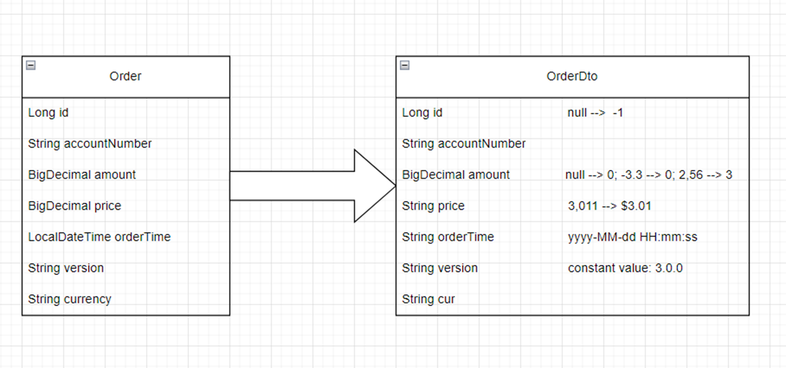
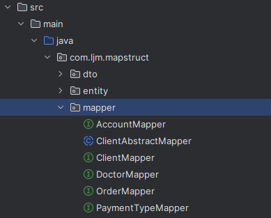
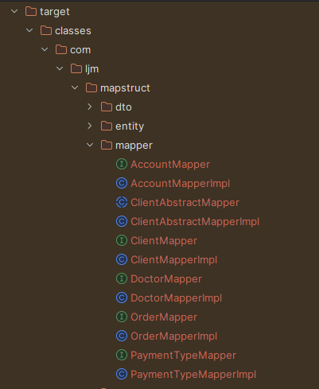

# MapStruct

MapStruct是一个代码生成器，它极大地简化了基于约定而非配置方法的Java bean类型之间映射的实现。
生成的映射代码使用简单的方法调用，因此快速、类型安全且易于理解。  

官方GitHub：[进入](https://github.com/mapstruct/mapstruct)  
官网：[进入](https://mapstruct.org/)  

## dto映射需求

将Order对象转换为OrderDto对象,其中有如下特殊规则：
* 如id值为null，赋值为-1
* amount值为null或小于0时赋值0，大于0时四舍五入为整数
* price为String类型并且格式为 $#.00
* orderTime为String类型并且格式为yyyy-MM-dd HH:mm:ss
* version为固定值3.0.0
* cur值为order对象中的的currency的值



Order类
```
public class Order {

    private Long id;

    private String accountNumber;

    private BigDecimal amount;

    private BigDecimal price;

    private LocalDateTime orderTime;

    private String version;

    private String currency;
    
    //ignore getter and setter
 }
```

OrderDto类
```
public class OrderDto {

    private Long id;

    private String accountNumber;

    private BigDecimal amount;

    private String price;

    private String orderTime;

    private String version;

    private String cur;
    
    //ignore getter and setter
 }
```


## 通常的做法
如需要完成如上述需求，通常做法是有以下几种，使用Getter、Setter方法，JSON映射转换，工具类如Spring BeanUtils、Apache copyProperties，第三方映射框架JMapper、Dozer等

### Getter和Setter
使用Order类基础的getter方法取值，并使用OrderDto类基础的Setter方法赋值，无需引入其他jar包，使用简单，性能好，但是需要大量编码而且易遗漏出错。
```
    @Test
    void simpleMapTest(){

        //create Order Object
        Order order = orderInit();

        OrderDto orderDto = new OrderDto();
        orderDto.setAccountNumber(order.getAccountNumber());
        orderDto.setCur(order.getCurrency());
        //set constant
        orderDto.setVersion("3.0.0");
        // 1.51 --> 2;  -2 --> 0; null --> 0
        orderDto.setAmount(halfUp(order.getAmount()));
        // 3.0111 --> $3.01
        if (order.getPrice() != null) {
            orderDto.setPrice(this.createDecimalFormat("$#.00").format(order.getPrice()));
        }

        if (order.getId() != null) {
            orderDto.setId(order.getId());
        } else {
            orderDto.setId(-1L);
        }

        if (order.getOrderTime() != null) {
            DateTimeFormatter df = DateTimeFormatter.ofPattern("yyyy-MM-dd HH:mm:ss");
            orderDto.setOrderTime(order.getOrderTime().format(df));
        }

        assertEquals("$3.01", orderDto.getPrice());
        assertEquals("1", orderDto.getAmount().toString());
        assertTrue(orderDto.getOrderTime() instanceof String);

    }
        

    private DecimalFormat createDecimalFormat(String numberFormat) {
        DecimalFormat df = new DecimalFormat(numberFormat);
        df.setParseBigDecimal(true);
        return df;
    }

    private BigDecimal halfUp(BigDecimal price){
        if(price == null || price.compareTo(BigDecimal.ZERO) < 0){
            return BigDecimal.ZERO;
        }
        return price.setScale(0, RoundingMode.HALF_UP);
    }
```

### 使用Spring BeanUtils

使用Spring BeanUtils工具类进行映射转换，过程简单，编码量少，但是只能转换相同类型并且名称相同的值，而且无法适用复杂规则
```
    @Test
    void springCopyPropertiesTest(){

        //create Order Object
        Order order = orderInit();
        OrderDto orderDto = new OrderDto();
        BeanUtils.copyProperties(order, orderDto, OrderDto.class);

        assertNull(orderDto.getOrderTime());
        assertNull(orderDto.getPrice());
        assertNull(orderDto.getCur());

    }
```

### 使用JSON转换

使用JSON工具类进行转换，过程简单，编码量少，只能名称相同的值，可以转换部分类型不同的值（但是格式无法自定义），无法适用复杂规则
```
    @Test
    void jsonMapTest(){

        Order order = orderInit();
        String jsonStr = JSON.toJSONString(order);
        OrderDto orderDto = JSON.parseObject(jsonStr, OrderDto.class);

        assertNull(orderDto.getCur());

    }
```
## MapStruct Start

### Maven

```
...
<properties>
    <org.mapstruct.version>1.5.5.Final</org.mapstruct.version>
</properties>
...
<dependencies>
    <dependency>
        <groupId>org.mapstruct</groupId>
        <artifactId>mapstruct</artifactId>
        <version>${org.mapstruct.version}</version>
    </dependency>
</dependencies>
...
<build>
    <plugins>
        <plugin>
            <groupId>org.apache.maven.plugins</groupId>
            <artifactId>maven-compiler-plugin</artifactId>
            <version>3.8.1</version>
            <configuration>
                <source>1.8</source>
                <target>1.8</target>
                <annotationProcessorPaths>
                    <path>
                        <groupId>org.mapstruct</groupId>
                        <artifactId>mapstruct-processor</artifactId>
                        <version>${org.mapstruct.version}</version>
                    </path>
                </annotationProcessorPaths>
            </configuration>
        </plugin>
    </plugins>
</build>
...
```

### Gradle
```
plugins {
    ...
    id "com.diffplug.eclipse.apt" version "3.26.0" // Only for Eclipse
}

dependencies {
    ...
    implementation 'org.mapstruct:mapstruct:1.5.5.Final'

    annotationProcessor 'org.mapstruct:mapstruct-processor:1.5.5.Final'
    testAnnotationProcessor 'org.mapstruct:mapstruct-processor:1.5.5.Final' // if you are using mapstruct in test code
}
...
```

### IntelliJ IDE配置
开启Build, Execution, Deployment -> Compiler -> Annotation Processors的Enable annotation processing选项

### Eclipse IDE配置
安装[m2e_apt](https://mapstruct.org/)插件

### 工程编辑
引入Mapstruct之后，项目进行编译之后（如mvn clean compile），默认会于target文件夹生产对应的Impl接口实现类，可以直接点击查看MapStruct生成Impl实现类的实现方式  
  
  


## 基础使用

1. 创建两个model使用转换，字段名称及类型一致
```
public class Doctor {
    private int id;
    private String name;

    private String specialty;
	
	//忽略getter和setter方法
}
```

```
public class DoctorDto {
    private int id;
    private String name;

    private String specialty;
	
	//忽略getter和setter方法
}
```

2. 创建mapper接口，使用MapStruct的@Mapper将接口的方法自动转换为对应对象类型（根据入参，出参自动转换）
```
import org.mapstruct.Mapper;

@Mapper
public interface DoctorMapper {

	//MapStruct的工厂类方法，用于返回mapper实例
    DoctorMapper INSTANCE = Mappers.getMapper(DoctorMapper.class);

	//将Doctor对象转换为DoctorDto
    DoctorDto toDto(Doctor doctor);

}
```

3. 调用Mapper的toDto方法

```
        Doctor doctor = new Doctor();
        doctor.setId(1);
        doctor.setName("tom");
        doctor.setSpecialty("psychology");
        DoctorDto doctorDto = DoctorMapper.INSTANCE.toDto(doctor);

```
## 注解使用

回顾前文说的Order转换OrderDto需求，使用MapStruct的注解进行处理

1. 创建接口OrderMapper.java
```
@Mapper
public interface OrderMapper
{

    OrderMapper INSTANCE = Mappers.getMapper(OrderMapper.class);


    // set default value if empty
    @Mapping(target = "id", source = "id", defaultValue = "-1L")
    // set constant value
    @Mapping(target = "version", constant = "3.0.0")
    // use custom method
    @Mapping(target = "amount", source = "amount", qualifiedByName = "halfUp")
    // set format for number
    @Mapping(target = "price", source = "price", numberFormat = "$#.00")
    // set format for date or dateTime
    @Mapping(source = "orderTime", target = "orderTime", dateFormat = "yyyy-MM-dd HH:mm:ss")
    // set target with different name
    @Mapping(source = "currency", target = "cur")
    OrderDto toDto(Order order);

    @Named("halfUp")
    static BigDecimal halfUp(BigDecimal price){
        if(price == null || price.compareTo(BigDecimal.ZERO) < 0){
            return BigDecimal.ZERO;
        }
        return price.setScale(0, RoundingMode.HALF_UP);
    }
}
```
2. 使用

```
    @Test
    void mapStructTest(){

        Order order = orderInit();
        //Order{id=1, accountNumber='P-00000001', amount=1.36, price=3.0111, orderTime=2023-06-02T15:11:46.379, version='0.0.1', currency='SGD'}
        
        OrderDto orderDto = OrderMapper.INSTANCE.toDto(order);

        //OrderDto{id=1, accountNumber='P-00000001', amount=1, price='$3.01', orderTime='2023-06-02 15:09:28', version='3.0.0', cur='SGD'}


    }
```

3. MapStruct自动生成的Impl实现类，编译后默认在target/classes处生成
```
public class OrderMapperImpl implements OrderMapper {
    private final DateTimeFormatter dateTimeFormatter_yyyy_MM_dd_HH_mm_ss_11333195168 = DateTimeFormatter.ofPattern("yyyy-MM-dd HH:mm:ss");

    public OrderMapperImpl() {
    }

    public OrderDto toDto(Order order) {
        if (order == null) {
            return null;
        } else {
            OrderDto orderDto = new OrderDto();
            if (order.getId() != null) {
                orderDto.setId(order.getId());
            } else {
                orderDto.setId(-1L);
            }

            orderDto.setAmount(OrderMapper.halfUp(order.getAmount()));
            if (order.getPrice() != null) {
                orderDto.setPrice(this.createDecimalFormat("$#.00").format(order.getPrice()));
            }

            if (order.getOrderTime() != null) {
                orderDto.setOrderTime(this.dateTimeFormatter_yyyy_MM_dd_HH_mm_ss_11333195168.format(order.getOrderTime()));
            }

            orderDto.setCur(order.getCurrency());
            orderDto.setAccountNumber(order.getAccountNumber());
            orderDto.setVersion("3.0.0");
            return orderDto;
        }
    }

    private DecimalFormat createDecimalFormat(String numberFormat) {
        DecimalFormat df = new DecimalFormat(numberFormat);
        df.setParseBigDecimal(true);
        return df;
    }
}
```

## MapStruct 类型自动转换
MapStruct支持source和target属性之间的数据类型转换。它还提供了基本类型及其相应的包装类之间的自动转换。

自动类型转换适用于：

* 基本类型及其对应的包装类之间。比如， int 和 Integer， float 和 Float， long 和 Long，boolean 和 Boolean 等。  
* 任意基本类型与任意包装类之间。如 int 和 long， byte 和 Integer 等。  
* 所有基本类型及包装类与String之间。如 boolean 和 String， Integer 和 String， float 和 String 等。  
* 枚举和String之间。  
* Java大数类型(java.math.BigInteger， java.math.BigDecimal) 和Java基本类型(包括其包装类)与String之间。  
>- 其它情况详见[MapStruct官方文档](https://mapstruct.org/documentation/stable/reference/html/#implicit-type-conversions)。  

因此，在生成映射器代码的过程中，如果源字段和目标字段之间属于上述任何一种情况，则MapStruct会自行处理类型转换。  

## @Mapping注解常用注解

@Mapping用于配置一个bean属性或枚举常量的映射。
映射属性或常量的名称将通过target()指定。对于映射的bean属性，默认情况下假设该属性在源bean中具有相同的名称。或者，可以指定source()、expression()或constant()中的一个来定义属性source。
此外，属性dateFormat()和qualifiedBy()可以用于进一步定义映射。

### target
声明目标bean的属性名称，嵌套属性可以通过.获取，如target = "clientList.name"

### source
声明源bean的属性名称，默认与target属性名称相同，也可以指定不同的名称，其他特性相同

### defaultValue
目标属性如为null值，则设置为该值

### constant
无论源属性值情况，设置目标属性为该常量值。

### numberFormat
设置目标属性为指定数字格式,如numberFormat = "$#.00"

实现过程如下：
```
//...
if (order.getPrice() != null) {
    orderDto.setPrice(this.createDecimalFormat("$#.00").format(order.getPrice()));
}
//...

    private DecimalFormat createDecimalFormat(String numberFormat) {
        DecimalFormat df = new DecimalFormat(numberFormat);
        df.setParseBigDecimal(true);
        return df;
    }
```
### dateFormat
指定时间格式，如dateFormat = "yyyy-MM-dd HH:mm:ss"

实现过程如下：
```
private final DateTimeFormatter dateTimeFormatter_yyyy_MM_dd_HH_mm_ss_11333195168 = DateTimeFormatter.ofPattern("yyyy-MM-dd HH:mm:ss");

//...
if (orderDto.getOrderTime() != null) {
    order.setOrderTime(LocalDateTime.parse(orderDto.getOrderTime(), this.dateTimeFormatter_yyyy_MM_dd_HH_mm_ss_11333195168));
}
```
### qualifiedByName
将源属性值经过指定方法处理后映射进目标属性值

使用如下：
```
@Mapping(target = "amount", source = "amount", qualifiedByName = "halfUp")
//...

@Named("halfUp")
static BigDecimal halfUp(BigDecimal price){
    //do something
    return price;
}

```

实现如下：
```
orderDto.setAmount(OrderMapper.halfUp(order.getAmount()));
```

### ignore
默认为false，如设置为true，则不对该属性进行映射处理

### ignore
默认为false，如设置为true，则不对该属性进行映射处理

### conditionQualifiedByName
映射该属性前使用指定方法进行判断，如返回true则继续映射，反之跳过此项属性映射。
使用如下：
```
@Mapping(source = "currency", target = "cur", conditionQualifiedByName = "myCondition")

//...
@Condition
@Named("myCondition")
default boolean myCondition(String str){
    //do something
    return true;
}

```

实现如下：
```
        //...
        if ( myCondition( orderDto.getCur() ) ) {
            order.setCurrency( orderDto.getCur() );
        }

```

## 依赖注入
//todo


