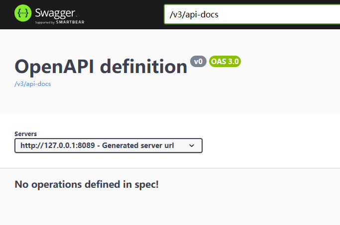
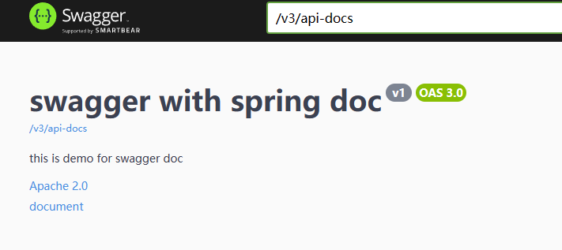
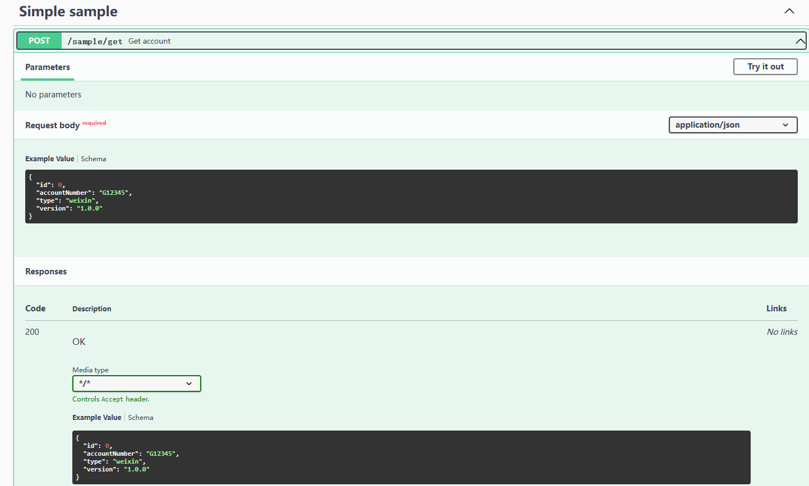
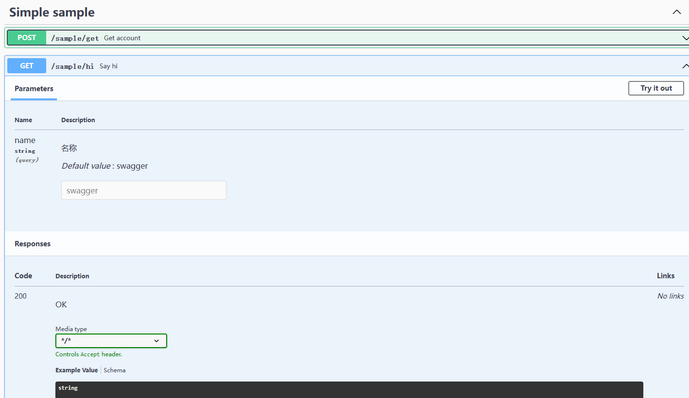

# Swagger SpringDOC

## 介绍
Swagger 是一款RESTful API文档生成工具,可以自动生成API文档。它能够减少编写API文档的工作量。
Swagger 的主要功能如下：
* RESTful API文档在线自动生成。
* 支持在线API测试。
* 支持多种语言(Java，PHP，Python等)的SDK代码自动生成。
* 符合OpenAPI规范(原Swagger规范)。
* 支持YAML和JSON两种语法格式的API定义文件。
* 支持OAuth2授权 outdoors。
* 支持API keys授权。
* 支持自定义数据模型和参数。
* 丰富的元数据支持。
* 支持导入外部JSON/YAML定义文件。
* 支持JAX-RS(Java)、Spring MVC(Java)、Flask(Python)等多种框架的集成。
* 支持扩展和插件机制易于定制化。

## 为什么使用SpringDoc

因为集成SpringFox只支持SpringBoot2.x，而基于Swagger的SpringDoc的社区现在十分活跃，SpringBoot也进入到了3.0版本，
所以SpringDoc替代SpringFox是大势所趋。


## 项目实操

### 环境准备及依赖


| dependency | version |
|:----------:|:-------:|
|    JDK     |   17    |
| SpringBoot |   3.2   |
|   Maven    |   3.6   |


```xml
		<dependency>
			<groupId>org.springdoc</groupId>
			<artifactId>springdoc-openapi-starter-webmvc-ui</artifactId>
			<version>2.2.0</version>
		</dependency>
```

直接启动项目, 打开服务的ip+端口号+/swagger-ui/index.html即可访问默认的swagger页面



***

### 简单场景使用

#### 文档头信息配置

```java
@Configuration
public class SwaggerConfig {

    @Bean
    public OpenAPI springShopOpenAPI() {
        return new OpenAPI()
                .info(new Info().title("swagger with spring doc")
                        .description("this is demo for swagger doc")
                        .version("v1")
                        .license(new License().name("Apache 2.0").url("http://springdoc.org")))
                .externalDocs(new ExternalDocumentation()
                        .description("document")
                        .url("https://springshop.wiki.github.org/docs"));
    }

}
```

#### 实体类

```java
public class Account {

    @Schema(name = "id",description = "Account Id",title = "id")
    private Long id;

    @Schema(name = "accountNumber",description = "Account Number",title = "accountNumber", example = "G12345")
    private String accountNumber;

    @Schema(name = "type",description = "Type",title = "type", example = "weixin")
    private String type;

    @Schema(name = "version",description = "Version",title = "version", example = "1.0.0")
    private String version;

    //......
}
```

#### controller类

```java
@RestController
@RequestMapping("sample")
@Tag(name = "Simple sample")
public class SampleController {


    @Operation(summary = "Say hi")
    @GetMapping("/hi")
    public String sayHi(
            @Parameter(name = "name", description = "名称")
            @RequestParam(defaultValue = "swagger")
            String name
    ){
        return "Hi " + name;
    }

    @Operation(summary ="Get account")
    @PostMapping("/get")
    public Account getAccount(@RequestBody Account account) {
        return account;
    }

}
```

#### 检查swagger页面





