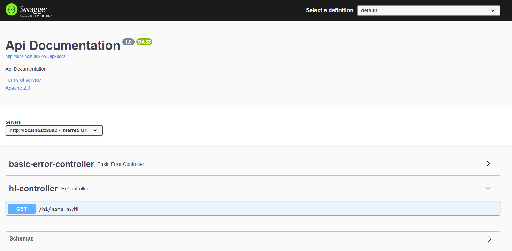

# Swagger

## 介绍
Swagger是一个规范和完整的Api框架，用于生成、描述、调用和可视化 RESTful 风格的 Web 服务。  
总体目标是使客户端和文件系统作为服务器以同样的速度来更新。  
文件的方法，参数和模型紧密集成到服务器端的代码，允许API来始终保持同步。  

官网：[进入](https://swagger.io/)

Swagger是一组开源项目，其中主要要项目如下：
* Swagger-tools:提供各种与Swagger进行集成和交互的工具。例如模式检验、Swagger 1.2文档转换成Swagger 2.0文档等功能。
* Swagger-core: 用于Java/Scala的的Swagger实现。与JAX-RS(Jersey、Resteasy、CXF...)、Servlets和Play框架进行集成。
* Swagger-js: 用于JavaScript的Swagger实现。
* Swagger-node-express: Swagger模块，用于node.js的Express web应用框架。
* Swagger-ui：一个无依赖的HTML、JS和CSS集合，可以为Swagger兼容API动态生成优雅文档。
* Swagger-codegen：一个模板驱动引擎，通过分析用户Swagger资源声明以各种语言生成客户端代码。

## swagger使用
>- 以下例子为SpringBoot in Maven项目，其他类型可参考官方文档进行构建。

1. pom引入swagger3
```
<dependency>
    <groupId>io.springfox</groupId>
    <artifactId>springfox-boot-starter</artifactId>
    <version>3.0.0</version>
</dependency>

```

2. 启动类上加 @EnableWebMvc 注解，不然可能会报空指针异常
```
@SpringBootApplication
@EnableWebMvc
public class SwaggerApplication {

	public static void main(String[] args) {
		SpringApplication.run(SwaggerApplication.class, args);
	}

}

```

3. 创建swagger config配置类：
```
@Configuration
@EnableOpenApi
public class SwaggerConfig {
}

```

4. 创建接口API
```
@RestController
@RequestMapping("hi")
public class HiController {

    @GetMapping("/name")
    public String sayHi(String name){
        return name + " hi!";
    }
}
```

5. 项目启动后访问http://localhost:8080/swagger-ui/index.html 

>- 默认端口为8080，如更改为其他端口则把访问地址改为修改后的端口号  


点击接口右上角Try it out即可访问对应接口

## swagger配置类
```
@Configuration
@EnableOpenApi
public class SwaggerConfig {

    @Bean
    public Docket docket() {
        return new Docket(DocumentationType.OAS_30)
                //文档信息配置
                .apiInfo(apiInfo())
                // 配置扫描的接口
                .select()
                // 配置扫描指定包的接口
                .apis(RequestHandlerSelectors.basePackage("com.ljm.swagger.controller"))

                // 过滤请求，只扫描请求以自定义开头的接口
                .paths(PathSelectors.ant("/hi/**"))
                .build()

                // 设置是否启动Swagger，默认为true（不写即可），关闭后Swagger就不生效了
                .enable(true)
                ;
    }

    private ApiInfo apiInfo() {

        return new ApiInfoBuilder()
                .title("swagger项目接口文档") // 文档标题
                .description("基本的一些接口说明") // 文档基本描述
                .contact(new Contact("jayce", "https://www.baidu.com", "xxxx@qq.com")) // 联系人信息
                .termsOfServiceUrl("http://terms.service.url/组织链接") // 组织链接
                .version("1.0") // 版本
                .license("Apache 2.0 许可") // 许可
                .licenseUrl("https://www.apache.org/licenses/LICENSE-2.0") // 许可链接
                .extensions(new ArrayList<>()) // 拓展
                .build();
    }

}
```


### ApiInfo
ApiInfo用于文档的基础信息配置，可通过修改swagger配置类的Docket来传入自定义ApiInfo
```
    private ApiInfo apiInfo() {

        return new ApiInfoBuilder()
                .title("swagger项目接口文档") // 文档标题
                .description("基本的一些接口说明") // 文档基本描述
                .contact(new Contact("jayce", "https://www.baidu.com", "xxxx@qq.com")) // 联系人信息
                .termsOfServiceUrl("http://terms.service.url/组织链接") // 组织链接
                .version("1.0") // 版本
                .license("Apache 2.0 许可") // 许可
                .licenseUrl("https://www.apache.org/licenses/LICENSE-2.0") // 许可链接
                .extensions(new ArrayList<>()) // 拓展
                .build();
    }
```


### RequestHandlerSelectors配置扫描指定包的接口

常用方法
```
// 扫描所有，项目中的所有接口都会被扫描到
any() 
// 不扫描接口    
none() 
// 通过方法上的注解扫描，如withMethodAnnotation(GetMapping.class)只扫描get请求
withMethodAnnotation(final Class<? extends Annotation> annotation)
// 通过类上的注解扫描，如.withClassAnnotation(Controller.class)只扫描有controller注解的类中的接口
withClassAnnotation(final Class<? extends Annotation> annotation)
// 根据包路径扫描接口    
basePackage(final String basePackage) 
```

### PathSelectors路径选择器
常用方法
```
any() // 任何请求都扫描
none() // 任何请求都不扫描
regex(final String pathRegex) // 通过正则表达式扫描
ant(final String antPattern) // 通过ant()指定请求扫描

```

### 根据环境决定是否开启swagger

```
//如当前环境是dev或sit，则开启swagger文档功能
@Bean
public Docket docket(Environment environment) {
    Profiles profiles = Profiles.of("dev", "sit"); // 设置要显示swagger的环境
    boolean isOpen = environment.acceptsProfiles(profiles); // 判断当前是否处于该环境
    return new Docket(DocumentationType.OAS_30)
            // 设置是否启动Swagger，通过当前环境进行判断：isOpen
            .enable(isOpen);
}

```
### API分组
swagger默认是只有一个分组default  
  

可通过创建多个Docket实例来创建不同的分组
```
@Bean
public Docket docketCategory() {
    return new Docket(DocumentationType.OAS_30)
            .apiInfo(apiInfo())
            // 分组名称
            .groupName("Category")
            .enable(true)
            .select()
            .apis(RequestHandlerSelectors.basePackage("com.yang.takeout.backend.controller"))
            // 过滤请求，只扫描请求以/category开头的接口
            .paths(PathSelectors.ant("/category/**"))
            .build();
}

@Bean
public Docket docketEmployee() {
    return new Docket(DocumentationType.OAS_30)
            .apiInfo(apiInfo())
            // 分组名称
            .groupName("Employee")
            .enable(true)
            .select()
            .apis(RequestHandlerSelectors.basePackage("com.yang.takeout.backend.controller"))
            // 过滤请求，只扫描请求以/employee开头的接口
            .paths(PathSelectors.ant("/employee/**"))
            .build();
}

```
  


## Swagger说明注解

| Swagger注解                                                                             | 	简单说明                            |
|:--------------------------------------------------------------------------------------|:---------------------------------|
| @Api(tags = "xxx模块说明")	                                                               | 作用在模块类上                          | 
| @ApiOperation("xxx接口说明")	                                                             | 作用在接口方法上                         | 
| @ApiModel("xxxPOJO说明")	                                                               | 作用在模型类上：如VO、BTO                  | 
| @ApiModelProperty(value = "xxx属性说明",hidden = true)	                                   | 作用在类方法和属性上，hidden设置为true可以隐藏该属性  | 
| @ApiParam("xxx参数说明")	                                                                 | 作用在参数、方法和字段上，类似@ApiModelProperty | 
| @ApiImplicitParam(name = "参数名称", value = "描述", parameterType = "参数的位置，如请求头参数、路径参数等")	 | 放在方法上面,效果和@ApiParam一样，但是 这个注解范围更广,描述唯一的方法参数 | 
| @ApiImplicitParams(value = {@ApiImplicitParam(xxx),@ApiImplicitParam(xxx)})	          | @ApiImplicitParam的集合，以数组的方式，放入注解中 | 
| @ApiIgnore                                                              | 忽略这个接口，不生成文档 | 


## swagger文件上传接口

单个文件上传
```
    @PostMapping(value = "/simple")
    public CommonResult uploadSimpleFile(@ApiParam(value = "upload file") @RequestPart() MultipartFile file){

        logger.info(file.getOriginalFilename());

        return CommonResult.success(null);

    }
```


多个文件上传
```
    @PostMapping("/multiple")
    public CommonResult uploadMultipleFile(@ApiParam(value = "upload files") @RequestPart() List<MultipartFile> files){

        for(MultipartFile file: files){
            logger.info(file.getOriginalFilename());
        }

        return CommonResult.success(null);

    }
```


## swagger访问需要登陆权限的接口
swagger可以设置授权信息来访问需要认证授权的API,有以下方法可以设置授权。

### 声明header参数
可以在指定API接口上使用@ApiImplicitParam来声明header需要的参数，如token,就可以在swagger访问接口时手动传入需要的header参数
```
@ApiImplicitParam(name = "token", value = "token in header", paramType = "header")
```
  


### swagger设置全局请求参数
在swagger配置中强制所有API传入指定参数
```
@Bean
public Docket docket() {
   //构建一个公共请求参数platform，放在在header
   RequestParameter parameter = new RequestParameterBuilder()
      //参数名称
      .name("token")
      //描述
      .description("authorize with token")
      //放在header中
      .in(ParameterType.HEADER)
      //是否必传
      .required(true)
      .build();
      //构建一个请求参数集合
   List<RequestParameter> parameters = Collections.singletonList(parameter);
   return new Docket(DocumentationType.OAS_30)
       .....
       .build()
       .globalRequestParameters(parameters);
}
```
  

### swagger设置全局授权信息
swagger配置加上授权配置，swagger访问页面手动加上全局授权信息

```
@Configuration
@EnableOpenApi
public class SwaggerConfig {
    @Bean
    public Docket docket() {
        return new Docket(DocumentationType.OAS_30)
                //skip others
                //...
                
                
                .securitySchemes(securitySchemes())
                .securityContexts(securityContexts())
    }
 
    /**
     * 设置授权信息
     */
    private List<SecurityScheme> securitySchemes() {
        ApiKey apiKey = new ApiKey("token", "token", In.HEADER.toValue());
        return Collections.singletonList(apiKey);
    }

    /**
     * 授权信息全局应用
     */
    private List<SecurityContext> securityContexts() {
        return Collections.singletonList(
                SecurityContext.builder()
                        .securityReferences(Collections.singletonList(new SecurityReference("token", new AuthorizationScope[]{new AuthorizationScope("global", "")})))
                        .build()
        );

    }
    
}    
    
```
  
  
  


